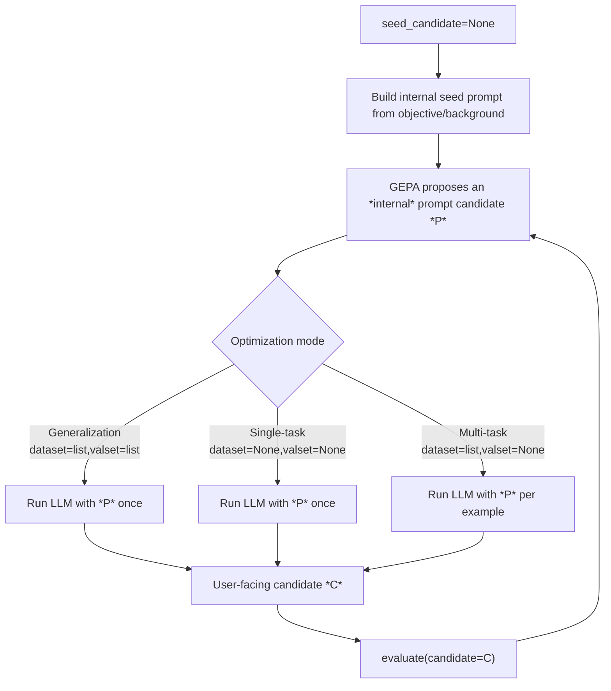
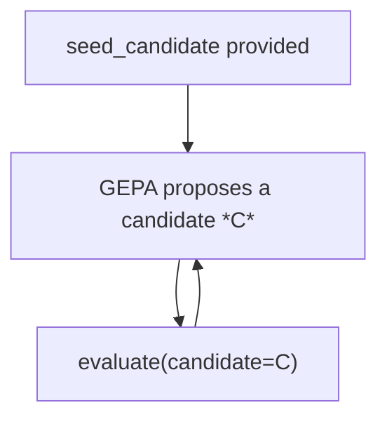

# Seedless Prompt-Evolution

## 1. Design Philosophy

Seedless mode is intended for the 99% case: users who want a minimal, yet powerful optimization API without having to specify a seed candidate.

- Internally, this PR treats this as a meta-optimization problem. Instead of directly optimizing only the final artifact, it optimizes an internal prompt candidate that generates that artifact.
- The user doesn't have to understand that we internally do prompt optimization. Their `evaluator` stays the same as a typical evaluator with a seed candidate. 
- The user simply provides and `objective` and `evaluator` and receives an optimized candidate through `results.best_candidate` or `results.best_candidate_per_example`.
- Notes: we don't currently support a multi-parameter candidate for this mode

---

## 2. What This PR Changes

This PR redefines `seed_candidate=None` from "generate one initial artifact" into **prompt-evolution mode**:

- GEPA now optimizes an **internal generation prompt** (built from `objective` and optional `background`).
- During evaluation, that prompt is run through `reflection_lm` to materialize candidate artifacts.
- Strategy is mode-dependent:
  - **Single-task search** -> run the internal prompt once
  - **Multi-task search** -> run the internal prompt per example
  - **Generalization** -> run the internal prompt once
- Key mental model:
  - **Seeded mode** : `candidate` is the user-facing artifact, and GEPA optimizes it directly.
  - **Seedless mode** : the `evaluator` still receives a user-facing `candidate`; GEPA simply uses an internal prompt to generate that `candidate` before evaluation.

The net effect is that seedless optimization becomes a two-level loop:
1. Evolve an internal prompt candidate.
2. Materialize the user-facing `candidate` from that prompt for evaluation.

---

## 3. Workflow Overview

### Seedless Mode (`seed_candidate=None`)

### Seeded Mode (`seed_candidate` provided)

---

## 4. Mode-to-Strategy Matrix

| Mode | Inputs | Seedless generation strategy | Why |
|---|---|---|---|
| Single-task search | `dataset=None`, `valset=None` | **Generate-once** | Only one task instance; one artifact is sufficient per candidate prompt. |
| Multi-task search | `dataset=<list>`, `valset=None` | **Per-example generation** | Different tasks can need different artifacts; prompt is optimized for task-conditional generation. |
| Generalization | `dataset=<list>`, `valset=<list>` | **Generate-once** | Must evaluate one candidate's transfer behavior across examples. |

### Refiner support in seedless mode
- Single-task and Multi-task: supported
- Generalization: **explicitly disallowed** (throws `ValueError`)
  - Reason: per-example refinement conflicts with the generalization objective.
- Refinement target semantics:
  - **Seedless mode**: refines the candidate generated from the current internal prompt candidate.
    - We don't refine the prompt. Otherwise, it would be llm(internal_prompt) -> llm(refiner_prompt) -> llm(internal_prompt)
  - **Seed mode**: refines the candidate itself

---

## 5. Evaluation Path in Adapter

The adapter now has explicit seedless dispatch:

- `_evaluate_seedless(...)` routes to one of:
  - `_evaluate_seedless_generate_once(...)`
  - `_evaluate_seedless_generate_once_with_refiner(...)`
  - `_evaluate_seedless_per_example(...)`
  - `_evaluate_seedless_per_example_with_refiner(...)`

### Common mechanics
- In seedless mode, GEPA optimizes an internal prompt rather than directly optimizing the user-facing `candidate`.
- `internal_prompt_candidate_lm` uses `InternalPromptCandidateSignature` to generate the user-facing `candidate` from that internal prompt before calling the `evaluator`.
- Generated text is injected into side info as `generated_candidate`.

---

## 6. Internal Prompt -> Candidate Mapping and Persistence

To support seedless post-processing and resume:

- Adapter stores:
  - `_internal_prompt_to_candidate: prompt_hash -> (best_candidate_text, best_score)`
  - This ensures a 1:1 prompt to candidate mapping for stability
- This mapping is now included in `get_adapter_state()` / `set_adapter_state()`.

---

## 7. Result Contract Changes (`OptimizeAnythingResult`)

`optimize_anything(...)` now returns `OptimizeAnythingResult` (wrapper around `GEPAResult`) with seedless-specific fields:

- `best_candidate`
- `best_candidate_per_example`
- `best_prompt`

Users can still access underlying `GEPAResult` data:
- directly via `result.gepa_result`
- or via delegated attribute access for most `GEPAResult` fields (e.g. `result.best_idx`, `result.candidates`)

Note: wrapper-defined fields (`best_candidate`, `best_candidate_per_example`, `best_prompt`) intentionally override same-name delegated behavior.

### Seedless semantics
- **Multi-task search**:
  - `best_candidate = None` (no single canonical artifact)
  - `best_prompt` exposes the evolved internal prompt
- **Single-task search** and **Generalization mode**:
  - `best_candidate` behaves as expected for a single best artifact
  - `best_candidate_per_example` is filled with that same best artifact across indices

---

## 9. Key Files Changed (Core to this PR)

- `src/gepa/optimize_anything.py`
  - seedless prompt-evolution initialization
  - mode-based strategy selection
  - seedless generalization + refiner guard
  - `OptimizeAnythingResult` + seedless result semantics
- `src/gepa/adapters/optimize_anything_adapter/optimize_anything_adapter.py`
  - prompt materialization signature/extractor
  - seedless evaluation dispatch + strategy implementations
  - mapping persistence in adapter state
