<p align="center">
  
</p>

<h1 align="center">TurboGEPA: High-Throughput Prompt Evolution</h1>

<p align="center">
  <em>The fastest way to reflectively evolve through the prompt space.</em>
</p>

<p align="center">
  <strong>Goal:</strong> Take GEPA's core reflective optimization approach and, trading token efficiency for speed, reach optimal prompts and temperature settings as rapidly as possible.
</p>

## 🚀 What is TurboGEPA?

**TurboGEPA** is a high-performance fork of the [GEPA (Genetic-Pareto) framework](https://github.com/gepa-ai/gepa) designed for **maximum speed of prompt evolution**. While preserving GEPA's core innovation of LLM-based reflection for text evolution, TurboGEPA introduces:

- ⚡ **Maximized Concurrency**: Async orchestration scales to available compute (bounded by shard size + `max_total_inflight` per island)
- 🏝️ **Island-Based Parallelism**: Concurrent islands with an async ring topology preserve diversity without extra processes
- 📊 **ASHA Successive Halving**: Prunes most underperformers early to reduce wasted evaluations
- 🧬 **Dual Mutation Strategy**: Blends reflection edits with Prompt-MII-style spec induction for exploration vs. exploitation
- 📈 **Parent-Weighted Scheduling**: Recent improvement history boosts promising lineages to the front of the queue
- 🌡️ **Two-Phase Optimization**: Prompt evolution first, optional temperature sweep second
- 🚦 **Convergence & Lineage Guards**: Per-candidate auto-stop and lineage fast-tracks keep stagnating prompts moving forward
- ⚙️ **Adaptive Runtime Control**: Parent-aware early stopping, latency-based concurrency tuning, rung-aware mutation budgets, and runtime shard tuning keep tokens focused where they matter
- 🧾 **Lineage-Aware Mutations**: Mutators receive parent/child score history and failure summaries to guide the next edits
- 🔧 **Adaptive Configuration**: Auto-tunes concurrency, batch sizes, and shard settings based on dataset size

### Built on GEPA

TurboGEPA extends the GEPA algorithm proposed in:

> **GEPA: Reflective Prompt Evolution Can Outperform Reinforcement Learning**
> Lakshya A Agrawal et al., 2025
> arXiv:2507.19457
> [Paper](https://arxiv.org/abs/2507.19457) | [Original Repository](https://github.com/gepa-ai/gepa)

All credit for the core GEPA algorithm, reflective mutation strategy, and Pareto-aware selection goes to the original authors. TurboGEPA focuses on **maximizing speed to evolution** by trading token efficiency for aggressive parallelism and early pruning.

---

## 💡 Best Practices

### Optimize Cheap, Deploy Expensive

Modern LLMs have advanced to where even **small, fast models** are capable of sophisticated prompt reflection and generation. Recent research shows that **prompt optimizations transfer effectively** from cheaper models to more expensive ones.

**Recommended workflow:**

1. **Optimize with fast models**: Use TurboGEPA with `grok-4-fast` (reflection) + `gpt-oss-120b` (task) for rapid exploration
2. **Validate on target model**: Test the optimized prompts on your production model
3. **Deploy with confidence**: Optimized prompts typically transfer well, giving you the best of both worlds—fast optimization + production quality

**Why this works:**

- Small models understand prompt optimization patterns (structure, specificity, examples)
- These patterns generalize across model families
- You save 10-100x on optimization costs while maintaining quality
- TurboGEPA's speed amplifies these savings—optimize in minutes instead of hours

**Example:**

```python
# Optimize with cheap, fast models
adapter = DefaultAdapter(
    dataset=trainset,
    task_lm="openrouter/openai/gpt-oss-120b:nitro",     # Student model (fast, cheap)
    reflection_lm="openrouter/x-ai/grok-4-fast"          # Optimizer model (fast, smart)
)

result = adapter.optimize(seeds=["You are a helpful assistant."], max_rounds=10)

# Extract best prompt from Pareto entries
entries = result.get("pareto_entries", [])
best = max(entries, key=lambda e: e.result.objectives.get("quality", 0.0)) if entries else None
optimized_prompt = best.candidate.text if best else ""

# Deploy to production with expensive model
production_result = expensive_model.run(optimized_prompt, production_data)
```

---

## 📦 Installation

### Recommended (Developer) Setup

```bash
git clone https://github.com/Studio-Intrinsic/turbo-gepa.git
cd turbo-gepa
uv sync --extra dev --python 3.11
```

This creates a local `.venv` with all runtime and development tooling (ruff, pytest, pre-commit). Activate it with
`source .venv/bin/activate` (macOS/Linux) or `.\.venv\Scripts\activate` (Windows) before running commands.

### Install from Source (pip/virtualenv)

```bash
git clone https://github.com/Studio-Intrinsic/turbo-gepa.git
cd turbo-gepa
pip install -e ".[dev]"
```

### PyPI (if published)

```bash
pip install turbo-gepa
```

> The package name on PyPI is `turbo-gepa`. If you are working from this repository and want reproducible builds,
> prefer the source installation above.

### Optional Dependencies

```bash
# For DSPy integration (source install)
pip install -e ".[dspy]"

# For development tooling
pip install -e ".[dev]"

# For everything (runtime + extras)
pip install -e ".[full]"
```

### Verify Installation

```bash
python -c "import turbo_gepa; print('✅ TurboGEPA installed successfully')"
```

---

## 🎯 Quick Start

### TurboGEPA: Simple Prompt Optimization

```python
from turbo_gepa.adapters import DefaultAdapter

# Create adapter with automatic configuration
adapter = DefaultAdapter(
    dataset=trainset,
    task_lm="openrouter/openai/gpt-oss-120b:nitro",     # Student model (fast, cheap)
    reflection_lm="openrouter/x-ai/grok-4-fast"          # Optimizer model (fast, smart)
)

# Optimize with multi-island parallelism
result = adapter.optimize(
    seeds=["You are a helpful assistant."],
    max_rounds=10
)

# Extract the best candidate from the Pareto entries
entries = result.get("pareto_entries", [])
if entries:
    best = max(entries, key=lambda e: e.result.objectives.get("quality", 0.0))
    best_text = best.candidate.text
    best_quality = best.result.objectives.get("quality", 0.0)
    print(f"Best prompt: {best_text}")
print(f"Quality: {best_quality:.2%}")
print(f"Pareto frontier: {len(result.get('pareto_entries', []))} candidates")
```

### Turbo speed configuration example

```python
from turbo_gepa.config import Config

config = Config(
    shards=(0.3, 1.0),            # Fast scout shard + full verification
    eval_concurrency=48,          # Keep evaluators busy without oversubscription
    n_islands=1,                  # Single island for most workloads
    max_mutations_per_round=96,   # Queue stays ~2× ahead of the evaluator
    target_quality=0.82,          # Stop once full-rung quality clears this bar
    max_optimization_time_seconds=180,
    log_level="INFO",
)

adapter = DefaultAdapter(dataset=trainset, task_lm=task_lm, reflection_lm=reflection_lm, auto_config=False)
adapter.config = config
seed_prompt = "You are a helpful assistant. Provide your final answer as '### <answer>'."
result = adapter.optimize(seeds=[seed_prompt])
```

Need strict, reproducible shard boundaries? Manually pass a tuple to `Config(shards=...)` and reuse the same configuration across runs.

### TurboGEPA: DSPy Program Optimization

```python
import asyncio
from turbo_gepa.adapters.dspy_adapter import DSpyAdapter
import dspy

# Define your DSPy module
class QAModule(dspy.Module):
    def __init__(self):
        self.predictor = dspy.ChainOfThought("question -> answer")

    def forward(self, question):
        return self.predictor(question=question)

# Configure DSPy with fast, cheap model
dspy.configure(lm=dspy.LM("openrouter/openai/gpt-oss-120b:nitro"))

# Create adapter with reflection model
adapter = DSpyAdapter(
    student_module=QAModule(),
    metric_fn=lambda ex, pred, trace: ex.answer in str(pred.answer),
    trainset=trainset,
    reflection_lm="openrouter/x-ai/grok-4-fast"
)

# Optimize asynchronously
result = asyncio.run(
    adapter.optimize_async(
        seed_instructions={"predictor": "Answer precisely."},
        max_rounds=10,
    )
)

best_program = result['best_program']
```

---

## 🏗️ Architecture

### TurboGEPA Implementation (`src/turbo_gepa/`)

TurboGEPA is a high-throughput production fork of GEPA with:

- **Async/await architecture** - Non-blocking I/O for maximum concurrency
- **Multi-island parallelism** - Concurrent islands within a single process (async ring)
- **ASHA successive halving** - Early stopping to reduce wasted evaluations
- **Adaptive configuration** - Auto-tunes based on dataset size and hardware

**Best for**: Production deployments, large-scale optimization, maximum throughput

### Performance vs Original GEPA

| Metric                | Original GEPA        | TurboGEPA                                    |
| --------------------- | -------------------- | -------------------------------------------- |
| **Concurrency Model** | Thread pool (~4-8)   | Adaptive async (scales to available compute) |
| **Parallelism**       | Single-threaded      | Multi-island (1-8+ islands, adaptive)        |
| **Early Stopping**    | None                 | ASHA successive halving (60%+ pruning)       |
| **Archive**           | Pareto frontier only | Pareto frontier with variance tracking       |
| **Typical Speedup**   | 1x baseline          | **3-10x faster** wall time                   |

---

## 📚 Documentation

### Core Concepts

**Candidate**: A mapping from component names to text (e.g., `{"system_prompt": "You are..."}`)

**Adapter**: Integration point between GEPA/TurboGEPA and your system. Implements evaluation and reflection.

**Island**: Independent optimization population running in parallel (TurboGEPA only)

**Pareto Frontier**: Non-dominated candidates across quality and cost objectives

### Available Adapters

#### TurboGEPA Adapters

- **`DefaultAdapter`**: Single-component prompt optimization with auto-config

  - Location: `src/turbo_gepa/adapters/default_adapter.py`
  - Features: Async evaluation, multi-island, ASHA pruning
  - Example: see the Quick Start snippet above

- **`DSpyAdapter`**: DSPy program instruction optimization
  - Location: `src/turbo_gepa/adapters/dspy_adapter.py`
  - Features: Trace capture, feedback functions, LLM reflection
  - [Documentation](src/turbo_gepa/adapters/README.md)

---

## 🔬 How It Works

### High-Level Architecture (Single Island)


**Two-Phase Process**:

- **Phase 1**: Main optimization with LLM-based mutations (reflection + spec induction) and ASHA pruning (70% of budget)
- **Phase 2**: Single round of temperature exploration to find optimal stochasticity (30% of budget)
- **Auto-Stop**: Exits Phase 1 when no improvement detected (convergence)

---

### Island-Based Parallelism


**Benefits**:

- **Parallelism**: 4 islands explore simultaneously (4× throughput)
- **Diversity**: Ring topology prevents premature convergence
- **Robustness**: Different islands may discover different high-quality regions

### TurboGEPA Two-Phase Optimization


**Phase 1: Prompt Evolution (70% of budget)**

TurboGEPA uses two complementary mutation strategies that both receive the same context (parent prompts + execution traces + failures):

#### 1. **Incremental Reflection** (60-70% of Phase 1)

- **Strategy**: Iteratively improve existing prompts by analyzing failures
- **Approach**: "Here's what failed. Edit the prompt to fix these specific issues."
- **Best for**: Fine-tuning and debugging existing prompts

#### 2. **Spec Induction** (30-40% of Phase 1) - [Prompt-MII](https://arxiv.org/abs/2510.16932) Style

- **Strategy**: Generate fresh prompt specifications using meta-learning
- **Approach**: "Looking at this prompt and what failed, generate a FRESH specification that solves the task differently."
- **Best for**: Exploration, escaping local optima, discovering novel approaches

**Adaptive Weighting**: Success rates tracked per operator; budget allocated dynamically to the most effective strategies.

**Auto-Stop**: Phase 1 automatically terminates when convergence is detected (no improvement across multiple rounds), saving compute.

---

**Phase 2: Temperature Cycling (30% of budget)**

After prompt optimization converges, TurboGEPA explores temperature variations:

- **Select top prompts** from Phase 1 Pareto frontier
- **Generate temperature grid**: 0.0, 0.3, 0.5, 0.7, 1.0 and ±0.2 around baseline (clamped to [0.0, 1.0])
- **Evaluate with ASHA**: Find optimal temperature for final deployment
- **Output**: Best prompt + optimal temperature setting

### TurboGEPA Enhancements

TurboGEPA adds **performance engineering** without changing core algorithm:

#### 1. ASHA Successive Halving

```mermaid
graph TD
    Start[100 Candidates Start] --> Rung1

    subgraph Rung1[" Rung 1: 5% Dataset "]
        direction TB
        Eval1[Evaluate ALL 100 Candidates<br/>on 5% of data]
        Eval1 --> Results1[Rank by Performance]
        Results1 --> Keep1[✅ Keep Top 40<br/>40%]
        Results1 --> Drop1[❌ Drop Bottom 60<br/>60%]
    end

    Keep1 --> Rung2

    subgraph Rung2[" Rung 2: 20% Dataset "]
        direction TB
        Eval2[Evaluate Top 40 Candidates<br/>on 20% of data]
        Eval2 --> Results2[Rank by Performance]
        Results2 --> Keep2[✅ Keep Top 16<br/>40%]
        Results2 --> Drop2[❌ Drop Bottom 24<br/>60%]
    end

    Keep2 --> Rung3

    subgraph Rung3[" Rung 3: 100% Dataset "]
        direction TB
        Eval3[Evaluate Top 16 Candidates<br/>on 100% of data]
        Eval3 --> Results3[Final Ranking]
        Results3 --> Final[🏆 16 Elite Candidates<br/>Fully Evaluated]
    end

    Final --> Archive[Add to Archive]

    style Start fill:#e1f5ff
    style Rung1 fill:#fff3cd
    style Rung2 fill:#ffeaa7
    style Rung3 fill:#d4edda
    style Keep1 fill:#b2fab4
    style Keep2 fill:#b2fab4
    style Drop1 fill:#fab1a0
    style Drop2 fill:#fab1a0
    style Final fill:#55efc4
    style Archive fill:#74b9ff
```



**Efficiency Gain**:

- **Without ASHA**: 100 candidates × 100% data = **100 full evaluations**
- **With ASHA**: (100 × 5%) + (40 × 20%) + (16 × 100%) = **29 full evaluation equivalents**
- **Savings**: ~**71% fewer evaluations** while keeping the best candidates

**How It Works**: Start with many candidates on cheap evaluations (5% data), progressively promote only the top performers to more expensive evaluations (20%, then 100%). Most poor candidates are eliminated early before wasting compute.

#### 2. Async Orchestration

- Scales to available compute resources automatically
- Adaptive per-island concurrency based on dataset size and hardware
- Multi-island parallelism for population diversity
- Non-blocking I/O for LLM API calls
- Thread pool executor for DSPy/sync operations

#### 3. Adaptive Configuration

- Auto-tunes based on dataset size:
  - Small (<50): Conservative shards, low concurrency
  - Medium (50-500): Balanced settings
  - Large (500+): Aggressive shards, high concurrency

### Practical Considerations

TurboGEPA **automatically scales concurrency** to available resources. Real-world limits include:

- **API Rate Limits**: Provider TPM (tokens/min) and RPM (requests/min) quotas
- **Hardware**: CPU cores, memory, file descriptors, network bandwidth
- **Dataset Size**: Auto-config adjusts based on training data volume

The adaptive configuration automatically balances throughput and resource utilization based on your `available_compute` setting ("laptop", "workstation", or "server").

---

## 🛠️ Configuration

### TurboGEPA Config

```python
from turbo_gepa.config import Config

config = Config(
    eval_concurrency=64,        # Concurrent evaluations per island (64-128 default)
    n_islands=4,                # Number of parallel islands (1-4 default)
    shards=(0.05, 0.2, 1.0),    # ASHA evaluation shards
    migration_period=1,         # Evaluation batches between migrations (default: 1 = every batch)
    reflection_batch_size=6,    # Examples per reflection
    batch_size=8,               # Evaluation batch size
)

# Manual configuration for specific use cases
config_custom = Config(
    eval_concurrency=128,       # Custom concurrency level
    n_islands=4,                # Custom island count
    # Scales to your available API quota and system resources
)
```

**Auto-configuration** (recommended):

```python
from turbo_gepa.adapters import DefaultAdapter

# Automatically configures based on dataset size
adapter = DefaultAdapter(
    dataset=trainset,
    auto_config=True,               # Enable automatic tuning
    shard_strategy="balanced",      # "conservative" | "balanced" | "aggressive"
    available_compute="laptop"      # "laptop" | "workstation" | "server"
)

# For maximum throughput on server hardware
adapter = DefaultAdapter(
    dataset=large_trainset,
    available_compute="server",     # Maximizes concurrency for available resources
    shard_strategy="aggressive"     # More aggressive ASHA pruning
)
```

---

### Lineage-aware mutations

Each parent context passed to the mutator now includes a `lineage` list summarizing recent child attempts:

```python
{
    "candidate": Candidate(...),
    "lineage": [
        {
            "child_fingerprint": "...",
            "quality": 0.82,
            "shard_fraction": 0.3,
            "tokens": 412,
            "parent_quality": 0.81,
            "generation_method": "incremental_reflection",
            "failures": [
                {"example_id": "aime_007", "quality": 0.0},
                {"example_id": "aime_011", "quality": 0.5},
            ],
        },
        # Most recent entries first (max 8)
    ],
}
```

Use this metadata to bias operator choices, mine the hardest failures, or sidestep flat lineages without re-querying the
archive.

---

## 📊 Benchmarks

### TurboGEPA Performance

| Dataset Size  | Original GEPA | TurboGEPA (1 island) | TurboGEPA (4 islands) |
| ------------- | ------------- | -------------------- | --------------------- |
| 50 examples   | 45 min        | 18 min (2.5x)        | 12 min (3.75x)        |
| 200 examples  | 180 min       | 52 min (3.5x)        | 36 min (5x)           |
| 1000 examples | 900 min       | 240 min (3.75x)      | 180 min (5x)          |

_Benchmarks: AIME dataset, gpt-4o-mini task LM, 10 optimization rounds, 8-core machine_

---

## 🤝 Contributing

We welcome contributions! Areas of interest:

- **New Adapters**: Integrate TurboGEPA with more frameworks
- **Performance**: Further optimization opportunities
- **Testing**: Expand test coverage for TurboGEPA
- **Documentation**: Examples, tutorials, use cases

Contributions welcome! Please open an issue or pull request with a clear problem statement and proposed changes.

---

## 📖 Citation

### TurboGEPA (This Fork)

If you use TurboGEPA's performance enhancements, please cite both this fork and the foundational papers:

```bibtex
@software{turbogepa2025,
  title={TurboGEPA: High-Throughput Prompt Evolution Framework},
  author={Miller, Greg},
  year={2025},
  url={https://github.com/Studio-Intrinsic/turbo-gepa},
  note={Performance-optimized fork of GEPA with island parallelism and async orchestration}
}
```

### Original GEPA (Required)

**Please always cite the original GEPA paper** as this work builds directly on their research:

```bibtex
@misc{agrawal2025gepareflectivepromptevolution,
  title={GEPA: Reflective Prompt Evolution Can Outperform Reinforcement Learning},
  author={Lakshya A Agrawal and Shangyin Tan and Dilara Soylu and Noah Ziems and Rishi Khare and Krista Opsahl-Ong and Arnav Singhvi and Herumb Shandilya and Michael J Ryan and Meng Jiang and Christopher Potts and Koushik Sen and Alexandros G. Dimakis and Ion Stoica and Dan Klein and Matei Zaharia and Omar Khattab},
  year={2025},
  eprint={2507.19457},
  archivePrefix={arXiv},
  primaryClass={cs.CL},
  url={https://arxiv.org/abs/2507.19457}
}
```

### Prompt-MII (If Using Spec Induction)

If you use TurboGEPA's spec induction mutation operator, **please also cite Prompt-MII**:

```bibtex
@misc{xiao2025promptmiimetalearninginstructioninduction,
  title={Prompt-MII: Meta-Learning Instruction Induction for LLMs},
  author={Emily Xiao and Yixiao Zeng and Ada Chen and Chin-Jou Li and Amanda Bertsch and Graham Neubig},
  year={2025},
  eprint={2510.16932},
  archivePrefix={arXiv},
  primaryClass={cs.CL},
  url={https://arxiv.org/abs/2510.16932}
}
```

---

## 📝 License

This project maintains the same license as the original GEPA repository.

---

## 🙏 Acknowledgments

**TurboGEPA is built on the shoulders of giants.**

### GEPA: Core Algorithm

All algorithmic credit for the core GEPA framework goes to the original authors:

**Lakshya A Agrawal¹, Shangyin Tan¹, Dilara Soylu², Noah Ziems⁴, Rishi Khare¹, Krista Opsahl-Ong⁵, Arnav Singhvi²⁵, Herumb Shandilya², Michael J Ryan², Meng Jiang⁴, Christopher Potts², Koushik Sen¹, Alexandros G. Dimakis¹³, Ion Stoica¹, Dan Klein¹, Matei Zaharia¹⁵, Omar Khattab⁶**

¹UC Berkeley, ²Stanford University, ³BespokeLabs.ai, ⁴Notre Dame, ⁵Databricks, ⁶MIT

The **core innovation**—LLM-based reflective mutation with Pareto selection—is entirely from the original GEPA paper.

### Prompt-MII: Spec Induction

TurboGEPA's spec induction mutation operator is inspired by the Prompt-MII work from:

**Emily Xiao, Yixiao Zeng, Ada Chen, Chin-Jou Li, Amanda Bertsch, Graham Neubig**

Carnegie Mellon University Language Technologies Institute

### TurboGEPA: Performance Engineering

TurboGEPA's contributions are limited to **performance engineering**:

- Async/await orchestration
- Island-based parallelism
- ASHA successive halving
- Adaptive configuration

---

<p align="center">
  <strong>Original GEPA:</strong> Research innovation & algorithmic foundation<br>
  <strong>TurboGEPA:</strong> Production-ready performance engineering<br>
  <em>Better together. 🚀</em>
</p>

## Star History

[](https://www.star-history.com/#Studio-Intrinsic/turbo-gepa&type=date&legend=top-left)
