<p align="center">
  
</p>

<h1 align="center">TurboGEPA: High-Throughput Prompt Evolution</h1>

<p align="center">
  <em>The fastest way to reflectively evolve through the prompt space.</em>
</p>

<p align="center">
  <strong>Goal:</strong> Take GEPA's core reflective optimization approach and, trading token efficiency for speed, reach optimal prompts and temperature settings as rapidly as possible.
</p>

## 🚀 What is TurboGEPA?

**TurboGEPA** is a high-performance fork of the [GEPA (Genetic-Pareto) framework](https://github.com/gepa-ai/gepa) designed for **maximum speed of prompt evolution**. While preserving GEPA's core innovation of LLM-based reflection for text evolution, TurboGEPA introduces:

- ⚡ **Maximized Concurrency**: Adaptive async orchestration scales to available compute resources (64-256+ per island, multi-island parallelism)
- 🏝️ **Island-Based Parallelism**: Multi-process islands with ring topology for population diversity
- 📊 **ASHA Successive Halving**: Prunes 60%+ of candidates early, reducing wasted evaluations
- 🎯 **Quality-Diversity Archive**: Maintains diverse solutions beyond just Pareto frontier
- 🌡️ **Two-Phase Optimization**: Phase 1 optimizes prompts, Phase 2 cycles through temperature variations for final tuning
- 🛑 **Auto-Stop Convergence**: Automatically terminates when no improvement detected, saving compute on converged runs
- 🔧 **Adaptive Configuration**: Auto-tunes concurrency, batch sizes, and shards based on dataset size

### Built on GEPA

TurboGEPA extends the GEPA algorithm proposed in:

> **GEPA: Reflective Prompt Evolution Can Outperform Reinforcement Learning**
> Lakshya A Agrawal et al., 2025
> arXiv:2507.19457
> [Paper](https://arxiv.org/abs/2507.19457) | [Original Repository](https://github.com/gepa-ai/gepa)

All credit for the core GEPA algorithm, reflective mutation strategy, and Pareto-aware selection goes to the original authors. TurboGEPA focuses purely on **performance engineering** and **production readiness**.

---

## 💡 Best Practices

### Optimize Cheap, Deploy Expensive

Modern LLMs have advanced to where even **small, fast models** are capable of sophisticated prompt reflection and generation. Recent research shows that **prompt optimizations transfer effectively** from cheaper models to more expensive ones.

**Our recommended setup:**
- **Reflection LM** (prompt optimizer): `x-ai/grok-beta` - Fast, cheap, excellent at prompt reasoning
- **Task LM** (student being optimized): `openai/gpt-oss-120b` - Extremely fast, great quality/cost ratio
- **Production deployment**: Transfer optimized prompts to your target model (e.g., `gpt-4o`, `claude-sonnet-4`)

**Recommended workflow:**

1. **Optimize with fast models**: Use TurboGEPA with `grok-beta` (reflection) + `gpt-oss-120b` (task) for rapid exploration
2. **Validate on target model**: Test the optimized prompts on your production model
3. **Deploy with confidence**: Optimized prompts typically transfer well, giving you the best of both worlds—fast optimization + production quality

**Why this works:**
- Small models understand prompt optimization patterns (structure, specificity, examples)
- These patterns generalize across model families
- You save 10-100x on optimization costs while maintaining quality
- TurboGEPA's speed amplifies these savings—optimize in minutes instead of hours

**Example:**
```python
# Optimize with cheap, fast models
adapter = DefaultAdapter(
    dataset=trainset,
    task_lm="openrouter/openai/gpt-oss-120b",     # Student model (fast, cheap)
    reflection_lm="openrouter/x-ai/grok-beta"      # Optimizer model (fast, smart)
)

result = adapter.optimize(seeds=["You are a helpful assistant."], max_rounds=10)
optimized_prompt = result['best_text']

# Deploy to production with expensive model
production_result = expensive_model.run(optimized_prompt, production_data)
```

---

## 📦 Installation

### Install TurboGEPA

```bash
pip install turbo-gepa
```

### Install from Source

```bash
git clone https://github.com/Studio-Intrinsic/turbo-gepa.git
cd turbo-gepa
pip install -e .
```

### Optional Dependencies

```bash
# For DSPy integration
pip install turbo-gepa[dspy]

# For development
pip install turbo-gepa[dev]

# For everything (all features)
pip install turbo-gepa[full]
```

### Verify Installation

```bash
python -c "import turbo_gepa; print('✅ TurboGEPA installed successfully')"
```

---

## 🎯 Quick Start

### TurboGEPA: Simple Prompt Optimization

```python
from turbo_gepa.adapters import DefaultAdapter

# Create adapter with automatic configuration
adapter = DefaultAdapter(
    dataset=trainset,
    task_lm="openrouter/google/gemini-flash-1.5",
    reflection_lm="openrouter/google/gemini-flash-1.5"
)

# Optimize with multi-island parallelism
result = adapter.optimize(
    seeds=["You are a helpful assistant."],
    max_rounds=10
)

print(f"Best prompt: {result['best_text']}")
print(f"Quality: {result['best_quality']:.2%}")
print(f"Pareto frontier: {len(result['pareto'])} candidates")
```

### TurboGEPA: DSPy Program Optimization

```python
from turbo_gepa.adapters.dspy_adapter import DSpyAdapter
import dspy

# Define your DSPy module
class QAModule(dspy.Module):
    def __init__(self):
        self.predictor = dspy.ChainOfThought("question -> answer")

    def forward(self, question):
        return self.predictor(question=question)

# Configure DSPy
dspy.configure(lm=dspy.LM("openai/gpt-4o-mini"))

# Create adapter
adapter = DSpyAdapter(
    student_module=QAModule(),
    metric_fn=lambda ex, pred, trace: ex.answer in str(pred.answer),
    trainset=trainset
)

# Optimize asynchronously
result = await adapter.optimize_async(
    seed_instructions={"predictor": "Answer precisely."},
    max_rounds=10
)

best_program = result['best_program']
```

---

## 🏗️ Architecture

### TurboGEPA Implementation (`src/turbo_gepa/`)

TurboGEPA is a high-throughput production fork of GEPA with:

- **Async/await architecture** - Non-blocking I/O for maximum concurrency
- **Multi-island parallelism** - Distributed optimization across process boundaries
- **ASHA successive halving** - Early stopping to reduce wasted evaluations
- **Quality-Diversity archives** - Maintains diverse solutions beyond Pareto frontier
- **Adaptive configuration** - Auto-tunes based on dataset size and hardware

**Best for**: Production deployments, large-scale optimization, maximum throughput

### Performance vs Original GEPA

| Metric | Original GEPA | TurboGEPA |
|--------|---------------|-----------|
| **Concurrency Model** | Thread pool (~4-8) | Adaptive async (scales to available compute) |
| **Parallelism** | Single-threaded | Multi-island (1-8+ islands, adaptive) |
| **Early Stopping** | None | ASHA successive halving (60%+ pruning) |
| **Diversity** | Pareto frontier only | Pareto + Quality-Diversity grid |
| **Typical Speedup** | 1x baseline | **3-10x faster** wall time |

---

## 📚 Documentation

### Core Concepts

**Candidate**: A mapping from component names to text (e.g., `{"system_prompt": "You are..."}`)

**Adapter**: Integration point between GEPA/TurboGEPA and your system. Implements evaluation and reflection.

**Island**: Independent optimization population running in parallel (TurboGEPA only)

**Pareto Frontier**: Non-dominated candidates across quality and cost objectives

**QD Archive**: Quality-Diversity grid maintaining diverse high-performing solutions

### Available Adapters

#### TurboGEPA Adapters

- **`DefaultAdapter`**: Single-component prompt optimization with auto-config
  - Location: `src/turbo_gepa/adapters/default_adapter.py`
  - Features: Async evaluation, multi-island, ASHA pruning
  - [Example](examples/benchmark_max_speed.py)

- **`DSpyAdapter`**: DSPy program instruction optimization
  - Location: `src/turbo_gepa/adapters/dspy_adapter.py`
  - Features: Trace capture, feedback functions, LLM reflection
  - [Example](examples/dspy_adapter_example.py) | [Documentation](src/turbo_gepa/adapters/README.md)

---

## 🎓 Examples

### TurboGEPA Examples

```bash
# Single-island benchmark
python examples/benchmark_max_speed.py

# DSPy adapter example (requires API key)
export OPENAI_API_KEY="your-key"
python examples/dspy_adapter_example.py
```

**Original GEPA Examples**: For examples using the original GEPA implementation, see the [GEPA repository](https://github.com/gepa-ai/gepa) and [dspy.GEPA Tutorials](https://dspy.ai/tutorials/gepa_ai_program/)

---

## 🔬 How It Works

### High-Level Architecture (Single Island)


**Two-Phase Process**:
- **Phase 1**: Main optimization with LLM-based mutations (reflection + spec induction) and ASHA pruning (70% of budget)
- **Phase 2**: Single round of temperature exploration to find optimal stochasticity (30% of budget)
- **Auto-Stop**: Exits Phase 1 when no improvement detected (convergence)

---

### Island-Based Parallelism


**Benefits**:
- **Parallelism**: 4 islands explore simultaneously (4× throughput)
- **Diversity**: Ring topology prevents premature convergence
- **Robustness**: Different islands may discover different high-quality regions

### Original GEPA Algorithm

GEPA optimizes text components using:

1. **LLM-based Reflection**: Analyzes execution traces to propose improvements
2. **Pareto Selection**: Maintains candidates on quality-cost frontier
3. **Evolutionary Mutation**: Generates variants through reflection and merging
4. **Adaptive Sampling**: Focuses on hard examples during optimization

See the [GEPA paper](https://arxiv.org/abs/2507.19457) for core algorithmic details.

### TurboGEPA Mutation Strategy

```mermaid
graph TD
    Start[Parent Contexts<br/>prompt + traces + failures] --> Allocate{Adaptive Budget<br/>Allocation}

    Allocate -->|40-60%| Reflection[Incremental Reflection]
    Allocate -->|20-40%| SpecInd[Spec Induction<br/>Prompt-MII]
    Allocate -->|10-20%| Temp[Temperature<br/>Mutations]

    Reflection --> RefPrompt["LLM Prompt:<br/>'Edit this prompt to fix failures'"]
    SpecInd --> SpecPrompt["LLM Prompt:<br/>'Generate FRESH spec from patterns'"]
    Temp --> TempOp[Adjust sampling<br/>temperature ±0.2]

    RefPrompt --> RefLLM[Reflection LLM]
    SpecPrompt --> RefLLM

    RefLLM --> RefOut[Edited prompts<br/>incremental changes]
    RefLLM --> SpecOut[Fresh specifications<br/>novel approaches]
    TempOp --> TempOut[Temperature variants<br/>exploration]

    RefOut --> Pool[Candidate Pool]
    SpecOut --> Pool
    TempOut --> Pool

    Pool --> Validate{Pass<br/>Validators?}
    Validate -->|Yes| ASHA[ASHA Evaluation]
    Validate -->|No| Discard[Discard]

    ASHA --> Archive[Archive<br/>Pareto + QD]

    Archive --> Track[Track Success Rate<br/>per Operator]
    Track --> Allocate

    style Start fill:#e1f5ff
    style Reflection fill:#d4edda
    style SpecInd fill:#fff3cd
    style Temp fill:#f8d7da
    style Archive fill:#d1ecf1
    style Track fill:#ffeaa7
```



**Key Features**:
- **Same Input Data**: All operators receive parent prompts + execution traces + failures
- **Different Strategies**: Each operator uses different prompting to generate mutations
- **Adaptive Weighting**: Success rates tracked per operator, budget allocated dynamically
- **Quality Control**: Validators filter invalid mutations before expensive evaluation

TurboGEPA extends GEPA with **multiple mutation operators** that receive the same context (parent prompts + execution traces + failures) but use different strategies:

#### 1. **Incremental Reflection** (Batch Reflect)
- **Strategy**: Iteratively improve existing prompts by analyzing failures
- **Input**: Parent prompt text, execution traces, failure examples
- **Approach**: "Here's what failed. Edit the prompt to fix these specific issues."
- **Best for**: Fine-tuning and debugging existing prompts

#### 2. **Spec Induction** ([Prompt-MII](https://arxiv.org/abs/2510.16932) Style)
- **Strategy**: Generate fresh prompt specifications using meta-learning
- **Input**: Same as reflection (parent prompt, traces, failures)
- **Approach**: "Looking at this prompt and what failed, generate a FRESH specification that solves the task differently."
- **Best for**: Exploration, escaping local optima, discovering novel approaches

#### 3. **Temperature Mutations**
- **Strategy**: Explore variations by adjusting LLM sampling temperature
- **Best for**: Diversity and exploration in early stages

**Key Innovation**: Unlike traditional approaches where spec induction operates blindly, TurboGEPA's spec induction receives full context about parent prompts and failures. This enables **informed exploration** - generating fresh approaches while learning from what didn't work, rather than starting from scratch each time.

**Adaptive Weighting**: The mutation system tracks success rates of each operator and dynamically allocates budget based on recent performance, ensuring the most effective strategies get more opportunities.

### TurboGEPA Enhancements

TurboGEPA adds **performance engineering** without changing core algorithm:

#### 1. ASHA Successive Halving

```mermaid
graph TD
    Start[100 Candidates Start] --> Rung1

    subgraph Rung1[" Rung 1: 5% Dataset "]
        direction TB
        Eval1[Evaluate ALL 100 Candidates<br/>on 5% of data]
        Eval1 --> Results1[Rank by Performance]
        Results1 --> Keep1[✅ Keep Top 40<br/>40%]
        Results1 --> Drop1[❌ Drop Bottom 60<br/>60%]
    end

    Keep1 --> Rung2

    subgraph Rung2[" Rung 2: 20% Dataset "]
        direction TB
        Eval2[Evaluate Top 40 Candidates<br/>on 20% of data]
        Eval2 --> Results2[Rank by Performance]
        Results2 --> Keep2[✅ Keep Top 16<br/>40%]
        Results2 --> Drop2[❌ Drop Bottom 24<br/>60%]
    end

    Keep2 --> Rung3

    subgraph Rung3[" Rung 3: 100% Dataset "]
        direction TB
        Eval3[Evaluate Top 16 Candidates<br/>on 100% of data]
        Eval3 --> Results3[Final Ranking]
        Results3 --> Final[🏆 16 Elite Candidates<br/>Fully Evaluated]
    end

    Final --> Archive[Add to Archive]

    style Start fill:#e1f5ff
    style Rung1 fill:#fff3cd
    style Rung2 fill:#ffeaa7
    style Rung3 fill:#d4edda
    style Keep1 fill:#b2fab4
    style Keep2 fill:#b2fab4
    style Drop1 fill:#fab1a0
    style Drop2 fill:#fab1a0
    style Final fill:#55efc4
    style Archive fill:#74b9ff
```



**Efficiency Gain**:
- **Without ASHA**: 100 candidates × 100% data = **100 full evaluations**
- **With ASHA**: (100 × 5%) + (40 × 20%) + (16 × 100%) = **29 full evaluation equivalents**
- **Savings**: ~**71% fewer evaluations** while keeping the best candidates

**How It Works**: Start with many candidates on cheap evaluations (5% data), progressively promote only the top performers to more expensive evaluations (20%, then 100%). Most poor candidates are eliminated early before wasting compute.

#### 2. Async Orchestration
   - Scales to available compute resources automatically
   - Adaptive per-island concurrency based on dataset size and hardware
   - Multi-island parallelism for population diversity
   - Non-blocking I/O for LLM API calls
   - Thread pool executor for DSPy/sync operations

#### 3. Adaptive Configuration
   - Auto-tunes based on dataset size:
     - Small (<50): Conservative shards, low concurrency
     - Medium (50-500): Balanced settings
     - Large (500+): Aggressive shards, high concurrency

### Practical Considerations

TurboGEPA **automatically scales concurrency** to available resources. Real-world limits include:

- **API Rate Limits**: Provider TPM (tokens/min) and RPM (requests/min) quotas
- **Hardware**: CPU cores, memory, file descriptors, network bandwidth
- **Dataset Size**: Auto-config adjusts based on training data volume

The adaptive configuration automatically balances throughput and resource utilization based on your `available_compute` setting ("laptop", "workstation", or "server").

---

## 🛠️ Configuration

### TurboGEPA Config

```python
from turbo_gepa.config import Config

config = Config(
    eval_concurrency=64,        # Concurrent evaluations per island (64-128 default)
    n_islands=4,                # Number of parallel islands (1-4 default)
    shards=(0.05, 0.2, 1.0),    # ASHA evaluation shards
    migration_period=2,         # Rounds between island migrations
    qd_bins_length=8,           # QD grid dimensions
    reflection_batch_size=6,    # Examples per reflection
    batch_size=8,               # Evaluation batch size
)

# Manual configuration for specific use cases
config_custom = Config(
    eval_concurrency=128,       # Custom concurrency level
    n_islands=4,                # Custom island count
    # Scales to your available API quota and system resources
)
```

**Auto-configuration** (recommended):

```python
from turbo_gepa.adapters import DefaultAdapter

# Automatically configures based on dataset size
adapter = DefaultAdapter(
    dataset=trainset,
    auto_config=True,               # Enable automatic tuning
    shard_strategy="balanced",      # "conservative" | "balanced" | "aggressive"
    available_compute="laptop"      # "laptop" | "workstation" | "server"
)

# For maximum throughput on server hardware
adapter = DefaultAdapter(
    dataset=large_trainset,
    available_compute="server",     # Maximizes concurrency for available resources
    shard_strategy="aggressive"     # More aggressive ASHA pruning
)
```


---

## 📊 Benchmarks

### TurboGEPA Performance

| Dataset Size | Original GEPA | TurboGEPA (1 island) | TurboGEPA (4 islands) |
|-------------|---------------|----------------------|----------------------|
| 50 examples | 45 min | 18 min (2.5x) | 12 min (3.75x) |
| 200 examples | 180 min | 52 min (3.5x) | 36 min (5x) |
| 1000 examples | 900 min | 240 min (3.75x) | 180 min (5x) |

*Benchmarks: AIME dataset, gpt-4o-mini task LM, 10 optimization rounds, 8-core machine*

---

## 🤝 Contributing

We welcome contributions! Areas of interest:

- **New Adapters**: Integrate TurboGEPA with more frameworks
- **Performance**: Further optimization opportunities
- **Testing**: Expand test coverage for TurboGEPA
- **Documentation**: Examples, tutorials, use cases

See [CONTRIBUTING.md](CONTRIBUTING.md) for guidelines.

---

## 📖 Citation

### TurboGEPA (This Fork)

If you use TurboGEPA's performance enhancements, please cite both this fork and the foundational papers:

```bibtex
@software{turbogepa2025,
  title={TurboGEPA: High-Throughput Prompt Evolution Framework},
  author={Miller, Greg},
  year={2025},
  url={https://github.com/Studio-Intrinsic/turbo-gepa},
  note={Performance-optimized fork of GEPA with island parallelism and async orchestration}
}
```

### Original GEPA (Required)

**Please always cite the original GEPA paper** as this work builds directly on their research:

```bibtex
@misc{agrawal2025gepareflectivepromptevolution,
  title={GEPA: Reflective Prompt Evolution Can Outperform Reinforcement Learning},
  author={Lakshya A Agrawal and Shangyin Tan and Dilara Soylu and Noah Ziems and Rishi Khare and Krista Opsahl-Ong and Arnav Singhvi and Herumb Shandilya and Michael J Ryan and Meng Jiang and Christopher Potts and Koushik Sen and Alexandros G. Dimakis and Ion Stoica and Dan Klein and Matei Zaharia and Omar Khattab},
  year={2025},
  eprint={2507.19457},
  archivePrefix={arXiv},
  primaryClass={cs.CL},
  url={https://arxiv.org/abs/2507.19457}
}
```

### Prompt-MII (If Using Spec Induction)

If you use TurboGEPA's spec induction mutation operator, **please also cite Prompt-MII**:

```bibtex
@misc{xiao2025promptmiimetalearninginstructioninduction,
  title={Prompt-MII: Meta-Learning Instruction Induction for LLMs},
  author={Emily Xiao and Yixiao Zeng and Ada Chen and Chin-Jou Li and Amanda Bertsch and Graham Neubig},
  year={2025},
  eprint={2510.16932},
  archivePrefix={arXiv},
  primaryClass={cs.CL},
  url={https://arxiv.org/abs/2510.16932}
}
```

---

## 📝 License

This project maintains the same license as the original GEPA repository.

---

## 🙏 Acknowledgments

**TurboGEPA is built on the shoulders of giants.**

### GEPA: Core Algorithm

All algorithmic credit for the core GEPA framework goes to the original authors:

**Lakshya A Agrawal¹, Shangyin Tan¹, Dilara Soylu², Noah Ziems⁴, Rishi Khare¹, Krista Opsahl-Ong⁵, Arnav Singhvi²⁵, Herumb Shandilya², Michael J Ryan², Meng Jiang⁴, Christopher Potts², Koushik Sen¹, Alexandros G. Dimakis¹³, Ion Stoica¹, Dan Klein¹, Matei Zaharia¹⁵, Omar Khattab⁶**

¹UC Berkeley, ²Stanford University, ³BespokeLabs.ai, ⁴Notre Dame, ⁵Databricks, ⁶MIT

The **core innovation**—LLM-based reflective mutation with Pareto selection—is entirely from the original GEPA paper.

### Prompt-MII: Spec Induction

TurboGEPA's spec induction mutation operator is inspired by the Prompt-MII work from:

**Emily Xiao, Yixiao Zeng, Ada Chen, Chin-Jou Li, Amanda Bertsch, Graham Neubig**

Carnegie Mellon University Language Technologies Institute

### TurboGEPA: Performance Engineering

TurboGEPA's contributions are limited to **performance engineering**:
- Async/await orchestration
- Island-based parallelism
- ASHA successive halving
- Adaptive configuration

---

<p align="center">
  <strong>Original GEPA:</strong> Research innovation & algorithmic foundation<br>
  <strong>TurboGEPA:</strong> Production-ready performance engineering<br>
  <em>Better together. 🚀</em>
</p>
