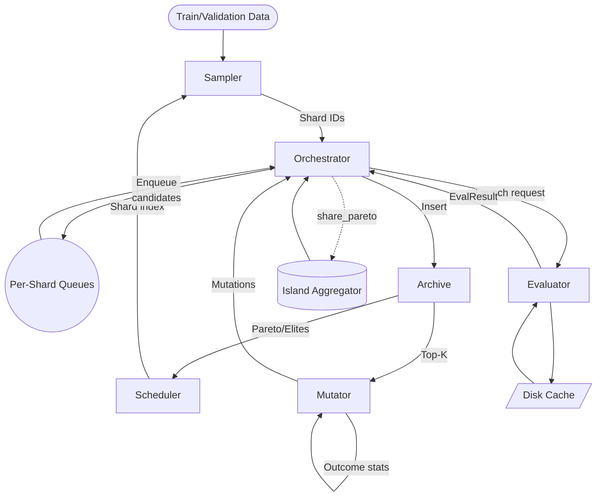
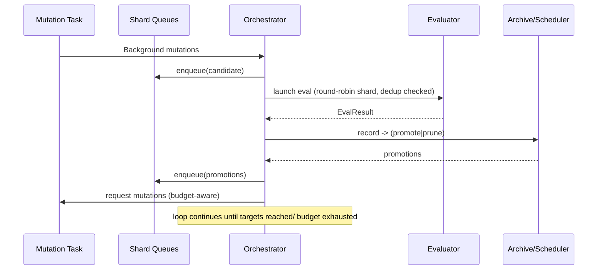

# TurboGEPA Optimization Pipeline

> The path TurboGEPA follows to evolve high-performing prompts in the shortest possible time. This document focuses on the streaming architecture and performance features we just built.

## 0. TL;DR

- TurboGEPA runs a fully streaming optimization loop: mutations are generated in the background while evaluations execute without batch barriers.
- A fingerprint-based work queue prevents duplicate launches while per-shard round-robin scheduling keeps ASHA fair and saturated.
- Operator credit, spec-induction caching, and adaptive mutation budgets keep LLM calls focused on promising edits.
- Multi-island runs share their current Pareto bests automatically so every island benefits from global discoveries.

## 1. High-Level Component Map



### How to read this diagram

- **Sampler**: selects example IDs per shard using random sampling + hardness hints.
- **Queue**: there is one FIFO queue per ASHA shard plus a global FIFO for capacity tracking.
- **Orchestrator**: owns the streaming loop, mutation budget, dedupe, and migration duties.
- **Evaluator**: executes shard evaluations with cache-assisted parallelism.
- **Mutator**: generates new prompts, leveraging operator credit and cached spec induction.
- **Archive/Scheduler**: Pareto frontier with asynchronous successive halving promotions.
- **IslandsAggregator**: fan-out/fan-in of prompts when running multiple islands.

## 2. Streaming Control Loop



Key features in the loop:

1. **Fingerprint dedupe** – `_pending_fingerprints` and `_inflight_fingerprints` ensure each prompt text/temperature pair is evaluated only once.
2. **Round-robin launch** – `_per_shard_queue` plus `_next_shard` prevent shallow shards from starving deeper shards.
3. **Adaptive mutation budget** – `_mutation_budget()` compares the ready queue to the concurrency window and skips generation when the queue is already full.
4. **Operator feedback** – `_ingest_result()` reports success/failure to the mutator, which adjusts future mutation mixes.

## 3. Detailed Component Notes

### 3.1 Configuration

- `eval_concurrency` – legacy knob, still used when you don’t override anything.
- `max_total_inflight` – **single global dial** for total concurrency; automatically split across shards.
- `max_mutations_per_round` – upper bound for mutations; the adaptive budget will never exceed it.
- `mutation_buffer_min` – how low the ready queue can get before the orchestrator spawns a new mutation task.

### 3.2 Orchestrator (`src/turbo_gepa/orchestrator.py`)

- Maintains per-shard queues and a global FIFO strictly for capacity accounting.
- `_stream_launch_ready` performs a bounded round-robin: one candidate per shard per rotation until all capacity is exhausted.
- `_stream_launch` increments shard and global inflight counters, launches the evaluation, and records the fingerprint in `_inflight_fingerprints`.
- `_stream_process_result` handles evaluator responses, updates archive/scheduler, requeues promotions, and releases dedupe locks.
- `_maybe_migrate` now shares the island’s current Pareto elite prompts via `share_pareto` so other islands can mutate them immediately.

### 3.3 Scheduler (`src/turbo_gepa/scheduler.py`)

- ASHA-style successive-halving with epsilon improvement tests.
- On promotion, the candidate’s prior rung history is cleared so thresholds reflect only current shard statistics.

### 3.4 Mutator (`src/turbo_gepa/mutator.py`)

- Provides incremental reflection, spec induction, and temperature exploration.
- Maintains `_operator_stats` with Laplace-smoothed win rates to bias budgets toward high-performing operators.
- `report_outcome()` gets called by the orchestrator after each evaluation to update stats.
- Caches spec-induction outputs per task example: repeated calls reuse responses from the task model, significantly reducing redundant LLM calls.

### 3.5 Evaluator (`src/turbo_gepa/evaluator.py`)

- Performs cache-assisted, concurrency-limited evaluations.
- Early-stop heuristic cancels lingering asynchronous calls once 90% of the shard is complete and slow stragglers exceed the variance buffer.

## 4. Runtime Enhancements

The current codebase includes several optimiser-friendly improvements:

1. **Shard-aware scheduling** – balanced shard launch capacity ensures shard 1.0 evaluations arrive promptly, accelerating promotions.
2. **Mutation budget on demand** – avoids flooding the queue when evaluations lag behind.
3. **Operator credit** – automatically favours mutation operators that historically produced Pareto winners in the current run.
4. **Spec-induction caching** – saves task-model calls when spec induction repeatedly targets the same example set.
5. **Fingerprint dedupe** – prevents wasted evaluations on identical prompts launched from multiple pathways.
6. **Cross-island share** – islands periodically push their best prompts back into their queues, letting peers build on the latest Pareto frontier.

## 5. Working With TurboGEPA

### 5.1 Running the AIME quick benchmark

```bash
uv run python examples/aime_turbo_benchmark.py --quick
```

This uses the speed configuration in `create_speed_config`, which now sets `max_total_inflight` automatically to match the CLI `--concurrency` choice.

### 5.2 Customising an optimisation run

```python
from turbo_gepa.config import Config

config = Config(
    shards=(0.3, 1.0),
    max_total_inflight=128,
    max_mutations_per_round=12,
    mutation_buffer_min=6,
    # ... other knobs ...
)

result = adapter.optimize(
    seeds=[seed_candidate],
    config=config,
    max_evaluations=200,
)
```

Key knobs to revisit for other domains:

- **`max_total_inflight`** – single dial for evaluator parallelism.
- **`max_mutations_per_round`** – keep this in sync with your LLM budget.
- **`migration_period`** and **`migration_k`** – how often and how many prompts you share across islands.

## 6. Extending TurboGEPA

Looking ahead, these are the next large levers:

1. **Dynamic reflection guidance** – derive structural hints from current Pareto prompts and feed them into reflection LLM calls.
2. **Confidence-weighted promotions** – run targeted re-checks on shard 1.0 promotions for high-variance benchmarks.
3. **Enhanced telemetry** – stream per-evaluation metrics to a live dashboard for faster human debugging.

## 7. File Map

| Path | Purpose |
|------|---------|
| `src/turbo_gepa/orchestrator.py` | Streaming control loop, dedupe, migration, mutation budget |
| `src/turbo_gepa/mutator.py` | Mutation strategies, operator credit, spec cache |
| `src/turbo_gepa/scheduler.py` | ASHA scheduler with rung cleanup |
| `src/turbo_gepa/sampler.py` | Random sampling + hardness queue |
| `src/turbo_gepa/evaluator.py` | Async evaluator with cache + early stop |
| `examples/aime_turbo_benchmark.py` | End-to-end benchmark harness |
| `tests/turbo_gepa/*` | Unit tests for scheduler, sampler, mutator |

## 8. Support

Questions? Drop into the Discord or file an issue. If you spot a performance regression, profiling the orchestrator’s launch loop (`_stream_launch_ready`) and the mutator’s spec-induction cache are great starting points.

