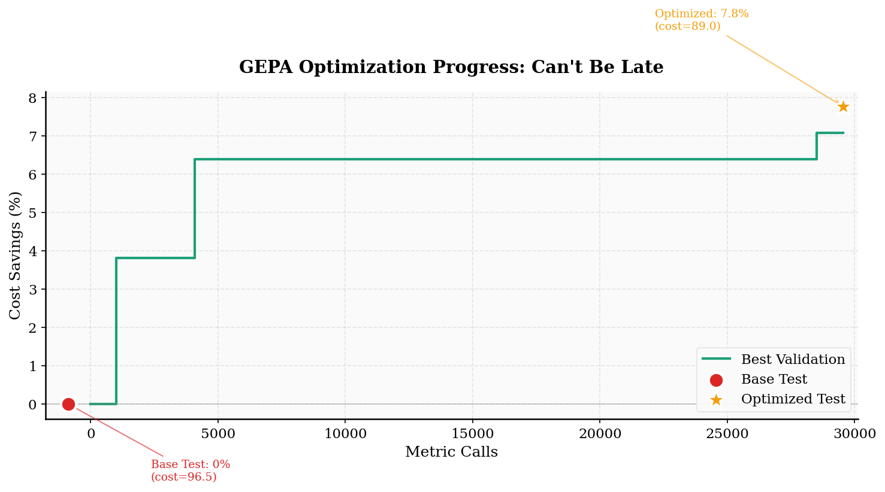
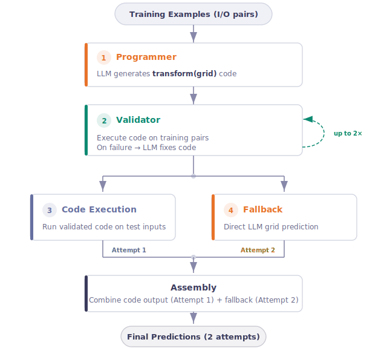
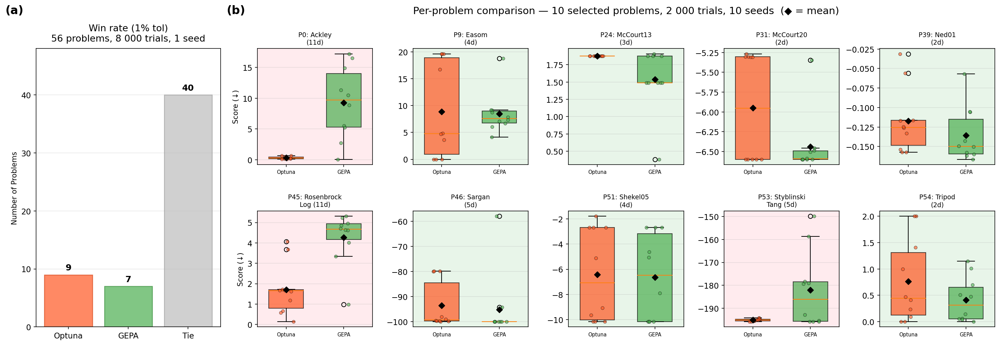

---
date:
  created: 2026-02-18
authors:
  - lakshya
  - donghyun
  - wenjie
  - karim
  - shangyin
  - sanjit
  - koushik
  - sewon
  - dan
  - ion
  - joey
  - omar
  - alex
  - matei
equal_contribution:
  - "Lakshya A Agrawal"
  - "Donghyun Lee"
slug: introducing-optimize-anything
readtime: 12
title: "optimize_anything: A Universal API for Text Optimization"
description: "A new API setting state-of-the-art results on optimizing code, prompts, agent architectures, and more: if you can measure it, you can optimize it."
---

# `optimize_anything`: A Universal API for Text Optimization

Today we are introducing **`optimize_anything`**, a declarative API that optimizes any artifact representable as text (code, prompts, agent architectures, vector graphics, configurations) using just two inputs: a **starting artifact** and an **evaluator**. You declare what to optimize and how to measure it; the system handles the search. Where prior LLM-evolution frameworks require configuring island topologies, prompt samplers, and multi-component pipelines, `optimize_anything` strips the interface down to its essence. We've tested it across [several domains](#results) from code optimization to agent architecture discovery and it consistently matches or outperforms domain-specific tools, including some purpose-built for each task. As models and search techniques advance, the search improves without changing your code. If you can measure it, you can optimize it.

<!-- more -->

While recent systems like AlphaEvolve, OpenEvolve, and ShinkaEvolve have demonstrated the power of LLM-guided search for algorithm discovery, they operate exclusively in single-task mode, optimizing one problem at a time with no built-in support for batch optimization or generalization. `optimize_anything` unifies **three optimization modes** (single-task search, multi-task search, and generalization) under one declarative API, enabling optimization tasks that prior frameworks cannot directly express: [discovering agent architectures from scratch](#5-agent-architecture-discovery-arc-agi), [learning prompts that generalize to unseen examples](#4-prompt-optimization-aime-mathematics), and [optimizing coding agent skills that transfer across models](#7-coding-agent-skills-learning-skills-for-any-repository).

<figure markdown="span">
  
  <figcaption>The optimize_anything loop: evaluate a text artifact, capture diagnostic feedback (ASI), and use an LLM to propose targeted improvements.</figcaption>
</figure>

## If You Can Write It, You Can Optimize It

The key insight behind `optimize_anything` is that a surprisingly wide range of problems can be formulated as optimizing a text artifact. Consider:

- **Code**: CUDA kernels, scheduling algorithms, solver implementations, all of which are text that can be evaluated by execution.
- **Prompts**: System prompts, prompt templates, multi-step prompts, all evaluated by running them against a dataset.
- **Agent architectures**: The entire agent system, including its prompts, sub-agents, control flow, and orchestration logic.
- **Configurations**: Hyperparameters, policies, and decision rules can be serialized as JSON strings and evaluated by simulation.
- **Agent Skills**: Repository-specific instructions and best practices for coding agents, evaluated by running the agent on real tasks from the codebase.

If an artifact can be serialized to text and its performance can be measured, an LLM can reason about it and propose improvements. `optimize_anything` provides a unified API to make this loop easier to set up.


## The `optimize_anything` API

### The Simplest Form

At its core, the API requires just two things: a starting artifact and an evaluator.

```python
import gepa.optimize_anything as oa

def evaluate(candidate: str) -> float:
    score, diagnostic = run_my_system(candidate)
    print(f"Error: {diagnostic}")  # captured automatically as ASI
    return score

result = oa.optimize_anything(
    seed_candidate="<your initial artifact>",
    evaluator=evaluate,
)
print(result.best_candidate)
```

That's it. The evaluator takes a candidate string and returns a score (higher is better). Any `print()` statements inside the evaluator are automatically captured as **Actionable Side Information (ASI)** to be used as diagnostic feedback that the LLM proposer reads during reflection. You can also use `oa.log()` for explicit logging, or return structured diagnostic information as a dictionary:

```python
def evaluate(candidate: str) -> tuple[float, dict]:
    result = execute_code(candidate)
    return result.score, {
        "Error": result.stderr,
        "Output": result.stdout,
        "Runtime": f"{result.time_ms:.1f}ms",
    }
```

ASI can be text, structured data, or even **images** (via `gepa.Image`) for vision-capable LLMs; anything that would help an expert diagnose a failure. [More on why this matters below.](#from-evolution-to-intelligent-design)

### One Interface, Three Optimization Modes

`optimize_anything` unifies three distinct optimization paradigms under one API, determined by whether you provide a `dataset` and `valset`:

<figure markdown="span">
  
  <figcaption>The three optimization modes: single-task search, multi-task search, and generalization.</figcaption>
</figure>

**1. Single-Task Search**: "Solve one hard problem." No dataset needed; the candidate *is* the solution, and the evaluator scores it directly (no `example` argument). For example, in [circle packing](#1-circle-packing-outperforming-alphaevolve), the artifact is the packing algorithm code and the evaluator returns the score plus geometric diagnostics as ASI. This is the mode that prior LLM-evolution frameworks operate in.

```python
oa.optimize_anything(seed_candidate=..., evaluator=...)
```

**2. Multi-Task Search**: "Solve a batch of related problems with cross-transfer." You provide a `dataset` of related tasks; insights from solving one help solve the others. For example, in [CUDA kernel generation](#2-cuda-kernel-generation-kernelbench), each task is a PyTorch operation to accelerate on the same hardware, and the evaluator compiles and benchmarks the kernel returning compiler errors and profiler traces as ASI. On KernelBench, multi-task mode converges faster and solves more problems across all speedup thresholds than dedicated single-task optimization of each problem.

```python
oa.optimize_anything(seed_candidate=..., evaluator=..., dataset=tasks)
```

**3. Generalization**: "Build a skill that transfers to unseen problems." You provide both a training `dataset` and a held-out `valset`; the optimized artifact (a prompt, an agent, a policy) must generalize to unseen examples. This abstracts over traditional machine learning and program synthesis. For example, in [agent architecture discovery](#5-agent-architecture-discovery-arc-agi), the artifact is the entire agent, the dataset and valset are ARC-AGI puzzles, and the evaluator runs the agent and returns its errors as ASI. The optimized agent improves from 32.5% to 89.5% on test-set (+57 percentage points).

```python
oa.optimize_anything(seed_candidate=..., evaluator=..., dataset=train, valset=val)
```

The full API signature:

```python
def optimize_anything(
    seed_candidate: str | dict[str, str],   # Starting artifact
    evaluator: Callable,                    # Score + ASI
    dataset: list | None = None,            # Training examples (modes 2 & 3)
    valset: list | None = None,             # Validation set (mode 3)
    objective: str | None = None,           # What to optimize for (natural language)
    background: str | None = None,          # Domain knowledge and constraints
    config: GEPAConfig | None = None,       # Engine, reflection, tracking settings
) -> GEPAResult
```

Notice what's *absent*: no mutation prompts, no task-specific instruction templates, no island configurations, no EVOLVE-BLOCK markers (all common in prior LLM-evolution frameworks). You declare the **what** (your artifact, your evaluator, and any domain knowledge as `background`) and `optimize_anything` handles the **how**: prompt construction, reflection, candidate selection, and search strategy. This declarative design, inspired by [DSPy](https://github.com/stanfordnlp/dspy)'s principle of *programming not prompting*, means the same API call works whether you're optimizing a CUDA kernel, a cloud scheduling policy, or an agent architecture.

### The Pareto Insight

In multi-task and generalization modes, `optimize_anything` leverages GEPA's core algorithmic insight: **Pareto-efficient search**. Rather than asking the LLM to improve *all* metrics simultaneously, each reflection step focuses on improving a specific subset of metrics or examples. Over multiple iterations, different subsets are selected (a minibatch of 2-3 examples or objectives at a time) and the proposer can focus its effort. This cycling through subsets, combined with Pareto-efficient selection that preserves candidates that excel on different axes, consistently outperforms naive all-at-once optimization. We'll see this concretely in the [SVG demo below](#lets-take-it-for-a-spin), where the optimization focuses each step on improving just 2 of 6 visual aspects.

But Pareto search is only half the story. It determines *which* feedback to show the proposer; the other half is making that feedback rich enough to act on.

## From Evolution to Intelligent Design

Classical optimization methods (gradient descent, evolutionary strategies, Bayesian optimization) reduce all diagnostic context to a single scalar. They know *that* a candidate failed, but not *why*. You can't show a Bayesian optimizer the compiler error that explains exactly which line crashed. All domain-specific diagnostic context (compiler errors, profiling traces, constraint violation details) is discarded.

Prior LLM-evolution frameworks including AlphaEvolve, ShinkaEvolve, and OpenEvolve innovate on the evolutionary algorithm itself: how to select parents, how to partition populations into islands, how to balance exploration and exploitation. They also use LLMs as proposers and feed execution results back into the loop: ShinkaEvolve stores textual feedback from the environment and passes it to the LLM during mutation; AlphaEvolve feeds evaluation metrics and code context back into its pipeline. These systems have achieved impressive results.

But in each of them, the feedback mechanism is an **internal implementation detail** baked into the framework. The user doesn't design the diagnostic signal, instead the framework decides what to show the proposer. In AlphaEvolve, for instance, the framework automatically extracts code context and evaluation metrics; the user cannot inject a custom profiler trace or a rendered image into the proposer's feedback loop. The interface between evaluator and proposer is still a score, plus whatever context the framework happens to extract.

`optimize_anything` takes a different approach: ASI is a **first-class part of the evaluator contract** that *you* design. Because you understand your domain, you can surface exactly the diagnostics that matter: a stack trace for a crashing program, a profiler breakdown for a slow kernel, a dictionary of constraint violations for circle packing, or the rendered image of a malformed SVG so a VLM can visually inspect its own output. During a **dedicated reflection step**, the proposer reasons about *why* specific candidates succeeded or failed, then proposes targeted improvements grounded in that explanation.

<figure>
  <div style="width:100%; max-width:800px; margin:0 auto; position:relative; padding-bottom:61.25%; height:0; overflow:hidden;">
    <iframe src="/static/diagrams/side_info_diagram.html" scrolling="no" style="position:absolute; top:0; left:0; width:100%; height:100%; border:none;"></iframe>
  </div>
  <figcaption>ASI is the text-optimization analogue of the gradient. Where gradients tell a numerical optimizer which direction to move, ASI tells an LLM proposer why a candidate failed and how to fix it.</figcaption>
</figure>

Prior frameworks frame the process as *evolution*: mutate, evaluate, select, repeat. The LLM is a smarter mutation operator, but the loop is fundamentally Darwinian. With rich, user-designed diagnostics, the proposer becomes a **designer**: it reads the feedback, diagnoses the problem, and proposes targeted fixes. That's not evolution, it's **Intelligent Design**.

**Evolution (blind):** "Change a parameter and hope the score goes up."

**Intelligent Design (ASI):** "The agent failed because it called `search_api()` which doesn't exist. I will rewrite the system prompt to restrict tools to the provided schema."

## Let's Take It for a Spin

Let's use `optimize_anything` to optimize SVG source code depicting "a pelican riding a bicycle" starting from a blank white canvas. The evaluator renders the SVG as a PNG, asks a VLM to score it against visual criteria, and passes the rendered image back as ASI so the proposer can literally *see* what it's improving. After exploring just 12 candidates, here's the zero-shot baseline versus the best optimized result:

<div style="display: flex; align-items: center; justify-content: center; gap: 1rem;" markdown>
<div style="flex: 1; text-align: center; min-width: 0;" markdown>

{ style="width: 100%;" }

<div style="margin: 0.5rem 0 0; max-width: none; width: 100%;"><em>Zero-shot attempt from Gemini 3 Flash</em></div>

</div>
<div style="flex: 1; text-align: center; min-width: 0;" markdown>

{ style="width: 100%;" }

<div style="margin: 0.5rem 0 0; max-width: none; width: 100%;"><em>Best candidate (score: 0.825)</em></div>

</div>
</div>

*The optimizer added background elements, improved anatomy, increased the sophistication of all visual elements, and refined the composition — all through LLM reflection on rendered image feedback. Claude Opus 4.6 as the proposer produces similar results after exploring 20 candidates:*

<div style="display: flex; align-items: center; justify-content: center; gap: 1rem;" markdown>
<div style="flex: 1; text-align: center; min-width: 0;" markdown>

{ style="width: 100%;" }

<div style="margin: 0.5rem 0 0; max-width: none; width: 100%;"><em>Zero-shot attempt from Claude Opus 4.6</em></div>

</div>
<div style="flex: 1; text-align: center; min-width: 0;" markdown>

{ style="width: 100%;" }

<div style="margin: 0.5rem 0 0; max-width: none; width: 100%;"><em>Best candidate (score: 0.817)</em></div>

</div>
</div>

Notably, we optimize the SVG code itself, not a prompt that generates SVG. Here's the code.

First, we define our evaluator and the visual aspects we'd like it to grade for:

```python title="Defining the evaluator"
from gepa import Image
from demo_utils import render_image, get_vlm_score_feedback

GOAL = "a pelican riding a bicycle"
VLM = "vertex_ai/gemini-3-flash-preview"

def evaluate(candidate, example):
    """Render SVG → image, score with a VLM, return (score, side_info)."""
    image = render_image(candidate["svg_code"]) # via cairosvg
    score, feedback = get_vlm_score_feedback(VLM, image, example["criteria"]) # simple regex parser

    return score, {
        "RenderedSVG": Image(base64_data=image, media_type="image/png"),
        "Feedback": feedback,
    }

VISUAL_ASPECTS = [
    # 6 visual aspects → Pareto-efficient selection
    {"id": "overall",     "criteria": f"Rate overall quality of this SVG ({GOAL}). SCORE: X/10"},
    {"id": "anatomy",     "criteria": "Rate pelican accuracy: beak, pouch, plumage. SCORE: X/10"},
    {"id": "bicycle",     "criteria": "Rate bicycle: wheels, frame, handlebars, pedals. SCORE: X/10"},
    {"id": "composition", "criteria": "Rate how convincingly the pelican rides the bicycle. SCORE: X/10"},
    {"id": "visual",      "criteria": "Rate visual appeal, scenery, and color usage. SCORE: X/10"},
    {"id": "craft",       "criteria": "Rate SVG technical quality: shapes, layering. SCORE: X/10"},
]
```

Then, we put it all together and run `optimize_anything`:
```python title="Running optimize_anything"
from gepa.optimize_anything import (
    optimize_anything, GEPAConfig, EngineConfig, ReflectionConfig,
)

result = optimize_anything(
    seed_candidate={"svg_code": open("seed.svg").read()}, # a plain white canvas
    evaluator=evaluate,
    dataset=VISUAL_ASPECTS,
    objective=f"Optimize SVG code to illustrate '{GOAL}'. Output ONLY valid SVG.",
    config=GEPAConfig(
        engine=EngineConfig(max_metric_calls=150),
        reflection=ReflectionConfig(reflection_lm=VLM),
    ),
)
print(result.best_candidate)
```

A few things to note:

- The **`dataset`** contains 6 evaluation aspects. GEPA calls the evaluator once per aspect per candidate, tracking scores individually. This enables Pareto-efficient selection: a candidate that excels at bicycle structure but struggles with pelican anatomy is preserved on the frontier, not discarded behind a mediocre average.
- Our desired visual aspects are defined in concise natural language. We avoid the need for detailed rubrics and simply rely on the VLM's judgment for scoring.
- **`reflection_minibatch_size=2`** (the default) means each reflection step shows the LLM feedback from just 2 of the 6 aspects. Over multiple iterations, all aspects get attention, but each reflection is focused and targeted.
- The **rendered image** is passed as ASI via `Image(base64_data=...)`, giving the VLM proposer visual feedback on its own output. The VLM evaluator never sees the SVG code, only the rendered image. The proposer sees both the feedback and the source SVG, and proposes targeted improvements.

??? example "Final optimized candidate by Gemini 3 Flash"
    ```xml
    <svg xmlns="http://www.w3.org/2000/svg" viewBox="0 0 1280 1280">
        <!-- Background: Sky and distant scenery -->
        <rect width="1280" height="1280" fill="#bbdefb"/>
        
        <!-- Stylized Sun -->
        <circle cx="1100" cy="180" r="80" fill="#fff9c4" opacity="0.8"/>
        
        <!-- Stylized Mountains/Hills for depth -->
        <path d="M0 900 L300 700 L600 850 L900 650 L1280 900 Z" fill="#90caf9" opacity="0.5"/>
        
        <!-- Road and Ground -->
        <rect x="0" y="900" width="1280" height="380" fill="#455a64"/>
        <rect x="0" y="900" width="1280" height="30" fill="#37474f"/>
        <line x1="0" y1="1120" x2="1280" y2="1120" stroke="white" stroke-width="12" stroke-dasharray="100,50" opacity="0.6"/>

        <!-- Bicycle Components -->
        <!-- Rear Wheel -->
        <g transform="translate(400, 950)">
            <circle r="170" fill="#212121"/>
            <circle r="145" fill="#f5f5f5"/>
            <g stroke="#bdbdbd" stroke-width="3">
            <line x1="-145" y1="0" x2="145" y2="0" transform="rotate(0)"/>
            <line x1="-145" y1="0" x2="145" y2="0" transform="rotate(30)"/>
            <line x1="-145" y1="0" x2="145" y2="0" transform="rotate(60)"/>
            <line x1="-145" y1="0" x2="145" y2="0" transform="rotate(90)"/>
            <line x1="-145" y1="0" x2="145" y2="0" transform="rotate(120)"/>
            <line x1="-145" y1="0" x2="145" y2="0" transform="rotate(150)"/>
            </g>
            <circle r="30" fill="#757575"/>
        </g>

        <!-- Front Wheel -->
        <g transform="translate(880, 950)">
            <circle r="170" fill="#212121"/>
            <circle r="145" fill="#f5f5f5"/>
            <g stroke="#bdbdbd" stroke-width="3">
            <line x1="-145" y1="0" x2="145" y2="0" transform="rotate(15)"/>
            <line x1="-145" y1="0" x2="145" y2="0" transform="rotate(45)"/>
            <line x1="-145" y1="0" x2="145" y2="0" transform="rotate(75)"/>
            <line x1="-145" y1="0" x2="145" y2="0" transform="rotate(105)"/>
            <line x1="-145" y1="0" x2="145" y2="0" transform="rotate(135)"/>
            <line x1="-145" y1="0" x2="145" y2="0" transform="rotate(165)"/>
            </g>
            <circle r="30" fill="#757575"/>
        </g>

        <!-- Chain and Gear -->
        <circle cx="620" cy="950" r="50" fill="#263238"/>
        <path d="M400 930 L620 910 L620 990 L400 970 Z" fill="#37474f" opacity="0.9"/>

        <!-- Bicycle Frame (Red) -->
        <g stroke="#c62828" stroke-width="28" fill="none" stroke-linejoin="round" stroke-linecap="round">
            <line x1="400" y1="950" x2="620" y2="950"/> <!-- Chainstay -->
            <line x1="620" y1="950" x2="550" y2="620"/> <!-- Seat Tube -->
            <line x1="620" y1="950" x2="820" y2="660"/> <!-- Down Tube -->
            <line x1="560" y1="660" x2="820" y2="660"/> <!-- Top Tube -->
            <line x1="400" y1="950" x2="560" y2="660"/> <!-- Seat Stay -->
            <line x1="880" y1="950" x2="820" y2="660"/> <!-- Fork -->
        </g>

        <!-- Handlebars and Seat -->
        <path d="M820 660 L840 570 M780 580 L890 580" fill="none" stroke="#212121" stroke-width="22" stroke-linecap="round"/>
        <path d="M510 620 L600 620" stroke="#212121" stroke-width="35" stroke-linecap="round"/>

        <!-- Pelican (The Rider) -->
        <!-- Far Leg (hidden/subtle) -->
        <path d="M560 600 L660 880 L690 950" fill="none" stroke="#ef6c00" stroke-width="12" stroke-linecap="round" opacity="0.4"/>
        
        <!-- Pelican Body -->
        <ellipse cx="560" cy="480" rx="220" ry="140" fill="white" stroke="#eceff1" stroke-width="2"/>
        
        <!-- Neck and Head -->
        <path d="M730 460 Q850 460 830 250" fill="none" stroke="white" stroke-width="75" stroke-linecap="round"/>
        <circle cx="830" cy="250" r="60" fill="white"/>
        <circle cx="855" cy="230" r="8" fill="#212121"/>
        
        <!-- Beak (Characteristic pouch) -->
        <path d="M865 220 L1150 270 Q1100 500 865 380 Z" fill="#ffa726"/>
        <path d="M865 220 L1130 275" fill="none" stroke="#f57c00" stroke-width="5"/>
        
        <!-- Wing (Arm reaching for handlebars) -->
        <path d="M620 480 Q760 480 830 580" fill="none" stroke="white" stroke-width="50" stroke-linecap="round" stroke-linejoin="round"/>

        <!-- Near Leg (Pedaling) -->
        <g>
            <path d="M560 600 L620 950" fill="none" stroke="#fb8c00" stroke-width="24" stroke-linecap="round"/>
            <rect x="570" y="935" width="110" height="30" rx="10" fill="#212121"/>
        </g>

        <!-- Motion and Polish -->
        <g stroke="white" stroke-width="6" stroke-linecap="round" opacity="0.4">
            <line x1="200" y1="350" x2="50" y2="350"/>
            <line x1="250" y1="420" x2="80" y2="420"/>
            <line x1="180" y1="500" x2="40" y2="500"/>
        </g>
        <g stroke="#90a4ae" stroke-width="5" stroke-linecap="round" opacity="0.5">
            <line x1="1050" y1="980" x2="1180" y2="980"/>
            <line x1="1080" y1="1040" x2="1220" y2="1040"/>
        </g>
        </svg>
    ```


## Results

`optimize_anything` beats AlphaEvolve at circle packing, evolves a 10-line agent stub into a 300+ line system that nearly triples its test accuracy on ARC-AGI, discovers novel cloud scheduling algorithms, and matches Optuna (a mature numerical optimizer) by generating solver code from scratch. We test across seven domains spanning search, batch optimization, and generalization. Each section below walks through the setup and links to [full, runnable code](#appendix-case-study-code).

### 1. Circle Packing: Outperforming AlphaEvolve

**Mode: Single-Task Search.** Pack n=26 circles to maximize the sum of their radii within a unit square. GEPA optimizes the packing algorithm code, using execution results and geometric diagnostics as ASI.

<figure markdown="span">
  
  <figcaption>GEPA outperforms AlphaEvolve, ShinkaEvolve, and OpenEvolve on circle packing (n=26), reaching a higher score with fewer evaluations.</figcaption>
</figure>

<figure markdown="span">
  
  <figcaption>Visual progression of the circle packing optimization: from an initial naive arrangement to a near-optimal packing.</figcaption>
</figure>

**Key result:** GEPA outperforms all three open-source LLM-evolution frameworks, reaching a score of 2.63598+. [Full code →](#appendix-b-circle-packing)

### 2. CUDA Kernel Generation (KernelBench)

**Mode: Multi-Task Search.** We generate fast CUDA kernels for multiple reference PyTorch operations from [KernelBench](https://github.com/ScalingIntelligence/KernelBench), evaluated on a V100 32 GB GPU. Under the hood, GEPA evolves the prompt that drives kernel generation, so improvements discovered for one problem transfer to others automatically.

<figure markdown="span">
  
  <figcaption>KernelBench results with GEPA (gpt-5 as proposer). 87% of generated kernels match or beat baseline performance; 25% are 20%+ faster. We use 31 of the 35 hand-curated problems from the KernelBench authors.<a href="#fn-kernelbench" class="fn-ref" id="fn-ref-kernelbench"><sup>1</sup></a></figcaption>
</figure>

To gauge the effectiveness of cross-task learning, we take the 10 problems where multi-task mode performed best and re-optimize each from scratch in single-task mode to see whether a dedicated single-task run can beat the multi-task result. The graph below shows that a multi-task mode converges faster and solves more problems across all speedup thresholds.

<figure markdown="span">
  
  <figcaption>Single-task vs multi-task mode on 10 KernelBench problems. </figcaption>
</figure>

**Key result:** 87% of GEPA-generated kernels match or beat the baseline, with 25% achieving 20%+ speedups. Multi-task mode outperforms dedicated single-task search modes, suggesting the efficiency of cross-task learning. [Full code →](#appendix-c-cuda-kernel-generation)


### 3. AI-Driven Systems Research: CloudCast & Can't Be Late

**Mode: Generalization.** We optimize cloud infrastructure algorithms: **CloudCast** discovers broadcast routing strategies for multi-cloud data transfer (minimizing egress cost), and **Can't Be Late** learns scheduling policies that decide when to use cheap-but-preemptible SPOT instances versus reliable ON_DEMAND instances to complete tasks before deadlines.

<div style="display: flex; align-items: flex-start; justify-content: center; gap: 1rem;" markdown>
<div style="flex: 1; text-align: center; min-width: 0;" markdown>

{ style="width: 100%;" }

<div style="margin: 0.5rem 0 0;"><em><strong>CloudCast (40.2% cost savings):</strong> Optimizes from baseline Dijkstra routing to a provider-aware Steiner tree algorithm with Pareto-frontier candidate selection.</em></div>

</div>
<div style="flex: 1; text-align: center; min-width: 0;" markdown>

{ style="width: 100%;" }

<div style="margin: 0.5rem 0 0;"><em><strong>Can't Be Late (7.8% cost savings):</strong> Optimizes from a simple deadline-check heuristic to an adaptive scheduling strategy that tracks spot availability patterns and computes break-even switching costs.</em></div>

</div>
</div>

**Key result:** `optimize_anything` discovers state-of-the-art algorithms for both problems (40.2% cost savings on CloudCast and 7.8% cost savings on Can't Be Late), outperforming hand-designed heuristics. [CloudCast code →](#appendix-d-cloudcast) | [Can't Be Late code →](#appendix-d2-cant-be-late)

### 4. Prompt Optimization: AIME Mathematics

**Mode: Generalization.** We optimize a system prompt for gpt-4.1-mini by *training* on [AIME](https://en.wikipedia.org/wiki/American_Invitational_Mathematics_Examination) 2022–2024 math competition problems and *testing* on AIME 2025. GEPA is the [state-of-the-art prompt optimization algorithm](https://gepa-ai.github.io/gepa/).

<figure markdown="span">
  
  <figcaption>AIME 2025 prompt optimization: gpt-4.1-mini accuracy improves from 46.67% to 60.00% through prompt refinement alone.</figcaption>
</figure>

**Key result:** Pure prompt optimization improves gpt-4.1-mini from 46.67% to **60.00%** on AIME 2025, a 13.3 percentage point gain from changing only the system prompt. [Full code →](#appendix-e-aime-prompt-optimization)

### 5. Agent Architecture Discovery: ARC-AGI

**Mode: Generalization.** This is the most ambitious application. Rather than optimizing a prompt, we optimize the **entire agent**: its code, sub-agent architecture, control flow, helper functions, and prompts, all treated as a single text artifact. The seed is a 10-line naive agent; GEPA evolves it into a 300+ line system with rule induction, code verification, iterative refinement, and structured fallbacks.

<figure markdown="span">
  
  <figcaption>ARC-AGI agent evolution: from a naive agent (32.5% test) to a sophisticated 300+ line system (89.5% test) with Gemini 3 Flash.</figcaption>
</figure>

<figure markdown="span">
  
  <figcaption>The optimized ARC-AGI agent architecture with a multi-stage pipeline with code generation, iterative validation, and dual-path prediction</figcaption>
</figure>

**Key result:** Using the same underlying model (Gemini 3 Flash), `optimize_anything` improves ARC-AGI v1 public test accuracy from 32.5% to **89.5%** by evolving the entire agent architecture, achieving gains that typically require significant manual iteration. [Full code →](#appendix-f-arc-agi-agent-architecture-discovery)
### 6. Blackbox Mathematical Optimization: Matching Optuna

**Mode: Single-Task Search.** Given a blackbox objective function, `optimize_anything` discovers an optimization algorithm tailored to it and matches [Optuna](https://optuna.org/), the industry-standard blackbox optimizer, across the 56-problem [EvalSet](https://github.com/sigopt/evalset) benchmark.

<figure markdown="span" style="margin: 0 auto;">
  
  <figcaption>GEPA's optimize_anything matches Optuna, the industry-standard blackbox optimizer, on the EvalSet benchmark. (a) Across all 56 EvalSet problems (budget of 8,000 evaluations each), GEPA ties Optuna on 40, wins 7, and loses 9. (b) On 10 selected problems where Optuna struggles (budget of 2,000 evaluations each), GEPA finds better solutions on 7 out of 10.</figcaption>
</figure>

On the 56-problem evalset benchmark with large budgets, GEPA and Optuna tie on most problems. But on the hardest problems with lower budgets where Optuna struggles, an interesting pattern emerges: Optuna's fixed TPE-CMA-ES pipeline fails in predictable, structural ways. On McCourt13, all 10 independent Optuna runs converge to the same local minimum because TPE's independent per-dimension sampling always falls into the dominant trap basin. On Tripod, CMA-ES assumes a smooth, unimodal landscape, but the objective is piecewise-linear with hard discontinuities, so it converges to the wrong basin and cannot escape.

GEPA tailors the solver to each problem by learning from accumulated evaluation history. For boundary optima, it discovers L-BFGS-B, a box-constrained optimizer that naturally sticks to boundaries. For deceptive traps, it designs multi-start search from diverse starting points, escaping basins that trap single-trajectory methods. While Optuna tunes parameters within a fixed algorithm, GEPA learns to optimize the algorithm itself on the fly.

**Key result:** `optimize_anything` matches the performance of Optuna, a mature numerical optimizer, by optimizing a blackbox search program tailored to each problem. [Full code →](#appendix-a-blackbox-mathematical-optimization)

### 7. Coding Agent Skills: Learning Skills for Any Repository

**Mode: Generalization.** Skills (natural-language instructions and best practices for working with a specific codebase) are text artifacts too. `optimize_anything` can optimize them: the evaluator runs a coding agent on real tasks from the repository and scores whether it resolves them; the optimized skills must generalize to unseen tasks.

The results are striking: GEPA-optimized skills boost resolve rates from 24% to **93%** on one repository and from 55% to **82%** on another, and transfer directly to Claude Code, pushing it to near-perfect pass rates while also reducing task duration.

**Key result:** `optimize_anything` learns repository-specific skills that dramatically improve coding agent performance and transfer across models. [Read the full post →](../learning-skills-for-any-repository/)


## Conclusion & Getting Started

`optimize_anything` makes a simple bet: if your artifact is text and its performance can be measured, you can optimize it. The API is minimal, requiring only a seed, an evaluator, and optionally a dataset. The results span algorithmic discovery, kernel generation, systems research, prompt tuning, agent architecture search, blackbox optimization, and coding agent skill learning.

The key ideas: (1) **three unified modes** (single-task search, multi-task search, and generalization) under one declarative API; (2) **Actionable Side Information (ASI)** as a first-class API concept that turns the optimizer from a blind mutator into an intelligent designer; (3) **Pareto-efficient search** across metrics and examples that outperforms naive all-at-once optimization.

Get started:

```bash
pip install gepa
```

```python
import gepa.optimize_anything as oa

result = oa.optimize_anything(
    seed_candidate="<your artifact>",
    evaluator=your_evaluator,
)
```

- [Documentation](https://gepa-ai.github.io/gepa/)
- [GitHub](https://github.com/gepa-ai/gepa)
- [Discord](https://discord.gg/A7dABbtmFw) 
<!-- (@luke: the discord link leads to a dspy channle. is this correct? ) -->

---

## Appendix: Detailed Code Walkthroughs for each Case Study {#appendix-case-study-code}

<div class="appendix-tiles" markdown>

--8<-- "docs/blog/posts/2026-02-18-introducing-optimize-anything/appendix/appendix-b-circle-packing.snippet"

--8<-- "docs/blog/posts/2026-02-18-introducing-optimize-anything/appendix/appendix-c-cuda-kernel-generation.snippet"

--8<-- "docs/blog/posts/2026-02-18-introducing-optimize-anything/appendix/appendix-d-cloudcast.snippet"

--8<-- "docs/blog/posts/2026-02-18-introducing-optimize-anything/appendix/appendix-d2-cant-be-late.snippet"

--8<-- "docs/blog/posts/2026-02-18-introducing-optimize-anything/appendix/appendix-e-aime-prompt-optimization.snippet"

--8<-- "docs/blog/posts/2026-02-18-introducing-optimize-anything/appendix/appendix-f-arc-agi-agent-architecture-discovery.snippet"

--8<-- "docs/blog/posts/2026-02-18-introducing-optimize-anything/appendix/appendix-a-blackbox-mathematical-optimization.snippet"

</div>
