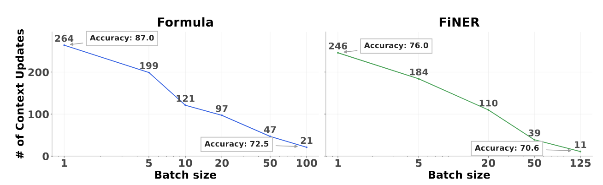
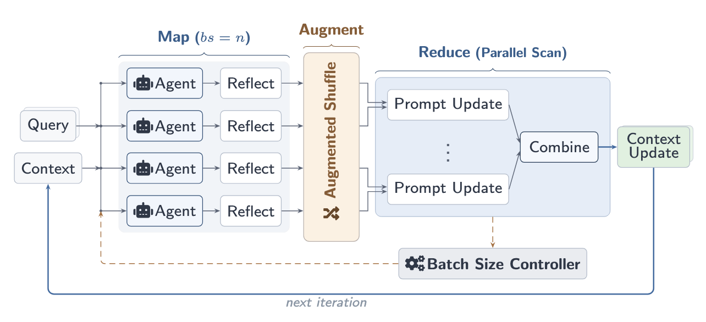
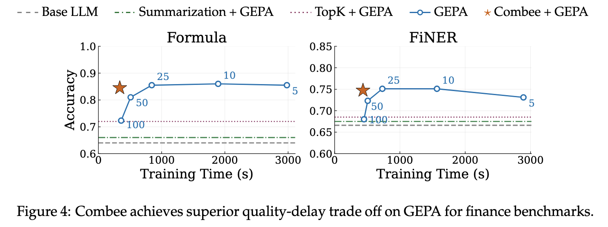
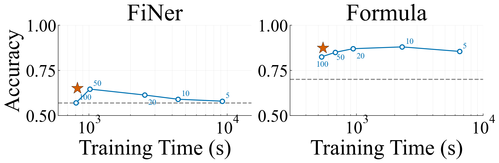

---
date:
  created: 2026-04-09
authors:
  - hanchen
  - runyuan
  - qizheng
  - changxiu
  - qiuyang
  - xiaokun
  - lakshya
  - weiliang
  - eric
  - alvin
  - james
  - kunle
  - ion
  - joey
equal_contribution:
  - "Hanchen Li"
  - "Runyuan He"
slug: gepa-at-scale-with-combee
readtime: 10
title: "Scaling GEPA with Combee: Parallel Prompt Learning for Self-Improving Agents"
description: "Exploring how to scale GEPA's prompt learning across many parallel agents using the Combee framework, achieving up to 17× speedup with no quality loss."
citation_authors:
  - "Hanchen Li"
  - "Runyuan He"
  - "Qizheng Zhang"
  - "Changxiu Ji"
  - "Qiuyang Mang"
  - "Xiaokun Chen"
  - "Lakshya A Agrawal"
  - "Wei-Liang Liao"
  - "Eric Yang"
  - "Alvin Cheung"
  - "James Zou"
  - "Kunle Olukotun"
  - "Ion Stoica"
  - "Joseph E. Gonzalez"
citation_technical_report_institution: "UC Berkeley, Stanford University"
citation_keywords: "prompt learning, parallel agents, context learning, scalable optimization, GEPA, Combee, self-improving agents"
---

# Scaling GEPA with Combee: Parallel Prompt Learning for Self-Improving Agents

GEPA's `optimize_anything` API lets you optimize any text artifact — prompts, code, agent architectures — by running agents, reflecting on their traces, and proposing improvements. But what happens when you want to learn from *many* agents in parallel?

As AI agents are increasingly deployed at scale, they interact with environments and generate vast amounts of traces. To continuously improve these agents, sequentially processing each trace becomes a severe bottleneck. GEPA processes three traces per batch by default, which causes it to spend hours for training on large datasets. It is essential to scale prompt learning for real-world deployments: it drastically reduces the training time required to update an agent's instructions, enables rapid iteration cycles, and allows the system to adapt to new scenarios almost instantly. 

However, scaling prompt learning to high parallelism introduces new challenges around information retention. Naively increasing GEPA's batch size leads to **context overload**, where the aggregator LLM cannot effectively distill the high-value insights from a large number of reflections. To address this, we leverage **Combee**, a framework that scales GEPA's prompt learning loop to high parallelism. Combee enables many agents to learn concurrently and consolidate their experience without quality degradation — achieving **up to 17× speedup** over default low-batch baselines while matching or exceeding their accuracy, all with similar costs. 

<!-- more -->

## The Problem: Context Overload

GEPA's prompt update (new candidate generation) loop is simple: run an agent, reflect on the trace, update the prompt. This works wonderfully in small batches — but it becomes a bottleneck as systems scale. Modern agentic deployments routinely spawn dozens of parallel agents to handle diverse tasks concurrently. If these agents discover 300 new, interesting edge cases, updating their centralized instructions with small batch sizes would require more than 100 iterations of candidate generation. Parallel prompt learning circumvents this latency trap, compressing the agent's knowledge acquisition phase so it can match the speed of data generation.

The naive approach to handle this parallelism is straightforward: increase the batch size of reflections fed to the aggregator LLM. But this fails in practice due to what we call **context overload**. When the aggregator must distill many reflections at once, it performs lossy compression — retaining broad, generic patterns while discarding the specific, high-value insights that drive downstream performance.



The degradation is dramatic. On the Formula financial reasoning benchmark, scaling from default batch size 3 to 100 drops accuracy from **87.0% to 72.5%** for prompt learning methods.

This reveals a fundamental tension: increasing parallelism reduces wall-clock training time, but naive aggregation destroys the knowledge that makes GEPA effective.


## Combee: Map-Shuffle-Reduce for Prompt Learning

Combee resolves this tension with three key ideas, following a **Map-Shuffle-Reduce** paradigm inspired by distributed systems:


### 1. Parallel Scan Aggregation

Instead of feeding all reflections into a single aggregator call, Combee employs a **hierarchical parallel scan** algorithm. Given $n$ reflections, Combee splits them into $k = \lfloor\sqrt{n}\rfloor$ subgroups, aggregates within each subgroup first, then combines the $k$ intermediate updates into a final context update. Each level of the tree processes only $\sim\!\sqrt{n}$ items — well within the aggregator's effective capacity.

This design is directly inspired by the parallel prefix scan from parallel computing (Blelloch, 1990) and ensures no single aggregation step is overwhelmed.

### 2. Augmented Shuffling

Reflections are high-density information — a small number of tokens encoding crucial insights from agent rollouts. To prevent any reflection from being lost during hierarchical aggregation, Combee **duplicates each reflection** $p$ times (default $p = 2$) and shuffles the augmented set before dispatching to worker nodes. This gives each reflection multiple chances to be incorporated, echoing the robustness principle behind self-consistency.

### 3. Dynamic Batch Size Controller

With parallel scan and augmented shuffling maintaining quality across batch sizes, the remaining question is *how large* to make the batch. Combee introduces a **dynamic batch size controller** that profiles delay at several candidate batch sizes, fits a power-law curve, and selects the largest batch size where marginal delay reduction still exceeds a threshold:

$$
\text{plateau}_{bs} = \left(\frac{\alpha A}{\tau}\right)^{\frac{1}{\alpha+1}}
$$

This automatically balances throughput and quality without manual tuning — analogous to critical batch size selection in distributed deep learning.

## Results with GEPA

We evaluate Combee on top of GEPA for domain-specific benchmarks, using DeepSeek-V3.1 as the base LLM.

### Domain-Specific Benchmarks

On two finance NLP tasks — Formula (numerical reasoning) and FiNER (entity recognition) — Combee combined with GEPA delivers the best quality-delay tradeoff:



On Formula, Combee + GEPA reaches the highest accuracy while training more than **2.4× faster** than quality-comparable baselines. On FiNER, Combee achieves the highest accuracy overall. Notably, prompt-level mitigations like Top-K retrieval and summarization — which attempt to compress reflections before aggregation — achieve significantly worse quality than Combee's structural approach.

### Across Model Families

Combee's design transfers seamlessly across model families. Evaluating with GPT-OSS 120B on Formula, Combee follows the same pattern: superior quality over fixed-batch baselines with much reduced training time.



## Why It Works: An Analogy to Distributed Training

The intuition behind Combee draws from a direct analogy to distributed training of neural networks. In distributed SGD, multiple workers process data shards in parallel and aggregate gradients via collective communication. Naive aggregation of too many gradients at once can degrade convergence — a well-studied problem addressed by techniques like gradient compression, learning rate warmup, and critical batch size scheduling.

Prompt learning at scale faces a strikingly parallel challenge. Instead of gradients, agents produce **context updates** — textual learning signals encoding how the agent should behave on future tasks. Combee's parallel scan aggregation mirrors gradient aggregation strategies; augmented shuffling mirrors redundancy techniques; and the dynamic batch size controller mirrors critical batch size scheduling.

The key insight is that **context is a first-class medium for scalable learning**, and many principles from distributed training — parallelism, aggregation strategies, communication efficiency — transfer directly to the prompt learning setting.

## Trying out Parallel Scaling

Combee concepts are integrated into GEPA and require minimal changes to existing workflows. Install the latest version to experiment with parallel prompt optimization yourself:

```bash
pip install -U gepa
```


# Links
Combee Official Paper: http://arxiv.org/abs/2604.04247

Twitter/X Post: https://x.com/lihanc02/status/2041566310581309651

Combee Implementation available for both ACE and GEPA.