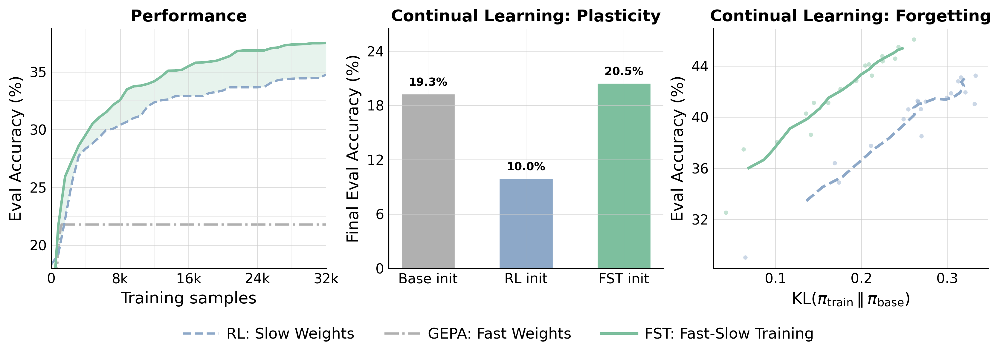
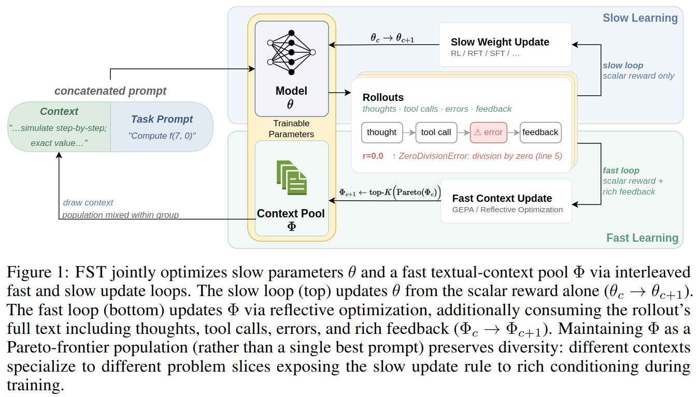
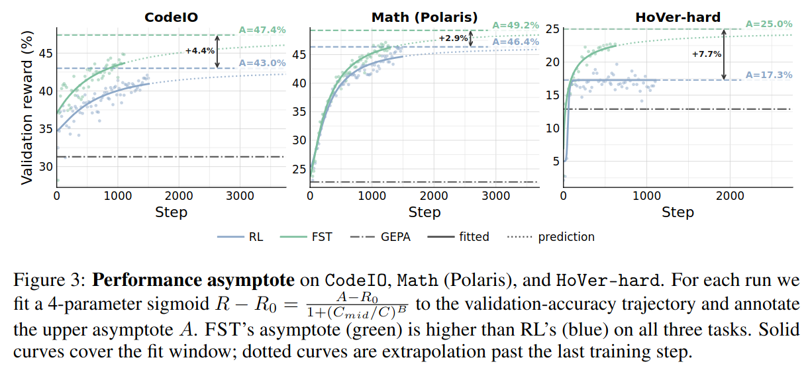
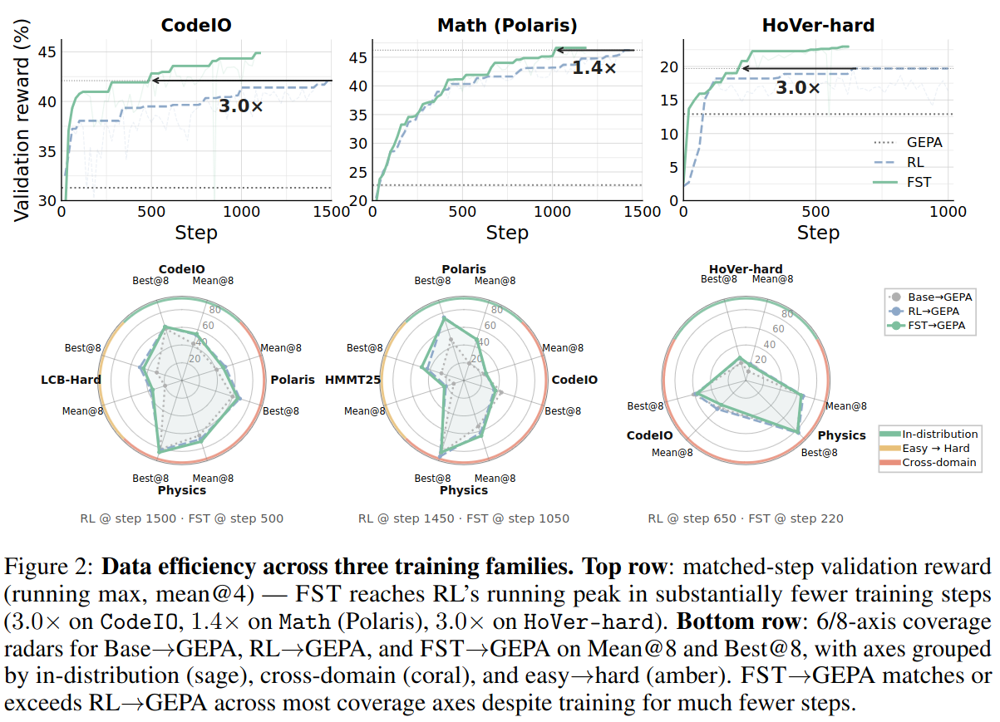
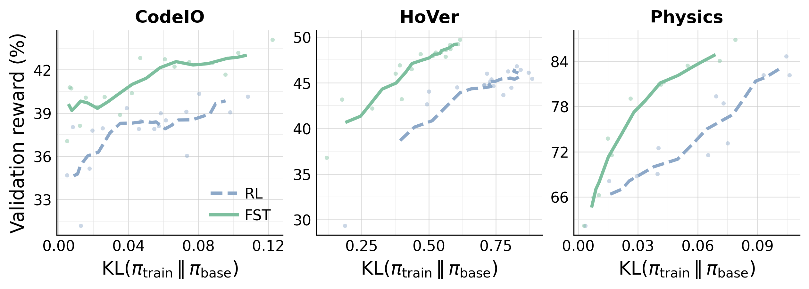
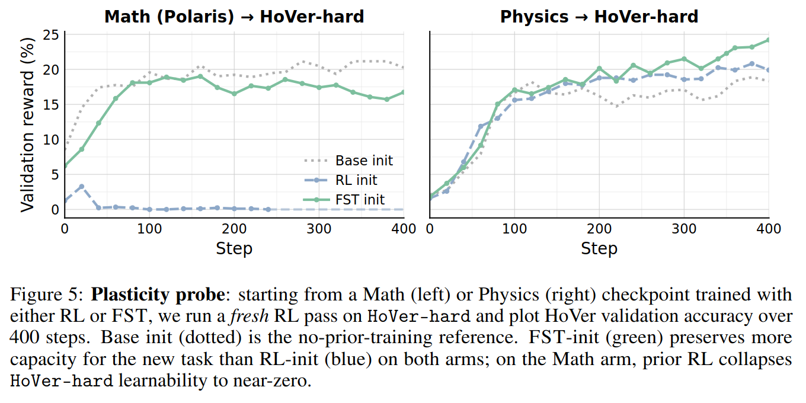
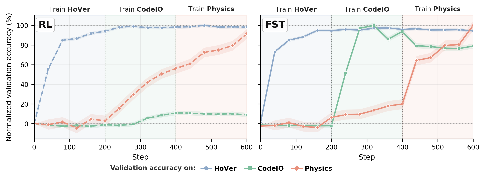
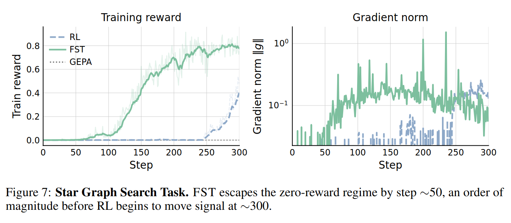
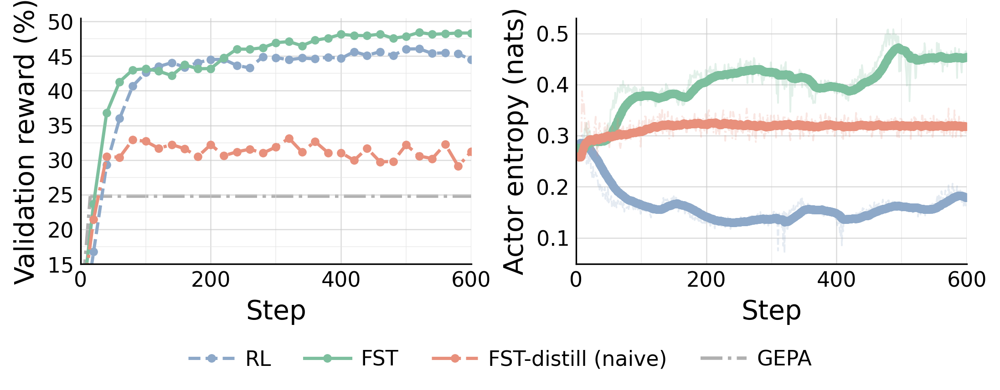

---
date:
  created: 2026-05-11
authors:
  - rishabh_tiwari
  - kusha
  - lakshya
  - joey
  - matei
  - kurt
  - inderjit
  - rishabh_agarwal
  - devvrit
equal_contribution:
  - "Rishabh Tiwari"
  - "Kusha Sareen"
  - "Lakshya A Agrawal"
equal_advisory:
  - "Rishabh Agarwal"
  - "Devvrit Khatri"
slug: learning-fast-and-slow
readtime: 12
title: "Learning, Fast and Slow: Towards LLMs That Adapt Continually"
bare_title: true
description: "Fast-Slow Training (FST) interleaves prompt optimization with reinforcement learning, treating the prompt as fast weights and parameters as slow weights, improving data efficiency, performance ceiling, plasticity, and continual learning."
social_image: blog/2026-05-11-learning-fast-and-slow/images/fst_diagram.png
citation_authors:
  - "Rishabh Tiwari*"
  - "Kusha Sareen*"
  - "Lakshya A Agrawal*"
  - "Joseph E. Gonzalez"
  - "Matei Zaharia"
  - "Kurt Keutzer"
  - "Inderjit S Dhillon"
  - "Rishabh Agarwal**"
  - "Devvrit Khatri**"
citation_keywords: "reinforcement learning, prompt optimization, fast-slow training, continual learning, plasticity, complementary learning systems, GEPA, CISPO"
---

# Learning, Fast and Slow: Towards LLMs That Adapt Continually

!!! tip "TL;DR"
    Adapting an LLM through parameter updates forces every improvement into a single persistent set of weights: task-specific tricks and general reasoning alike. This shrinks the model's distribution toward the trained task, eroding its capacity to learn new ones. Prompt optimization enables fast task-specific adaptations and hence sidesteps this, but cannot, on its own, match the performance ceiling of parameter updates.

    We introduce **Fast-Slow Training (FST)**, a paradigm for LLM training that optimizes the agent/context layer including prompts as "fast weights" and the network parameters as "slow weights", with the two updates interleaved during training. Fast weights encode task-dependent nuances; enabling slow weights to focus on general capabilities. Across math, code, and general reasoning benchmarks, FST beats weights-only training on every axis we measured. With one recipe, FST:

    - [Matches RL's performance with up to 3x fewer training steps and lifts the asymptotic ceiling](#data-efficiency) under [ScaleRL](https://arxiv.org/abs/2510.13786)-style scaling-law fits.
    - [Reaches matched accuracy at ~70% lower KL divergence from the base, preserving the model's ability to keep learning (plasticity).](#plasticity)
    - [Does a better job at continual learning where weights-only training stalls when the task switches.](#continual-learning)

<figure markdown="span">
  
  <figcaption><b>Fast-Slow Training (FST).</b> Comparison of RL (slow-weight updates only), GEPA (fast-weight prompt optimization only) and our method FST (interleaved fast + slow), averaged across <code>CodeIO</code>, <code>Math (Polaris)</code>, and <code>HoVer-hard</code>. <b>Left:</b> Validation accuracy vs. training step. <b>Middle:</b> Plasticity probe (final HoVer-hard accuracy after fresh RL from each initialization). <b>Right:</b> Slow-weight displacement, KL(πtrain ∥ πbase) vs. validation accuracy.</figcaption>
</figure>

<figure markdown="span">
  <video controls muted autoplay loop playsinline style="width: 100%; max-width: 800px;">
    <source src="../../../../2026-05-11-learning-fast-and-slow/images/fst_explainer_silent.mp4" type="video/mp4">
    Your browser does not support the video tag.
  </video>
</figure>

## The Quest for Adaptable General-Purpose AI

A north star in AI research is to build **performant and scalable** systems that **adapt** and learn on the fly across **general,** diverse sets of tasks.

The generality of our systems and their ability to solve problems they were not initially trained for has skyrocketed in the past 5 or so years due to LLMs and their capacity for **in-context learning**. Given the capability of current LLMs, it can be easy to forget that not too long ago the best way to, for example, detect if movie reviews were positive or negative was to train a discriminative sentiment classifier from scratch. While this paradigm of in-context learning has massively paid its dividends in terms of generality, directly updating the model parameters for a given task typically yields higher ceiling performance.

However, beyond compute costs, domain-specific finetuning imposes a set of restrictions on the model. For one, training a model on a narrow domain is known to degrade out of distribution performance. It can also decrease the ability to later finetune the model on new tasks. Though current models are quite general, there seems to be a tradeoff between how adaptable and how performant they are. What can we do to close this gap?

### Is Reinforcement Learning Enough?

The emerging paradigm of **reinforcement learning** for LLMs has shown great promise in making models more performant across diverse tasks. Whether RL causes specialization and degrades future-task and out-of-domain performance remains an open question. Recent work argues on-policy updates change the model distribution minimally and don't induce forgetting [\[1\]](https://arxiv.org/abs/2509.04259) [\[2\]](https://arxiv.org/pdf/2510.18874), yet heavy RL on a single domain does drastically shift the distribution in practice, e.g. the OpenAI goblin incident [\[3\]](https://openai.com/index/where-the-goblins-came-from/).

Even when on-policy, continual and episodic deep RL has long surfaced obstacles like primacy bias [\[4\]](https://proceedings.mlr.press/v162/nikishin22a/nikishin22a.pdf) (early data dominates the final policy), loss of plasticity [\[5\]](https://arxiv.org/abs/2303.07507) (the model becomes less able to learn new skills), and catastrophic forgetting [\[6\]](https://arxiv.org/abs/1612.00796) (old-domain performance tanks when learning a new one).

These obstacles have produced a rich literature of methods enabling learning across changing tasks [\[7\]](https://arxiv.org/pdf/1703.01988) [\[8\]](https://arxiv.org/pdf/1611.02779) [\[9\]](https://arxiv.org/pdf/2406.02596) [\[10\]](https://arxiv.org/abs/2312.11669), with a common theme: equipping the model with both fast and slow components. The idea dates back to classic work by Schmidhuber [\[11\]](https://ieeexplore.ieee.org/document/6796337) and Hinton [\[12\]](https://arxiv.org/abs/1610.06258): fast components quickly absorb task-specific information, while slow components build a general core of skills that transfers across tasks.

Fast and slow learning has an even richer history in neuroscience via complementary learning systems theory [\[13\]](https://stanford.edu/~jlmcc/papers/McCMcNaughtonOReilly95.pdf) [\[14\]](https://pubmed.ncbi.nlm.nih.gov/22141588/): the neocortex learns slowly to discover structure across experiences, while the hippocampus adapts quickly to new situations without disrupting the existing structure, with new memories gradually ingrained into the neocortex over time.

Inspired by this literature, we propose…

## Fast-Slow Training for LLMs

Due to the strong in-context learning ability of LLMs, we represent the model context as fast weights [\[15\]](https://arxiv.org/abs/2212.07677) and the model parameters as slow weights. Fast-Slow Training (FST) in LLMs presents a general blueprint where *any* context optimization approach can be taken to update the context, adapting quickly to new settings, and *any* gradient-based learning approach can be taken to update model parameters.

<figure markdown="span">
  
  <figcaption>FST jointly optimizes slow parameters θ and a fast textual-context pool Φ via interleaved fast and slow update loops. The slow loop (top) updates θ from the scalar reward alone (θc → θc+1). The fast loop (bottom) updates Φ via reflective optimization, additionally consuming the rollout's full text including thoughts, tool calls, errors, and rich feedback (Φc → Φc+1). Maintaining Φ as a Pareto-frontier population (rather than a single best prompt) preserves diversity: different contexts specialize to different problem slices exposing the slow update rule to rich conditioning during training.</figcaption>
</figure>

To instantiate this idea, we take a state-of-the-art RL algorithm in CISPO [\[16\]](https://arxiv.org/abs/2506.13585) and interleave its updates with a state-of-the-art prompt optimizer GEPA [\[17\]](https://arxiv.org/abs/2507.19457), which is able to leverage rich text feedback. Every $T$ RL steps, we do a light round of prompt optimization with GEPA. The prompt optimizer generates a set of prompts covering the Pareto front. For each problem in RL, we pull several of these into the rollout prompts and calculate the advantage once per problem.

$$
A_i \;=\; \frac{r(x, y_i) \;-\; \bar r_g}{\sigma_g \;+\; \varepsilon}, \qquad \bar r_g \;=\; \tfrac{1}{G}\!\sum_{j=1}^{G} r(x, y_j)
$$

$$
\mathcal{L}_{\mathrm{CISPO}}(\theta)
=
-\mathbb{E}\!\left[
\operatorname{sg}\!\big(\min(\rho_t,\tau)\big)
\cdot A
\cdot
\nabla_{\theta}\log \pi_{\theta}(y_t \mid x,\phi,y_{<t})
\right]
$$

The intuition is as follows. Reinforcement learning does whatever it takes to maximize reward on the task being trained. This includes forcing the model to internalize task-specific information into its parameters in order to climb rewards. But our goal when doing RL for LLMs is a **general purpose reasoner**: a model whose weights capture broadly useful reasoning strategies rather than memorizing domain-specific details for every possible setting. As such, by introducing context optimization, declarative task-specific information can quickly be absorbed into the prompt, leading the model weights to learn more general reasoning behavior.

FST has several benefits. We find FST:

1. improves data efficiency and the performance ceiling,
2. remains close to the base model and maintains plasticity,
3. and improves continual learning.

We detail each experiment below.

### Fast-Slow Training Improves Data Efficiency and Performance Ceiling { #data-efficiency }

<figure markdown="span">
  
  <figcaption><b>Data efficiency across three training families.</b> <b>Top row</b>: matched-step validation accuracy (running max, mean@4); dash-dot GEPA-only reference rises from the step-0 base accuracy to the prompt-only ceiling within GEPA's inference budget. FST reaches RL's running peak in substantially fewer training steps (3.0× on <code>CodeIO</code>, 1.4× on <code>Math (Polaris)</code>, 3.0× on <code>HoVer-hard</code>). <b>Bottom row</b>: out-of-distribution accuracy averaged across cross-domain (and easy→hard, where available) benchmarks for each family, evaluated with no GEPA prompt. FST matches RL on OOD averages while reaching the in-distribution peak with substantially fewer steps.</figcaption>
</figure>

<figure markdown="span">
  
  <figcaption><b>Performance asymptote</b> on <code>CodeIO</code>, <code>Math (Polaris)</code>, and <code>HoVer-hard</code>. For each run we fit a 4-parameter sigmoid R - R0 = (A − R0) / (1 + (Cmid/C)B) to the validation-accuracy trajectory and annotate the upper asymptote A. FST's asymptote (green) is higher than RL's (blue) on all three tasks. Solid curves cover the fit window; dotted curves are extrapolation past the last training step.</figcaption>
</figure>

We find data efficiency in FST is much improved over RL, taking far fewer steps to achieve the same performance across tasks. This does not come at a cost of OOD performance or diversity: FST has equal or better performance across out-of-domain and Easy-to-Hard tasks. Next, following ScaleRL [\[18\]](https://arxiv.org/abs/2510.13786), we fit sigmoidal scaling curves to RL on these tasks and find improvements in the performance ceiling.

### Fast-Slow Training Remains Close to the Base Model and Maintains Plasticity { #plasticity }

<figure markdown="span">
  
  <figcaption><b>Validation reward versus KL(πtrain ∥ πbase) trajectories</b> on <code>CodeIO</code>, <code>HoVer</code>, and <code>Physics</code>. Translucent markers are per-checkpoint measurements; the line is a rolling-mean smoothing along training step. At matched reward, FST (green) sits to the left of RL (blue) on every task, reaching the same reward at a significantly lower KL from the base policy.</figcaption>
</figure>

<figure markdown="span">
  
  <figcaption><b>Plasticity probe</b>: starting from a Math (left) or Physics (right) checkpoint trained with either RL or FST, we run a <i>fresh</i> RL pass on <code>HoVer-hard</code> and plot HoVer validation accuracy over 400 steps. Base init (dotted) is the no-prior-training reference. FST-init (green) preserves more capacity for the new task than RL-init (blue) on both arms; on the Math arm, prior RL collapses <code>HoVer-hard</code> learnability to near-zero.</figcaption>
</figure>

Since the prompt absorbs the brunt of the task-specific information, the model parameters are able to remain much closer in distribution to the base model. This is significant when linking to past work [\[19\]](https://arxiv.org/abs/2509.04259) that shows base model KL on a task is a strong proxy for catastrophic forgetting. We additionally probe the plasticity of models trained with RL vs. FST and find FST checkpoints are much more amenable to future RL training.

### Fast-Slow Training Improves Continual Learning { #continual-learning }

<figure markdown="span">
  
  <figcaption><b>Continual learning across <code>HoVer</code> → <code>CodeIO</code> → <code>Physics</code></b>: a single uninterrupted training run that switches task every 200 steps. The y-axis is per-task validation accuracy normalized with respect to the peak accuracy reached across methods within each stage. FST (solid) reaches near-peak on every stage; RL (dashed) acquires <code>HoVer</code> but completely stalls on <code>CodeIO</code> and only partially recovers on <code>Physics</code>.</figcaption>
</figure>

We compare FST with RL in a task-stage continual learning setting, where a single training run continues across 3 tasks, HoVer (blue) → CodeIO (green) → Physics (red). Here, the FST seed prompts for GEPA are 100% task-agnostic and the prompt optimizer autonomously decides how and when to change the system prompt in response to changing data. We find FST is able to quickly pick up tasks where RL stalls.

## Why does FST work?

We wanted to better understand what exactly about FST enabled faster learning on new tasks and a higher performance ceiling. We conducted a few controlled experiments:

### Fast Weights Acquire Task Signal Faster Than Slow Weights { #fast-weights-faster-signal }

<figure markdown="span">
  
  <figcaption><b>Star Graph Search Task.</b> FST escapes the zero-reward regime by step ~50, an order of magnitude before RL begins to move signal at ~250.</figcaption>
</figure>

We train models with RL and FST on a synthetic star graph search task [\[20\]](https://arxiv.org/abs/2510.03971), where the goal is to find a path between two nodes in a large star shaped graph. The base model obtains 0 rewards on this task. We find the addition of context optimization is able to drastically speed up the rate at which FST obtains learning signal. This is in part due to the capability of GEPA to learn from text feedback and incorporate general lessons into the context. While GEPA alone only aids in solving few problems, it provides enough gradient signal for FST to climb rewards.

### Fast and Slow Weights Both Optimizing for Reward Raise Performance Ceiling { #both-weights-help-ceiling }

<figure markdown="span">
  
  <figcaption><code>HoVer</code> training: FST (green) lifts validation accuracy above the prompt-only ceiling (GEPA only, dashed), RL (blue) plateaus, and FST-distill, fast-weight self-distillation that relies on GEPA to drive reward gains.</figcaption>
</figure>

Finally, to study the impact on the performance ceiling, we train models with RL, FST and FST-distill, a variant using reverse KL to distill information from the FST prompt into model weights, following recent work on self-distillation [\[21\]](https://arxiv.org/abs/2601.20802). We find FST has the highest ceiling while other approaches rely on only the fast or the slow weights to climb on rewards. Additionally, we note an added diversity and exploration benefit of FST: since the prompt optimization process generates several candidate prompts covering the Pareto front, using one per rollout allows the model to explore more during RL and usually maintains higher entropy over training.

## The Future

More broadly, FST represents a paradigm for continual learning in LLMs where model context can be optimized as "fast weights" (through any method), quickly picking up task-specific information, and network parameters can be updated as "slow weights" (eg. via RL, SFT, OPD…), building a robust general reasoning core.

Several directions stand out. The framework is general: the prompt and weight optimizers we plug in (GEPA and CISPO) are just one choice, and studying the impact of swapping in different prompt or weight optimizers is a natural axis to explore. There's also room to make the method more compute efficient by reusing rollouts across the fast and slow updates. Finally, while we showed an initial result on distilling fast-weight gains back into slow weights (FST-distill), a more comprehensive study of this direction is an exciting follow-up.

Paper: <https://arxiv.org/abs/2605.12484>

Code: <https://rishabhtiwari.ai/projects/fst/code/>
