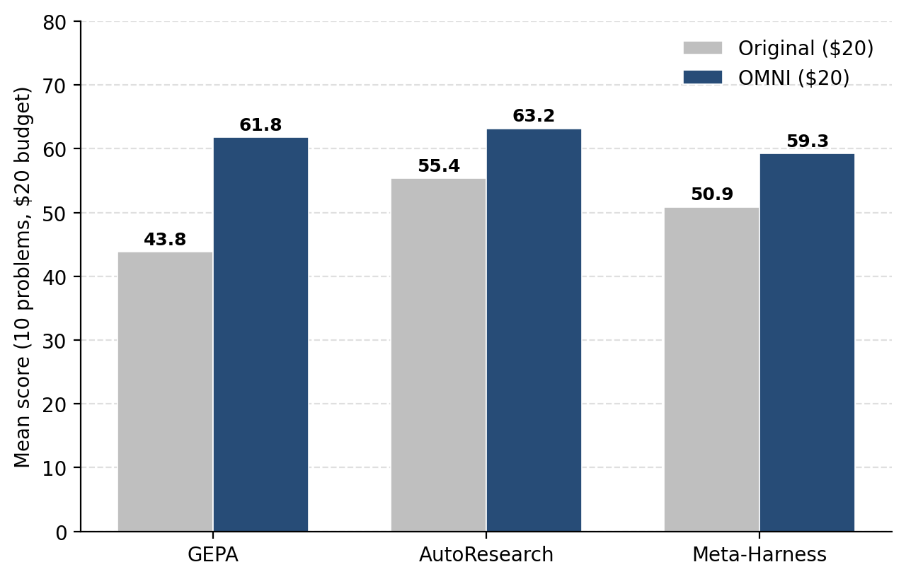

---
date:
  created: 2026-05-28
authors:
 - gepa-team
slug: optimize-anything-omni
readtime: 10
title: "optimize_anything Goes Omni: Pluggable Backends and Composable Optimizer Pipelines"
description: "optimize_anything now dispatches a single optimization call to any backend — GEPA, an autonomous coding agent, or an agent-based optimizer — and lets you compose them into multi-stage pipelines. On Frontier-CS, the composed OMNI pipeline beats every standalone optimizer under a matched budget."
social_image: blog/2026-05-28-optimize-anything-omni/images/omni_design.png
citation_authors:
  - "Donghyun Lee"
  - "Shangyin Tan"
  - "Qiuyang Mang"
  - "Lakshya A Agrawal"
  - "Wenjie Ma"
  - "Karim Elmaaroufi"
  - "Koushik Sen"
  - "Sanjit A. Seshia"
  - "Dan Klein"
  - "Omar Khattab"
  - "Alexandros G. Dimakis"
  - "Ion Stoica"
  - "Joseph E. Gonzalez"
  - "Matei Zaharia"
citation_technical_report_institution: "UC Berkeley"
citation_keywords: "text optimization, LLM-driven optimization, prompt optimization, program optimization, agent-based optimization, optimizer pipeline, Pareto optimization, GEPA, Frontier-CS"
---

# <span class="gradient-code">optimize_anything</span> Goes Omni: Pluggable Backends and Composable Optimizer Pipelines

!!! tip ""
    **TL;DR.** `optimize_anything` is now **backend-pluggable** and **pipeline-composable**: one knob (`backend=`) dispatches the same optimization call to GEPA, an autonomous coding agent, or an agent-based optimizer, and the backends compose into multi-stage pipelines. Using **[Terrarium](https://github.com/gepa-ai/terrarium)**, our new evaluation framework that pins every optimizer to the same task, budget, and evaluation server, we find that **no single optimizer dominates** on [Frontier-CS](https://arxiv.org/abs/2512.15699) — but the composed **`OMNI`** pipeline beats every standalone optimizer under a matched \$20 budget.

<figure markdown="span">
  { style="width: 70%;" }
  <figcaption>On Frontier-CS (10 problems, matched $20 budget, Claude Sonnet 4.6), the composed <span class="gradient-code">OMNI</span> pipeline (63.2) beats every standalone optimizer — GEPA (43.8), AutoResearch (55.4), and Meta-Harness (50.9).</figcaption>
</figure>

When we [introduced `optimize_anything`](https://gepa-ai.github.io/gepa/blog/introducing-optimize-anything/), the premise was simple: if your artifact is text and its quality can be measured, you can optimize it. The API stripped LLM-driven search down to two things, an artifact and an evaluator, and let GEPA's reflective-mutation loop handle the actual optimization.

But GEPA's reflective proposer is just *one* way to close the loop. A growing family of systems share the exact same shape: a candidate string, a black-box scoring function, and an LLM-driven search loop, yet realize it through very different strategies. Some hand the proposal step to an autonomous coding agent. Some keep an external framework in charge of selection and let an agent mutate one parent at a time. Each is strong on some problems and weak on others (and we don't know exactly why so we cannot effectively dispatch the problems), and until now, switching between them meant re-porting your task into a new framework.

This release closes that gap on both ends. `optimize_anything` is now a **dispatcher**: the same call runs against any compatible backend. And backends are **composable**: you can run several, pick the best, and continue — all under one budget.

## One call, any backend

Under the hood, three families of optimizers all fit the same `(candidate, score, loop)` contract, differing only in *who proposes the next candidate* and *who owns the search loop*:

<figure markdown="span">
  { style="width: 100%;" }
  <figcaption>Three optimizer families, one contract. <strong>Left:</strong> an orchestrator framework owns the loop and parent selection; the proposer is either a single LLM call (LLM-based, e.g. GEPA) or a coding agent (agent-based, e.g. Meta-Harness). <strong>Right:</strong> a single autonomous agent (e.g. AutoResearch) owns everything. In every case the eval server stays external and owns the budget.</figcaption>
</figure>

`optimize_anything` now ships three backends, one per family:

| `backend=` | Family | How it proposes |
| --- | --- | --- |
| `"gepa"` *(default)* | LLM-based optimizer | A single reflective LLM call mutates a parent selected from a Pareto frontier. |
| `"claude_code"` | Autonomous agent | A long-horizon [Claude Code](https://www.anthropic.com/claude-code) session ([AutoResearch](https://github.com/karpathy/autoresearch)-style) owns the entire loop — selection, proposal, and evaluation. |
| `"meta_harness"` | Agent-based | A coding-agent proposer mutates candidates while the framework owns the outer loop and parent selection ([Meta-Harness](https://arxiv.org/abs/2603.28052)). |

Selecting one is a single argument. Everything else — your `Task`, your `evaluate` function, your budget — is unchanged:

```python
from gepa.omni import optimize_anything, Task, OmniConfig

task = Task(
    name="frontier_cs/algo_0",
    initial_candidate=open("seed_solution.py").read(),
    objective="Maximize the hidden-test score for this competitive-programming problem.",
    background="A single Python program. A sandboxed judge runs it against hidden tests and returns a 0–100 score.",
)

def evaluate(candidate: str) -> tuple[float, dict]:
    score, feedback = run_judge(candidate)      # your sandboxed judge
    return score, {"Feedback": feedback}        # the dict is surfaced to the proposer as ASI

# Same task, same evaluator — swap only the backend:
result = optimize_anything(task, evaluate, OmniConfig(backend="gepa",         max_token_cost=20))
result = optimize_anything(task, evaluate, OmniConfig(backend="claude_code",  max_token_cost=20))
result = optimize_anything(task, evaluate, OmniConfig(backend="meta_harness", max_token_cost=20))

print(result.best_score, result.best_candidate)
```

`backend="gepa"` is the default, so existing code keeps its exact behavior. The `evaluate` contract is the same one from `optimize_anything`: `(candidate) -> (score, info)` for single-task problems, or `(candidate, example) -> (score, info)` when the `Task` carries a `train_set`/`val_set`. The returned `info` dict is surfaced to the proposer as **Actionable Side Information (ASI)** — the diagnostic feedback that turns blind mutation into targeted, engineer-like iteration.


## Why one optimizer is not enough

To decide *which* backend to reach for, we ran a controlled study with [Terrarium](https://github.com/gepa-ai/terrarium), holding the task, budget, model (Claude Sonnet 4.6, medium thinking), and evaluation server fixed, and varying only the optimizer. The most basic question a practitioner asks is: *which optimizer should I use?* On [Frontier-CS](https://arxiv.org/abs/2512.15699), a suite of open-ended, verifiable competitive-programming problems where each candidate is a full program scored by a hidden-test judge, the answer is uncomfortable.

<figure markdown="span">
  { style="width: 100%;" }
  <figcaption>On Frontier-CS (10 problems, $20 budget each, Claude Sonnet 4.6). <strong>(a)</strong> AutoResearch has the highest average (55.4), ahead of Meta-Harness (50.9) and GEPA (43.8). <strong>(b)</strong> But per problem, the winner is nearly a coin toss: GEPA wins 3, AutoResearch 3, Meta-Harness 4. The optimizer that wins a given problem is hard to predict from the problem itself.</figcaption>
</figure>

All three optimizers crush a zero-shot baseline. The baseline is a single LLM call to the same model scores just **7.72** on average, versus 43.8–55.4 for the optimizers, confirming that *some* optimizer is essential. But which one? AutoResearch wins on average, yet the per-problem breakdown shows the lead is fragile: each optimizer is the single best on a roughly equal share of problems, and there is no reliable way to predict the winner from a problem's surface features. "Pick the right optimizer for the task" turns out to be an unsatisfying answer in practice.

### Optimizers plateau — and a fresh optimizer can unstick them

A second pattern compounds the first. With enough budget, every optimizer's progress is **front-loaded**: it banks most of its improvement early, then plateaus, and the rest of the budget buys little. The natural question is whether that tail of budget is wasted or whether handing the stalled candidate to a *different* optimizer can break the plateau.

It can.

<figure markdown="span">
  { style="width: 100%;" }
  <figcaption>Switching optimizers unblocks a plateau. The original optimizer is dashed past its stuck point; the alternatives receive its best candidate as a seed and start fresh under the remaining budget. <strong>P0:</strong> GEPA plateaus at 54.4 (after ≈$1.3); AutoResearch lifts it to 62.7. <strong>P85:</strong> AutoResearch plateaus at 50.0 (after ≈$0.5); both GEPA and Meta-Harness reach a perfect 100.</figcaption>
</figure>

The plateau a single optimizer reaches is rarely the best the budget can buy — and a *different* optimizer, seeded from the stuck candidate, can usually keep making progress. (Which alternative helps varies, too: on P0, AutoResearch breaks through while Meta-Harness stays put.) Two findings, one conclusion: rather than betting the whole budget on one optimizer, **explore with several and continue from the best**.

## OMNI: composing optimizers into a pipeline

These observations point at a design rather than a winner. **`OMNI`** is a compositional pipeline that puts both findings to work under one budget:

<figure markdown="span">
  { style="width: 100%;" }
  <figcaption><span class="gradient-code">OMNI</span> as an optimizer pipeline. <strong>Phase 1:</strong> run every backend in parallel on a small slice of the budget and pick the single best candidate (exploiting that no optimizer dominates, and that early progress is fast). <strong>Phase 2:</strong> hand that candidate to a <em>fresh</em> optimizer for the rest of the budget (exploiting that a fresh optimizer breaks plateaus). The continuation backend names the variant — <span class="gradient-code">OMNI</span>-GEPA, <span class="gradient-code">OMNI</span>-AutoResearch, or <span class="gradient-code">OMNI</span>-Meta-Harness — each capped at $20 total.</figcaption>
</figure>

Phase 1 begins the slow part of the search from a stronger starting point than any single optimizer reaches alone; phase 2 uses a fresh optimizer to push past the plateau the explorer would otherwise hit. With the new API, that pipeline is a short composition over the same backends — the explore phase uses `optimize_best_of` (run several backends in parallel, keep the highest-scoring candidate), then a fresh optimizer continues from the winner:

```python
from dataclasses import replace
from gepa.omni import optimize_anything, optimize_best_of, Task, OmniConfig

# Phase 1 — explore: run all three backends in parallel, keep the single best candidate.
explore = optimize_best_of(task, evaluate, configs=[
    OmniConfig(backend="gepa",         max_token_cost=5),
    OmniConfig(backend="claude_code",  max_token_cost=5),
    OmniConfig(backend="meta_harness", max_token_cost=5),
])

# Phase 2 — continue: seed a fresh optimizer from the winner and spend the rest of the budget.
#   The continuation backend names the variant — this is OMNI-GEPA.
omni = optimize_anything(
    replace(task, initial_candidate=explore.best_candidate),
    evaluate,
    OmniConfig(backend="gepa", max_token_cost=5),
)

print(omni.best_score, omni.best_candidate)
```

`OMNI` is one point in a larger design space the new API opens up. The same primitives compose other strategies just as easily:

- **`optimize_sequential`** — chain backends; each one's best seeds the next (monotonic, so a regressing stage can't poison a later one).
- **`optimize_parallel`** / **`optimize_best_of`** — run backends concurrently; take all results, or just the highest-scoring.
- **`optimize_vote`** — run in parallel, then re-score each backend's best once through your evaluator for a fair cross-backend comparison.
- **`optimize_adaptive_sequential_with_server`** — give the active backend a bounded slice, watch for a plateau, and *automatically* switch backends when progress stalls — exactly the "fresh optimizer unsticks the plateau" effect, scheduled for you under one shared budget.

Because every stage shares the same external eval server and budget, these are genuine compositions, not bigger budgets in disguise.

## Results: OMNI beats every standalone optimizer on Frontier-CS

We compared each backend run standalone against the corresponding `OMNI` pipeline on Frontier-CS, under a matched **\$20** budget. The figure at the top of the post shows the outcome: `OMNI` (63.2) tops every standalone optimizer. And the gains hold across the board — every continuation variant beats its standalone counterpart:

| Optimizer | Standalone | `OMNI` | Improvement |
| --- | --- | --- | --- |
| GEPA | 43.8 | **61.8** | +18.0 (**+41%**) |
| AutoResearch | 55.4 | **63.2** | +7.8 (+14%) |
| Meta-Harness | 50.9 | **59.3** | +8.4 (+16%) |

The largest gain goes to GEPA, which more than closes its standalone gap behind the agent-based baselines — `OMNI`-GEPA (61.8) overtakes even the strongest *standalone* optimizer (AutoResearch, 55.4). And critically, **every** `OMNI` variant beats **every** standalone optimizer: the weakest `OMNI` pipeline (59.3) still tops the best single optimizer (55.4). Composition, not optimizer choice, is the reliable win.

## Getting started

`optimize_anything` was always meant to be a frontend that dispatches to the best available optimizer for your problem. Backends and pipelines make that concrete: the user-facing surface is unchanged, the default behavior is identical, and you can now reach for a different strategy — or a composition of strategies — with one argument.

```bash
pip install gepa
```

```python
from gepa.omni import optimize_anything, Task, OmniConfig

result = optimize_anything(
    Task(name="my_task", initial_candidate="<your artifact>", objective="<what good looks like>"),
    evaluate=your_evaluator,
    config=OmniConfig(backend="gepa"),   # or "claude_code", "meta_harness"
)
```

We are releasing both pieces of this work together: the backend-pluggable, pipeline-composable `optimize_anything`, and **[Terrarium](https://github.com/gepa-ai/terrarium)**, the evaluation framework that pins optimizers to a shared task / eval-server / budget contract so they can be compared head-to-head. We'd love community contributions of new backends, tasks, and pipelines.

- [Documentation](https://gepa-ai.github.io/gepa/)
- [GitHub](https://github.com/gepa-ai/gepa) · [Terrarium](https://github.com/gepa-ai/terrarium)
- [Discord](https://discord.gg/WXFSeVGdbW)
- [Twitter](https://x.com/gepa_ai)
- [Slack](https://join.slack.com/t/gepa-ai/shared_invite/zt-3o352xhyf-QZDfwmMpiQjsvoSYo7M1_w)
