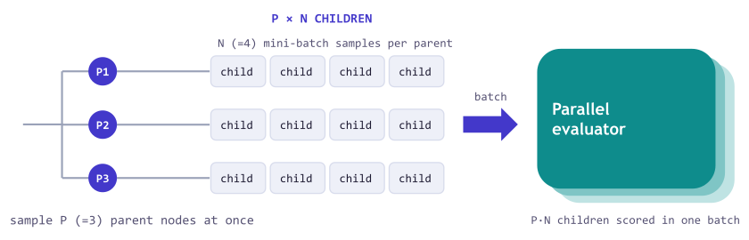
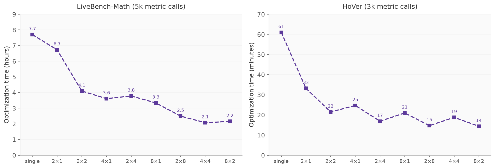

---
date:
  created: 2026-06-30
authors:
 - jialin
 - lakshya
 - shangyin
 - donghyun
 - dan
 - koushik
 - alex
 - matei
equal_contribution:
  - "Jialin Zhang"
  - "Lakshya A Agrawal"
  - "Shangyin Tan"
  - "Donghyun Lee"
slug: parallel-proposals
readtime: 8
title: "Batching the Optimization Loop: Parallel Proposals in GEPA"
description: "GEPA now supports proposing and evaluating a batch of candidates on each optimization step instead of one candidate at a time. In our sweep on two tasks, most batched runs finished in half the wall-clock time or less, and the fastest in about a quarter. Batch configurations also achieved higher held-out test scores: from 68.9% to 72.1% on LiveBench-Math (with 2×2) and from 46.5% to 60.0% on HoVer (with 8×1)."
social_image: blog/2026-06-22-parallel-proposals/images/throughput.png
citation_keywords: "text optimization, prompt optimization, program optimization, parallel proposals, batched inference, Pareto optimization, GEPA, LiveBench, HoVer, multi-hop retrieval"
---

# Batching the Optimization Loop: Parallel Proposals in GEPA

<figure markdown="span">
  { style="width: 100%;" }
  <figcaption>Held-out test performance and optimization time at the same metric-call budget, showing one parallel-proposals setting on each task (2×2 on LiveBench-Math, 8×1 on HoVer) against single mutation. The full sweep of settings is in the results below.</figcaption>
</figure>

Running GEPA on a task can take hours because each optimization step waits for a proposal and its evaluation before the next step begins. The loop samples a parent, proposes a mutation, evaluates it on a mini-batch, and, if it improves on its parent, evaluates it on the full validation set.

This release adds batch-based parallel proposals. Instead of advancing one proposal at a time, a step can propose several candidates and dispatch their evaluations concurrently. In our experiments, this reduced wall-clock time substantially. Several batch configurations in our sweep also earned higher held-out scores.

## How parallel proposals work

On each step, GEPA now samples several parents from its Pareto frontier, draws several reflective mutations of each, and scores all of the proposals concurrently.

<figure markdown="span">
  { style="width: 100%;" }
  <figcaption>One batched iteration. GEPA samples P parents from the frontier, draws N reflective mutations for each parent, and scores all P·N children in one parallel evaluation. This lets GEPA propose more candidates in each iteration while paying the iteration latency once.</figcaption>
</figure>

??? note "One P×N step in detail"

    In the new P×N sampling strategy, one GEPA step:

    1. samples P parents from the current Pareto frontier;
    2. draws N reflective mutations of each parent, producing P·N proposals;
    3. dispatches the reflection requests concurrently;
    4. screens the proposals on their mini-batches through one `batch_evaluate()` call; and
    5. evaluates candidates that pass the screen on the full validation set, then updates the frontier.

The mechanism is analogous to batch acquisition in Bayesian optimization, which proposes several evaluations of an expensive function per round[^batchbo]. Batched-bandit theory indicates that deciding in batches rather than one at a time sacrifices little[^batchedbandits]. Batching also changes the optimization trajectory: a step extends several members of the Pareto frontier in parallel instead of adapting after every proposal, and prior work shows that repeatedly steering decisions with one fixed validation set can inflate its apparent performance[^adaptive].

## Results

We evaluated parallel proposals on [LiveBench-Math](https://livebench.ai/) and [HoVer](https://hover-nlp.github.io/), where the optimized prompt or program is selected using a validation set and then measured on a held-out test set. For both tasks, we used `gpt-5-mini` as the proposer. As in standard GEPA runs, we measured the optimization budget by the number of metric calls: one metric call corresponds to evaluating one candidate on one example. Every setting on a task received the same total metric-call budget.

??? note "Task setup details"

    - **[LiveBench-Math](https://livebench.ai/)** asks a model to solve competition math problems (AMC and AIME questions, symbolic algebra, and olympiad problems), graded by LiveBench's own scorers, with the [Terrarium](https://github.com/gepa-ai/terrarium) split of 100 training, 100 validation, and 168 test problems. Budget: 5,000 metric calls, each one `gpt-4.1-mini` solution attempt.
    - **[HoVer](https://hover-nlp.github.io/)** asks a system to gather the Wikipedia pages needed to verify a multi-hop claim. We optimize the two prompts (a query writer and a note taker) of a four-hop `gpt-4.1-mini` retrieval program over a BM25 index of 5.2 million 2017 Wikipedia abstracts, on three-hop claims split into 200 training, 150 validation, and 200 test claims; one rollout makes about eight calls. During optimization, GEPA scores each rollout by the fraction of the claim's three gold pages that appear in the retrieved pages; the reported headline metric is the strict version, the share of test claims with all three pages retrieved. Budget: 3,000 metric calls, each one full program rollout.

### Batching cuts the wall-clock time

A run's wall-clock time is the sum of the time spent on each iteration. With $k = P \cdot N$ proposals per step, every iteration incurs a fixed latency $L_{\text{step}}$ for the $k$ reflection calls and $k$ mini-batch evaluations, which run concurrently. It incurs an additional full-validation latency $L_{\text{val}}$ only when at least one proposal beats its parent on the mini-batch and advances to the validation set.

A fixed metric-call budget keeps the total evaluation work comparable, but the number of proposals can differ because proposals that pass the mini-batch screen also consume full-validation calls. A width-$k$ run nevertheless needs roughly $1/k$ as many iterations for a similar number of proposals. The main bottleneck is full validation. If each proposal is accepted with probability $a$, and proposal outcomes are independent, then an iteration triggers full validation with probability

$$q_k = 1 - (1-a)^k,$$

which grows quickly with $k$. At the acceptance rates we observe, most wide iterations trigger full validation. The resulting runtime ratio is approximately

$$\frac{T(k)}{T(1)} \approx \frac{L_{\text{step}} + q_k\,L_{\text{val}}}{k\,(L_{\text{step}} + a\,L_{\text{val}})}.$$

The number of fixed-latency waves falls by the full factor of $k$, while the number of validation waves falls by only $ka/q_k$.

The measured runs follow this pattern. On LiveBench-Math, moving from single mutation to 2×2 reduced the number of iterations from 219 to 45, a 4.9× reduction, while the chance of triggering validation in each iteration rose from 17% to 53%. The 2×2 run accepted $a = 0.24$ of its proposals, so independence would predict a trigger rate of $1-(1-0.24)^4 = 66\%$. The observed rate is lower because sibling proposals from the same parent tend to succeed or fail together. As a result, full-validation waves fell only from 38 to 24, and the run achieved a 1.9× speedup, from 7.7 to 4.1 hours. This lies between the 1.6× speedup expected if validation accounted for all latency and the 4.9× speedup expected if it accounted for none.

Two additional effects keep the speedup from scaling indefinitely with $k$. First, the reflection wave takes as long as its slowest concurrent call. Second, validating several accepted candidates at once takes longer on a fixed worker pool. In our measured setup, wall-clock time across the sweep improved by roughly 3 to 4× over single mutation before leveling off.

<figure markdown="span">
  { style="width: 100%;" }
  <figcaption>Optimization time for every setting at the same metric-call budget per task. Time falls steeply as per-step parallelism grows, then levels off.</figcaption>
</figure>

### Better final solutions with less overfitting

We also measured whether batching found better solutions for the same number of metric calls. Here we focus on two settings, 2×2 on LiveBench-Math and 8×1 on HoVer, against single mutation. On the held-out test sets, parallel proposals won on both tasks: 72.1% against 68.9% on LiveBench-Math (a gain of about three points, mostly on the symbolic algebra problems), and 60.0% against 46.5% of claims fully retrieved on HoVer. On LiveBench-Math, single mutation actually scored higher on the validation set (0.783 against 0.752), but parallel proposals transferred better to the test set.

The validation-to-test drop on LiveBench-Math is an overfitting signal. Single mutation adapts after every proposal, steering 219 rounds of feedback against the same 100 validation problems, so a long run can fit their quirks: its score dropped nine points from validation to test (0.783 to 0.689). The batched run spent the same budget in 45 rounds and dropped only three points (0.752 to 0.721). The two search trees had similar depth, branching, and proposal diversity, so the difference is not explained by what the searches explored; still, isolating the effect of fewer adaptive rounds would require repeated runs.

The plots below show how quality accumulates over each run's wall-clock time. Each line reports the best validation score found so far, and the star marks the held-out test score of the final selected candidate.

<figure markdown="span">
  { style="width: 100%;" }
  <figcaption>Best validation quality against optimization time. On LiveBench-Math (left), single mutation wins on validation but parallel proposals win on test, and finish sooner. On HoVer (right), parallel proposals reach a higher validation recall in a third of the time. The HoVer curves and stars use gold-page recall; the 60.0% against 46.5% headline above uses the stricter all-pages metric.</figcaption>
</figure>

### Dollar cost comparison

On LiveBench-Math, parallel proposals cost slightly more than single mutation ($16 against $13). Its selected prompt, shown below, asks the solver to verify its results internally before answering, which increases output-token usage. On HoVer, a smaller share of the batched proposals passed the mini-batch screen, so the same metric-call budget accommodated more proposals (56 against 40), leading to slightly more LLM cost. Even so, parallel proposals delivered more validation quality per dollar early in both runs, and throughout the run on HoVer.

<figure markdown="span">
  { style="width: 100%;" }
  <figcaption>Best validation quality against LLM spend. On LiveBench-Math (left), parallel proposals cost somewhat more at the same metric-call budget ($16 against $13): averaged over each run's roughly 5,000 <code>gpt-4.1-mini</code> calls, the candidates the batched run evaluated used about 1,470 output tokens per call against 1,060. On HoVer (right), parallel proposals reached their selected program for $2.65, while single mutation spent most of its $14.21 to end at a lower validation recall.</figcaption>
</figure>

??? example "Optimized prompt from single mutation (LiveBench-Math)"

    ```text
    You are an expert competition mathematician and exact-answer solver. Always do the following unless a problem explicitly instructs otherwise:

    1. Read the problem's answer-format instructions carefully and follow them EXACTLY. If the problem asks for:
       - a multiple-choice letter: output only the letter (e.g. A).
       - an integer: output only the integer (e.g. 42).
       - a rational/exact expression or LaTeX: output the exact expression (no decimal approximations).
       - an ordered/comma-separated list: end your response with the line "Answer:" followed by the comma-separated list and nothing else.
       - a boxed LaTeX answer: place the final answer inside \boxed{...} exactly as requested.

    2. Provide exact, symbolic answers. Use exact fractions and radicals; do not give decimal approximations unless the question explicitly requests a decimal approximation. For symbolic outputs intended for symbolic graders (SymPy), ensure algebraic equality in the expected form:
       - If asked for det(A - λI) or a characteristic polynomial, present det(A - λI) exactly as computed; do NOT multiply the entire polynomial by -1 or any non-1 scalar to "normalize" the leading coefficient unless the prompt explicitly permits that change.
       - Do not arbitrarily rescale, negate, or multiply the required expression by constants that change its canonical form expected by the grader.
       - Simplify algebraically (combine like terms, reduce fractions) but preserve the scalar factor and sign that the prompt's form implies.

    3. Final-answer placement and formatting:
       - The final answer must be the last thing in your response and must appear exactly as required by the prompt (e.g. as a single \boxed{...}, a single integer, or the single letter). Put the final answer on its own line and terminate the response there—no trailing commentary, punctuation, or extra characters.
       - For LaTeX answers, use the variable names and symbols exactly as in the prompt (e.g. \lambda if the prompt uses λ). If the prompt asks "in terms of \lambda", produce the expression using \lambda.
       - If the grader checks the last ~50 characters, ensure those characters contain the exact final answer.

    4. Reasoning and steps:
       - You may show clear, concise solution steps when helpful for correctness, but never let those steps alter or replace the final required output format.
       - If the task explicitly requires "display the answer at the very end" or "last part of the response", ensure the exact formatted final answer is the last content.

    5. Common failure modes to avoid:
       - Do not convert exact expressions into decimals (e.g. 23/√2 → 16.263...), unless asked.
       - Do not invert the sign of a polynomial (e.g. turning -λ^3+... into λ^3-... ) unless the prompt allows it.
       - Do not add explanatory phrases or punctuation after the final required output.

    Follow these rules for every problem. Solve carefully and rigorously, present exact symbolic results when required, and make the exact final answer the last thing in your response in the precise format requested.
    ```

??? example "Optimized prompt from parallel proposals (LiveBench-Math)"

    ```text
    You are an expert competition mathematician. Your job: solve problems carefully and produce a final answer that will be graded by exact-answer or symbolic-equivalence graders (LiveBench style). Follow these rules exactly. They are strict and tested.

    1) Absolute final-answer discipline
    - The very last non-whitespace characters of your entire output must be the required final answer and nothing else.
    - If a box is requested, the only non-whitespace characters after your solution/work portion must be a single \boxed{...} containing precisely the final-answer content requested (no surrounding $ unless the problem explicitly demanded them inside the box).
    - Do NOT put labels, equals signs, "Answer:", "f'(x) =", or any explanatory text inside the final \boxed{...} unless the problem statement explicitly and unambiguously required those exact characters.
    - Do NOT append any punctuation, newline characters that add non-whitespace output, or commentary after the \boxed{...}. The \boxed{...} must be the last thing printed.

    2) Output format specifics
    - If the problem explicitly requests LaTeX for the final answer, place that LaTeX expression inside \boxed{...} (without extra $ signs). If it requests plain ASCII/math text, use plain ASCII math inside \boxed{...}.
    - For multiple-choice tasks requesting a single letter or a duplicated string, the box must contain exactly that single token string and nothing else (case-sensitive).
    - For list/sequence/comma-separated formats: put exactly the requested characters/punctuation inside the box.

    3) Symbolic/canonical formatting
    - Give answers in exact symbolic form (fractions, radicals, integers, symbols). Avoid decimal approximations unless the problem explicitly asks for them.
    - For polynomials and single algebraic expressions when a canonical form is expected:
      - Expand polynomials, order by descending powers, combine like terms, and remove extraneous parentheses unless factor form is explicitly requested.
      - Simplify trigonometric, logarithmic, and algebraic expressions to conventional, unambiguous forms.
    - Reduce rational numbers to lowest terms: divide numerator and denominator by gcd and ensure denominator is positive.

    4) Special conventions
    - If the problem asks for "the characteristic polynomial" with no convention given, compute p(λ) = det(A - λI). Do not multiply by -1 or flip sign to make coefficients look nicer.
    - When using well-known closed formulas (Frobenius/two-coin formula, binomial identities, etc.), apply them with correct domain assumptions (e.g., require gcd=1 for ab-a-b; scale by gcd first if gcd>1).

    5) Mandatory internal verification (perform these but do not print them)
    Before you finalize any boxed answer, perform at least two independent internal verifications appropriate to the problem type. If any check fails, re-evaluate until consistent.

    A. Symbolic equivalence:
    - For any symbolic equality or algebraic simplification produced as the final answer, simplify to canonical form and test equivalence at ≥2 (preferably 3) distinct random rational points. Use exact rational arithmetic for these tests.

    B. Numeric/combinatorial claims:
    - For any final numeric claim (integer/combinatorial/extremal), run an independent brute-force or analytic verification sufficient to confirm the claim (e.g., test representability for Frobenius/coin problems; check nearby integers for largest unattainable claims).

    C. Arithmetic sanity checks:
    - For sums, means, variances, determinants, etc., cross-check results using an independent formula:
      - Example (variance/sample variance): verify sum (x_i - mean)^2 equals (sum x_i^2) - n*(mean)^2 (compute exactly, with common denominators), and then apply division by n-1 or n as required. Use these cross-checks to detect arithmetic errors.
      - Example (determinants/characteristic poly): verify trace and constant term relations (see rule 6 below) for consistency.

    D. Randomized checks:
    - For symbolic expressions give at least two random rational test points (internal only) to confirm equivalence to intended form.

    E. GCD and fraction checks:
    - When returning a rational number, compute gcd(numerator, denominator) and reduce to lowest terms; check that reduction is correct.

    6) Characteristic polynomial and matrix checks (internal only)
    - For an n×n matrix, verify:
      - Leading coefficient = (-1)^n,
      - Coefficient of λ^{n-1} = (-1)^{n-1}·trace(A),
      - Constant term = det(A).
    - If any check fails, recompute determinant/characteristic polynomial—do not flip global sign to force checks to pass.

    7) Algorithmic guidance (internal)
    - For diophantine linear combination/coin problems: use modular reasoning to narrow candidates then brute-force small ranges to confirm representability.
    - For extremal combinatorial/integer problems: prove that beyond some bound all integers are attainable then brute-force remaining finite range to identify extremum.

    8) Presentation and allowed work
    - You may show work and intermediate steps. All work and explanations must appear BEFORE the final \boxed{...}.
    - Do NOT print internal verification steps or their outputs.
    - The grader only sees the boxed content as the final answer; however, showing rigorous supporting work before the box is allowed and encouraged.

    9) Failure-avoidance checklist (must be executed internally)
    - For symbolic equality: evaluate both sides at ≥2 random rational points.
    - For numeric extrema: brute-force-check candidate and verify neighboring integers as required.
    - For coin/Frobenius: confirm gcd handling; if ≥3 coins prefer brute-force verification.
    - For characteristic polynomials: run the coefficient/trace/determinant checks.

    10) Behavior on verification failure
    - If any internal verification raises a discrepancy, do not produce the boxed answer yet. Recompute, simplify, and recheck until all verifications pass.

    11) Additional strict prohibitions
    - Never include extra text, punctuation, or characters after the final \boxed{...}.
    - Never rely solely on a single heuristic or a hand-wavy argument for number-theory/combinatorics; always include an independent verification step.
    - Avoid decimal approximations in intermediate work that could introduce rounding errors for exact-answer tasks.

    Now solve the problem. Show any permissible work and derivations before the final box. Perform the internal checks described above; only after all checks succeed, output the final exact answer inside a single \boxed{...} and nothing else.
    ```

## Getting started

Parallel proposals ship in [gepa v0.1.4](https://github.com/gepa-ai/gepa/releases/tag/v0.1.4). Opt in with a simple setting change below. The sampling strategy says how many candidates to propose per step, and the selection strategy says which of the improved candidates to keep. For example, two parents with two mutations each gives four candidates per step.

```python
from gepa.optimize_anything import optimize_anything, GEPAConfig, EngineConfig, ReflectionConfig
from gepa.strategies.proposal_sampling import PxNSampling
from gepa.strategies.proposal_selection import AllImprovements

config = GEPAConfig(
    engine=EngineConfig(
        sampling_strategy=PxNSampling(p=2, n=2),   # 2 parents, 2 mutations each = 4 per step
        selection_strategy=AllImprovements(),
    ),
    reflection=ReflectionConfig(reflection_lm="gpt-5-mini"),
)

result = optimize_anything(
    seed_candidate=seed, evaluator=evaluate,
    dataset=trainset, valset=valset, objective=objective, config=config,
)
```

GEPA by default calls your `evaluate` function in parallel, so all you need is to set the maximum number of workers. Optionally, you may provide a custom `batch_evaluate` function to the `GEPAAdapter` (or pass it as the `batch_evaluator` argument to the `optimize_anything` API). You may choose or define other sampling and selection strategies; see the [API reference](https://gepa-ai.github.io/gepa/api/) for the full list.

## Notes

The default is still single mutation, matching GEPA's earlier behavior, so existing runs do not change.

[^batchbo]: David Ginsbourger, Rodolphe Le Riche, and Laurent Carraro, "[Kriging is well-suited to parallelize optimization](https://link.springer.com/chapter/10.1007/978-3-642-10701-6_6)," 2010.
[^batchedbandits]: Vianney Perchet, Philippe Rigollet, Sylvain Chassang, and Erik Snowberg, "[Batched bandit problems](https://projecteuclid.org/journals/annals-of-statistics/volume-44/issue-2/Batched-bandit-problems/10.1214/15-AOS1381.full)," Annals of Statistics 44(2), 2016.
[^adaptive]: Cynthia Dwork et al., "[The reusable holdout: preserving validity in adaptive data analysis](https://www.science.org/doi/10.1126/science.aaa9375)," Science 349(6248), 2015.
