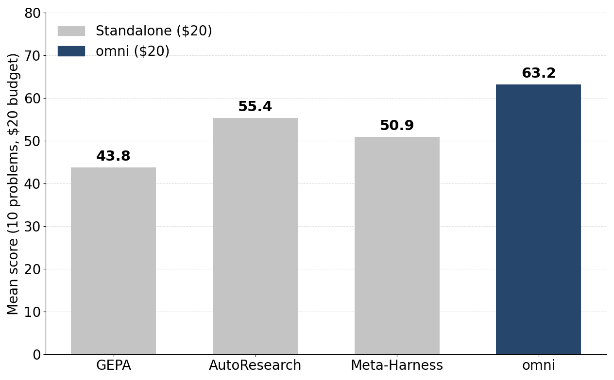

---
date:
  created: 2026-07-22
authors:
 - gepa-team
# - shangyin
# - lakshya
# - donghyun
# - ben
# - dan
# - koushik
# - alex
# - matei
slug: optimize-anything-omni
readtime: 15
title: "optimize_anything Goes omni: Composing Optimizers into Meta-Optimizer Pipelines"
description: "optimize_anything now supports customizable optimizers that can be composed into meta-optimizer pipelines. Why compose? Because no single optimizer wins everywhere. Our omni meta-optimizer combines the best of each and beats every standalone optimizer on Frontier-CS tasks under a matched budget."
social_image: blog/2026-05-28-optimize-anything-omni/images/omni_design.png
citation_authors:
  - "GEPA Team"
#  - "Shangyin Tan"
#  - "Lakshya A Agrawal"
#  - "Donghyun Lee"
#  - "Jialin Zhang"
#  - "Dan Klein"
#  - "Koushik Sen"
#  - "Alexandros G. Dimakis"
#  - "Matei Zaharia"
citation_technical_report_institution: "UC Berkeley"
citation_keywords: "text optimization, LLM-driven optimization, prompt optimization, program optimization, agent-based optimization, optimizer pipeline, Pareto optimization, GEPA, Frontier-CS"
---

# <span class="gradient-code">optimize_anything</span> Goes <span class="gradient-code">omni</span> : Pluggable Engines and Composable Optimizer Pipelines

!!! tip ""
    **TL;DR.** `optimize_anything` is now **engine-pluggable** and **pipeline-composable**: one argument (`engine=`) dispatches the same optimization task to any supported engine, such as GEPA, [AutoResearch](https://github.com/karpathy/autoresearch), or [Meta-Harness](https://arxiv.org/abs/2603.28052), and the engines compose into multi-stage pipelines as well. Using [Terrarium](https://github.com/gepa-ai/terrarium), our new evaluation framework that runs every optimizer to a curated set of task with a matched budget, we find that **no single optimizer dominates** on [Frontier-CS](https://arxiv.org/abs/2512.15699), but the meta-optimizer **<span class="gradient-code">omni</span>** beats every standalone optimizer under a matched \$20 budget.

<figure markdown="span">
  { style="width: 70%;" }
  <figcaption>On Frontier-CS, the meta-optimizer <span class="gradient-code">omni</span> beats every standalone optimizer.</figcaption>
</figure>

When we [introduced `optimize_anything`](https://gepa-ai.github.io/gepa/blog/introducing-optimize-anything/), the premise was simple: if your artifact is describable as text and its quality can be measured, you can optimize it. You write down the artifact and a function that scores it, and GEPA's reflective-mutation loop optimizes it.

But GEPA's reflective proposer is just *one* way to run the optimization loop. A growing set of systems share a similar shape with a candidate string, a black-box scoring function, and an LLM-driven search loop. Some delegate the entire loop to an autonomous coding agent (e.g., [AutoResearch](https://github.com/karpathy/autoresearch)). Some keep an external framework in charge of loop orchestration and let an agent mutate one candidate at a time (e.g., [Meta-Harness](https://arxiv.org/abs/2603.28052)). Each is strong on some problems and weak on others, and **we don't have a good way to tell which will win**. Until now, switching between them meant porting your task into a new framework.

This release changes that in two ways. First, `optimize_anything` now can dispatch the same call to any of these optimizers. You pick one with the `engine` argument, or plug in your own. Second, the optimizers compose. You can run several engines in any order, keep the best, and continue from there. We also release an example meta-optimizer <span class="gradient-code">omni</span> that runs all three engines in parallel and leverages the best result. 

## Different Optimizers

These systems fall into three families. All fit the same `(candidate, score, loop)` contract, differing only in *who proposes the next candidate* and *who owns the loop*:

<figure markdown="span">
  { style="width: 100%;" }
  <figcaption><strong>Left:</strong> an orchestrator framework owns the loop and parent selection; the proposer is either a single LLM call (LLM-based, e.g. GEPA) or a coding agent (agent-based, e.g. <a href="https://arxiv.org/abs/2603.28052">Meta-Harness</a>). <strong>Right:</strong> a single autonomous agent (e.g. <a href="https://github.com/karpathy/autoresearch">AutoResearch</a>) owns everything.</figcaption>
</figure>

`optimize_anything` now ships three engines, one per family:

| `engine=` | Family | How it proposes |
| --- | --- | --- |
| `"gepa"`  | LLM-based optimizer | A single reflective LLM call mutates a parent selected from a Pareto frontier. |
| `"autoresearch"` | Autonomous agent | A long-horizon [Claude Code](https://www.anthropic.com/claude-code) session ([AutoResearch](https://github.com/karpathy/autoresearch)-style) owns the entire loop: selection, proposal, and evaluation. |
| `"meta_harness"` | Agent-based | A coding-agent proposer mutates candidates while the framework owns the outer loop and parent selection ([Meta-Harness](https://arxiv.org/abs/2603.28052)). |

You pick the engine with one argument. The task and the `evaluate` function stay the same:

```python
from gepa.optimize_anything import optimize_anything, OptimizeAnythingConfig

def evaluate(candidate: str) -> tuple[float, dict]:
    score, feedback = run_judge(candidate)
    return score, {"Feedback": feedback}

seed = open("seed_solution.py").read()
task = dict(
    evaluator=evaluate,
    objective="Maximize the score for this competitive-programming problem.",
    background="A sandboxed judge runs hidden tests and returns a 0–100 score.",
)

# Same task, same evaluator, swap only the engine:
result_gepa = optimize_anything(seed, **task, 
                          config=OptimizeAnythingConfig(engine="gepa",        ))
result_autoresearch = optimize_anything(seed, **task, 
                          config=OptimizeAnythingConfig(engine="autoresearch",))
result_meta_harness = optimize_anything(seed, **task, 
                          config=OptimizeAnythingConfig(engine="meta_harness",))

```

The `evaluate` function is polymorphic: `(candidate) -> (score, info)` for single-task problems, or `(candidate, example) -> (score, info)` when you also pass `dataset` / `valset` examples. The returned `info` dict is handed to the proposer as **Actionable Side Information (ASI)**: the feedback an engine uses to decide what to change next.


## Why one optimizer is not enough

To decide *which* engine to reach for, we ran a controlled study with [Terrarium](https://github.com/gepa-ai/terrarium), holding the task, budget, model (Claude Sonnet 4.6, medium thinking), and evaluation server fixed, and varying only the optimizer. The most basic question a practitioner asks is: *which optimizer should I use?* On [Frontier-CS](https://arxiv.org/abs/2512.15699), a suite of open-ended, verifiable competitive-programming problems where each candidate is a full program scored by a hidden-test judge, the answer is uncomfortable.

<figure markdown="span">
  { style="width: 100%;" }
  <figcaption>On Frontier-CS (10 problems, $20 budget each, Claude Sonnet 4.6). <strong>(a)</strong> AutoResearch has the highest average (55.4), ahead of Meta-Harness (50.9) and GEPA (43.8). <strong>(b)</strong> But per problem, the winner is nearly a coin toss: GEPA wins 3, AutoResearch 3, Meta-Harness 4. The optimizer that wins a given problem is hard to predict from the problem itself.</figcaption>
</figure>

All three optimizers far outscore a zero-shot baseline. A single LLM call to the same model scores just **7.72** on average, versus 43.8–55.4 for the optimizers, so *some* optimizer is clearly essential. But which one? AutoResearch has the best average, but the per-problem numbers undercut that average: each optimizer is the best on about a third of the problems, and we couldn't find a way to predict the winner from the problem itself. "Pick the right optimizer for the task" isn't a usable answer when you can't tell which one is right.

### Optimizers plateau, but a fresh optimizer may break through!

There's a second effect. Given enough budget, every optimizer makes most of its gains early and then plateaus; the rest of the budget makes little difference. So we asked: is that tail of budget wasted, or can a *different* optimizer, handed the stalled candidate, break the plateau?

It usually can.

<figure markdown="span">
  { style="width: 100%;" }
  <figcaption>Switching optimizers unblocks a plateau. The original optimizer is dashed past its stuck point; the alternatives receive its best candidate as a seed and start fresh under the remaining budget. <strong>P0:</strong> GEPA plateaus at 54.4 (after ≈$1.3); AutoResearch lifts it to 62.7. <strong>P85:</strong> AutoResearch plateaus at 50.0 (after ≈$0.5); both GEPA and Meta-Harness reach a perfect 100.</figcaption>
</figure>

The plateau one optimizer reaches is rarely the best the budget can buy: a *different* optimizer, seeded from the stuck candidate, usually keeps making progress. Which one helps varies, too — on P0, AutoResearch breaks through while Meta-Harness stays put. Both findings point the same way: rather than bet the whole budget on one optimizer, **explore with several and continue from the best**.

## <span class="gradient-code">omni</span>: composing optimizers into a meta-optimizer

These observations point to a design rather than a single winner. **<span class="gradient-code">omni</span>** is a meta-optimizer that puts both findings to work under one budget:

<figure markdown="span">
  { style="width: 100%;" }
  <figcaption><span class="gradient-code">omni</span> as a meta-optimizer. <strong>Phase 1:</strong> run every engine in parallel on a small slice of the budget and pick the single best candidate, exploiting that no optimizer dominates, and that early progress is fast. <strong>Phase 2:</strong> hand that candidate to a <em>fresh</em> optimizer for the rest of the budget, exploiting that a fresh optimizer breaks plateaus.
</figure>

Phase 1 starts the slow part of the search from a better candidate than any single optimizer reaches alone; phase 2 hands that candidate to a fresh optimizer to push past the plateau. In the new API this is a short composition over the same engines: `optimize_best_of` runs several engines in parallel and keeps the highest-scoring candidate, then a fresh optimizer continues from it:

```python
from gepa.optimize_anything import (
    optimize_anything, optimize_best_of, OptimizeAnythingConfig,
)

# Phase 1 ~ explore: run all engines in parallel, keep the best.
explore = optimize_best_of(seed, **task, configs=[
    OptimizeAnythingConfig(engine="gepa",         max_token_cost=5),
    OptimizeAnythingConfig(engine="autoresearch", max_token_cost=5),
    OptimizeAnythingConfig(engine="meta_harness", max_token_cost=5),
])

# Phase 2 ~ continue: seed a fresh optimizer from the winner.
#   The continuation engine names the variant. This is omni-GEPA.
omni = optimize_anything(
    explore.best_candidate, **task,
    config=OptimizeAnythingConfig(engine="gepa", max_token_cost=5),
)

```

<span class="gradient-code">omni</span> is just one point in the design space the new API opens up. The same primitives compose other strategies:

- **`optimize_sequential`** — chain engines; each one's best seeds the next (monotonic, so a regressing stage can't poison a later one).
- **`optimize_parallel`** / **`optimize_best_of`** — run engines concurrently; take all results, or just the highest-scoring.
- **`optimize_vote`** — run in parallel, then vote each engine's best once through your evaluator for a fair cross-engine comparison.
- **`optimize_adaptive_sequential`** — give the active engine a bounded slice, watch for a plateau, and *automatically* switch engines when progress slows down. The "fresh optimizer breaks through the plateau" effect, scheduled for you under one shared budget.


## Results: <span class="gradient-code">omni</span> beats every standalone optimizer on Frontier-CS

We compared each engine run standalone against the corresponding <span class="gradient-code">omni</span> variant on Frontier-CS, under a matched **\$20** budget. The figure at the top of the post shows that the best <span class="gradient-code">omni</span> variant outscores every standalone optimizer, and every continuation variant beats its standalone counterpart:

| Optimizer | Standalone | `omni` | Improvement |
| --- | --- | --- | --- |
| GEPA | 43.8 | **61.8** | +18.0 (**+41%**) |
| AutoResearch | 55.4 | **63.2** | +7.8 (+14%) |
| Meta-Harness | 50.9 | **59.3** | +8.4 (+16%) |

The largest gain goes to GEPA: standalone GEPA is weaker than both agent-driven baselines, but <span class="gradient-code">omni</span>-GEPA overtakes even the strongest standalone optimizer (AutoResearch). And every <span class="gradient-code">omni</span> variant beats every standalone optimizer — the weakest variant still scores higher than the best single engine. The reliable win comes from the composition.

## Getting started

**The best way to use `optimize_anything` is through the skill**, [`gepa-optimize-anything`](https://github.com/gepa-ai/gepa/tree/main/.claude/skills/gepa-optimize-anything): an instruction bundle that teaches a coding agent to drive the API for you, from picking the optimization mode to writing a feedback-rich evaluator, finding the right budget (it is always recommended to choose your own budget for realistic/production tasks), and avoiding the common pitfalls. In a clone of the repo, Claude Code (or any agent that reads `.claude/skills/`) discovers it automatically; just ask the agent to optimize something. Elsewhere, install it with `/plugin marketplace add gepa-ai/gepa` and `/plugin install gepa-optimize-anything@gepa` (see the [Agent Skill guide](https://gepa-ai.github.io/gepa/guides/agent-skill/)).

Prefer to wire it up by hand? `optimize_anything` should be your entry point. Define your evaluator, pick the engine, and go:

```bash
pip install gepa[full]
```

```python
from gepa.optimize_anything import optimize_anything, OptimizeAnythingConfig

result = optimize_anything(
    "<your artifact>",
    evaluator=your_evaluator,
    objective="<what good looks like>",
    config=OptimizeAnythingConfig(engine="gepa"),   # or "autoresearch", "meta_harness"
)
```

We are releasing both pieces of this work together: the engine-pluggable, pipeline-composable `optimize_anything`, and [Terrarium](https://github.com/gepa-ai/terrarium), the evaluation framework that pins optimizers to a shared task / eval-server / budget contract so they can be compared head-to-head. We'd love community contributions of new engines, tasks, and pipelines.

- [Documentation](https://gepa-ai.github.io/gepa/)
- [GitHub](https://github.com/gepa-ai/gepa) · [Terrarium](https://github.com/gepa-ai/terrarium)
- [Discord](https://discord.gg/WXFSeVGdbW)
- [Twitter](https://x.com/gepa_ai)
- [Slack](https://join.slack.com/t/gepa-ai/shared_invite/zt-3o352xhyf-QZDfwmMpiQjsvoSYo7M1_w)


## Appendix: Bringing your own optimizer

The three engines we ship are just a starting set. The engine surface is small enough that any LLM-driven search loop fits, and if you have a different proposer — a new reflective template, a different agent scaffold, an evolutionary policy — you drop it in as an engine and everything else in `optimize_anything` (the pipeline helpers, the eval-server budget, the [Terrarium](https://github.com/gepa-ai/terrarium) task registry) comes with it for free.

The contract is one class and one line of registration:

```python
from gepa.oa.engine import Result
from gepa.oa.registry import register_engine

class MyEngine:
    name = "my_engine"

    def __init__(self, config):
        # Cross-cutting caps every engine honors:
        self.max_token_cost = config.max_token_cost   # your proposer's USD budget
        self.stop_at_score = config.stop_at_score     # early-exit target
        # Pop your engine-specific options out of config.engine_config here.

    def run(self, task, server) -> Result:
        best, best_score = task.seed_candidate or "", float("-inf")
        while ...:                                     # your termination logic
            candidate = your_proposer(task, best)
            score, _ = server.evaluate(candidate)       # eval budget is enforced here
            if score > best_score:
                best, best_score = candidate, score
        return Result(best_candidate=best, best_score=best_score)

register_engine("my_engine", MyEngine)
```

Once registered, users pick your engine exactly like the built-ins — `config=OptimizeAnythingConfig(engine="my_engine")` — and every composition helper works with it. Running `optimize_best_of` with `MyEngine` alongside GEPA and AutoResearch, or slotting it into `optimize_adaptive_sequential` as an unstuck-the-plateau step, is a one-line configuration change. And the plateau story from earlier is the argument: engines that get stuck where GEPA doesn't (and vice versa) make every composition strictly better.

The built-in [`best_of_n`](https://github.com/gepa-ai/gepa/blob/feat/optimize-anything-omni/src/gepa/oa/engines/best_of_n.py) engine — sample from one LLM call, evaluate, keep the best — is a ~150-line end-to-end reference for how a from-scratch engine reads `config.engine_config`, honors the two budgets, and streams to `eval_log`. If you'd like your optimizer to ship with `optimize_anything`, open a PR against [gepa-ai/gepa](https://github.com/gepa-ai/gepa); we'd love to make it available to every downstream user.
