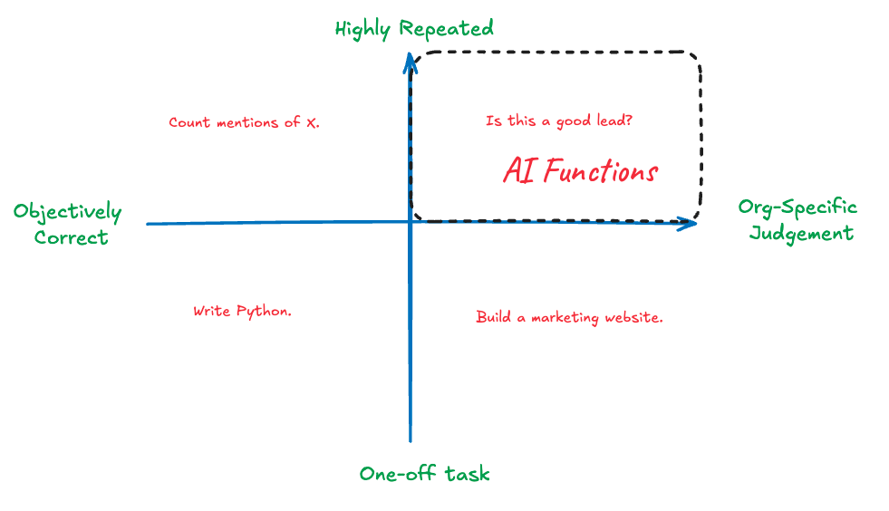
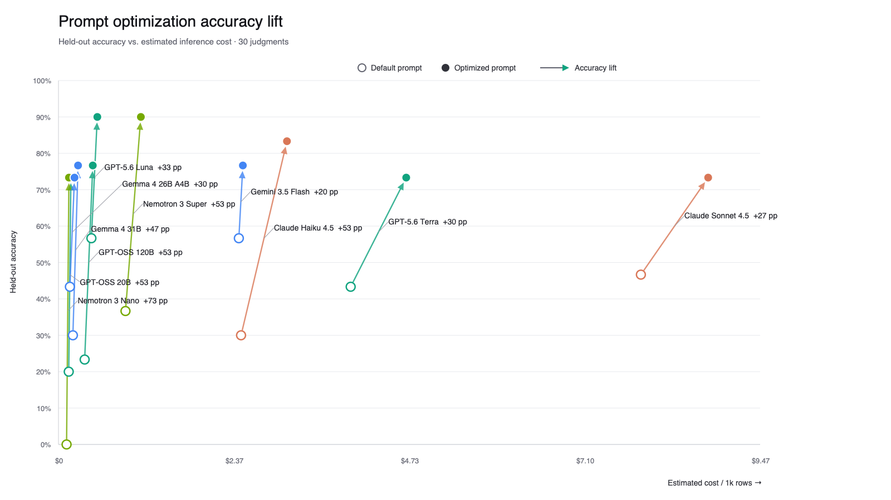
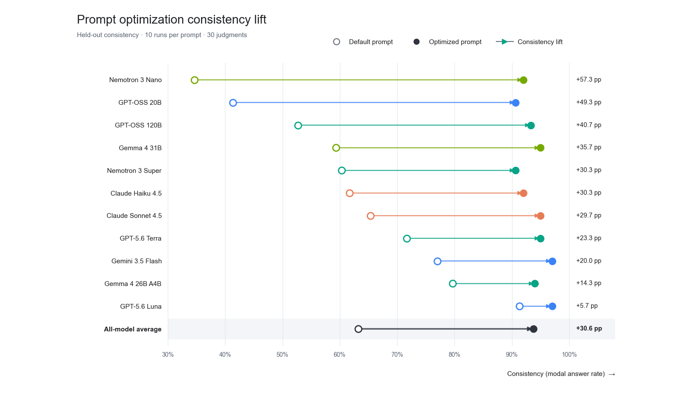

---
date:
  created: 2026-09-17
authors:
  - seth
guest: true
slug: bridging-the-subjectivity-gap
readtime: 8
title: "Bridging the Subjectivity Gap: How Automated Prompt Optimization Helps Teams Build Expert-Aligned AI Functions"
description: "A case study by Sutro showing how automated prompt optimization aligns repeated AI decisions with organization-specific judgment using only 30 annotations."
social_image: blog/2026-09-17-bridging-the-subjectivity-gap/images/accuracy-lift.png
external_links_new_tab: true
---

# Bridging the Subjectivity Gap: How Automated Prompt Optimization Helps Teams Build Expert-Aligned AI Functions

  
<strong>30</strong><b>annotations</b>

  
<strong>+42.9pp</strong><b>average accuracy increase</b>

  
<strong>+30.6pp</strong><b>average consistency increase</b>

  
<strong>79%</strong><b>cheaper at peak accuracy</b>

Most applied AI organizations build systems for recurring tasks, often taking the form of scorers, judges, classifiers, summarizers, matchers, and more. These tasks are typically subjective in nature, and the goal is to align the judgment of a model with that of a domain expert.

While foundation models have a lot of general world knowledge, they don't know how *your organization* wants a particular decision made. That gap between general intelligence and organization-specific judgment is the **subjectivity gap**.

We refer to models that make repeated decisions as **AI Functions**. They make up a less-visible category of intelligence relative to agentic coding, world models, and robotics - but are perhaps just as important, if not more so.

<!-- more -->

<figure markdown="span">
  { style="width: 100%;" }
  <figcaption>AI Functions are repeated tasks whose correct output depends on organization-specific judgment rather than a universal answer.</figcaption>
</figure>

Building AI Functions is easy, but calibrating them to your judgment remains difficult. Common options include hand-tuning prompts, having a coding agent scan a dataset and write a prompt that encodes its own judgment, or collecting labeled data and fine-tuning your own model.

Reflective prompt optimization is a better fit for this setting, for two reasons:

- **It works well in sparse-data environments.** You only need to capture enough representative samples to demonstrate the general decision procedure, not thousands of "easy" cases that are already in-distribution for a foundation model.
- **Modern foundation models are adept at instruction following.** They can follow a well-defined, in-context decision policy. Instead of encoding that policy in model weights through fine-tuning or reinforcement learning, reflective optimization can encode it in context - through prompts and, optionally, tools - so the resulting AI Function can run on off-the-shelf inference.

It's like teaching a new employee or intern how work gets done at your company. If you can give them the right context, instructions, and a handful of tricky examples plus their solutions, they can be surprisingly effective at carrying out specific organizational tasks right out of the gate.

For this work we used <a href="https://gepa-ai.github.io/gepa/" target="_blank" rel="noopener noreferrer">GEPA</a>, an open-source reflective optimizer whose flexibility, speed, and abstractions such as <a href="https://gepa-ai.github.io/gepa/api/optimize_anything/optimize_anything/" target="_blank" rel="noopener noreferrer"><em>optimize_anything</em></a> make it practical to adapt to new scenarios.

## A simple demonstration

The loop is: build a reference set that encodes *your* judgment, evaluate models against it, then optimize prompts so each model adapts to those labels. The hard part is the first step—finding cases that are both difficult and representative enough to teach the decision policy. Easy examples are already in-distribution for frontier models; they do not surface the subjectivity gap. In this study, the Sutro platform materializes a stream of hard lead-scoring cases for annotation; we used two held-out sets of 30 labels each (one for eval, one for GEPA).[^hard-cases]

We started from a short prompt that briefly described what Sutro does and asked models to classify leads as *strong*, *medium*, or *weak* fits, then evaluated eleven frontier models on the eval set. Separately, GEPA optimized each model's system prompt against the training set. Results below are plotted against extrapolated cost to process 1,000 records.

<figure markdown="span">
  { style="width: 100%;" }
  <figcaption>GEPA improved held-out accuracy for every model. The chart plots default and optimized prompts against the estimated inference cost per 1,000 records.</figcaption>
</figure>

<figure markdown="span">
  { style="width: 100%;" }
  <figcaption>Optimization also made model judgments substantially more repeatable. Every model exceeded 90% consistency after optimization, measured as modal answer rate over ten runs.</figcaption>
</figure>

Every model gained accuracy (mean **+42.9pp**); several open-weight models matched or beat larger proprietary ones after optimization. Consistency, measured as modal answer rate over ten runs, rose above **90%** for all eleven. Per-model numbers are in the [Appendix](#appendix-per-model-results).

### Cost

Optimized prompts averaged **15.4%** higher cost per lead (longer context). After adaptation, though, Nemotron 3 Super and GPT 5.6 Luna hit the study's peak accuracy (**90%**) at **54%** and **79%** lower cost than Gemini 3.5 Flash (optimized peak **77%**). Serving cost is dominated by which model you pick once prompts are adapted—not by the modest prompt-length overhead (often cacheable).

## Becoming model-agnostic

It's worth reiterating that we treated this task as model-agnostic. We created an annotation set of hard cases, gave each model the opportunity to adapt to the task with reflective optimization, and then let our own evaluation tell us which models were best suited for the job. We used our own data, representing our own decision criteria, to make an informed choice about which model to deploy.

This becomes particularly important when there are real deployment constraints. If a team needs to use an open-weight model for security reasons or stay below a particular inference cost, a task-specific evaluation like this can show which models actually satisfy those constraints **after adaptation**, rather than forcing the team to infer suitability from general-purpose benchmarks.

## Alternatives

**Manual prompt engineering.** If we were to do the same exercise with manual prompt engineering, it would require the time-intensive process of:

- Gathering hard and representative samples by hand and setting up tooling to track performance quality on each iteration.
- Manually looking for error modes in failed cases and appending them as new rules to the prompt. This could take hours, days, or weeks, depending on quality needs.
- Repeating this for every model we want to test - or hoping a single prompt generalizes well to all of them.

**Model-written prompts.** We could ask Claude or another auto-grader to populate our annotations instead of humans, but this defeats the purpose of learning our subjective rules.

**Fine-tuning or reinforcement learning.** Weight-based adaptation can be powerful, particularly when sufficient training data and verifiable rewards are available. For this task, however, reflective optimization produced substantial improvement from only 30 annotations and required no weight updates.

In our case, 30 annotations earned us an average of **42.9** percentage points of task accuracy.

Because reflective optimization doesn't require weight updates, it's easy to run AI Functions using off-the-shelf, serverless inference providers. It also becomes trivial to re-optimize whenever labeled data arrives.

## Own the eval, then pick the model

As more public benchmarks become saturated and the frontier landscape fragments, more applied AI teams are asking:

- Is this model performant on *our task*, not just a public benchmark?
- How can we have greater sovereignty over the models that run *our tasks* on *our data*?
- How can we become *model-agnostic* and adapt our tasks to the best model for the job?

We used GEPA to answer those questions for our lead scorer. Many enterprise tasks look like this: the last mile is subjective judgment.

Reflective optimization is also a way to lift open-weight models to or above proprietary ones on a given task, without training custom weights. As more models become available, cheap, inspectable adaptation starts to matter alongside fine-tuning and RL.

## Limitations

- Selecting and maintaining hard, representative annotation sets remains the main bottleneck (see above). That is the workflow <a href="https://sutro.sh/" target="_blank" rel="noopener noreferrer">Sutro</a> is built around.
- Reflective optimizers like GEPA still need good scorers. Sometimes a simple label match is enough; other times you need meta-judges or richer objectives.

## Related: aligning structured judges

A related line of work applies the same subjectivity-gap idea to structured judgment models (for example TypeSafe's Jev): align the judge to human labels with reflective optimization rather than treating zero-shot judgment as fixed. See <a href="https://github.com/sutro-sh/jev-align" target="_blank" rel="noopener noreferrer">sutro-sh/jev-align</a> for an open example of that loop.

## Reach out

Questions about this guest post are welcome at [team@sutro.sh](mailto:team@sutro.sh). For GEPA itself, join the community on <a href="https://join.slack.com/t/gepa-ai/shared_invite/zt-3o352xhyf-QZDfwmMpiQjsvoSYo7M1_w" target="_blank" rel="noopener noreferrer">Slack</a>.

## Appendix: per-model results {#appendix-per-model-results}

Held-out accuracy and consistency for each of the eleven models. Consistency is the modal answer rate over ten independent runs with the same prompt.

**Accuracy**

| Model | Default prompt | Optimized prompt | Gain |
| --- | ---: | ---: | ---: |
| **`gpt-oss-120b`** | 23% | 77% | +54pp |
| **`gpt-oss-20b`** | 20% | 73% | +53pp |
| **`nemotron-3-nano`** | 0% | 73% | **+73pp** |
| **`nemotron-3-super`** | 37% | **90%** | +53pp |
| **`claude-haiku-4-5`** | 30% | 83% | +53pp |
| **`claude-sonnet-4-5`** | 47% | 73% | +26pp |
| **`gemini-3.5-flash`** | **57%** | 77% | +20pp |
| **`gemma-4-26b-a4b`** | 43% | 73% | +30pp |
| **`gemma-4-31b`** | 30% | 77% | +47pp |
| **`openai-gpt-5.6-luna`** | **57%** | **90%** | +33pp |
| **`openai-gpt-5.6-terra`** | 43% | 73% | +30pp |

**Consistency across 10 runs**

| Model | Default prompt | Optimized prompt | Gain |
| --- | ---: | ---: | ---: |
| **`gpt-oss-120b`** | 53% | 93% | +40pp |
| **`gpt-oss-20b`** | 41% | 91% | +50pp |
| **`nemotron-3-nano`** | 35% | 92% | **+57pp** |
| **`nemotron-3-super`** | 60% | 91% | +31pp |
| **`claude-haiku-4-5`** | 62% | 92% | +30pp |
| **`claude-sonnet-4-5`** | 65% | 95% | +30pp |
| **`gemini-3.5-flash`** | 77% | **97%** | +20pp |
| **`gemma-4-26b-a4b`** | 80% | 94% | +14pp |
| **`gemma-4-31b`** | 59% | 95% | +36pp |
| **`openai-gpt-5.6-luna`** | **91%** | **97%** | +6pp |
| **`openai-gpt-5.6-terra`** | 72% | 95% | +23pp |

[^hard-cases]: Sutro's platform materializes hard examples for annotation and optimization. Curating that stream—not writing the starting prompt—is the scarce step.

