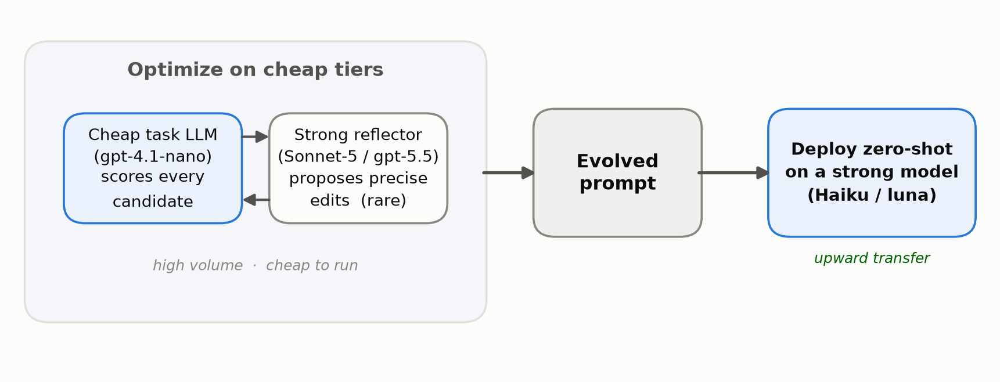
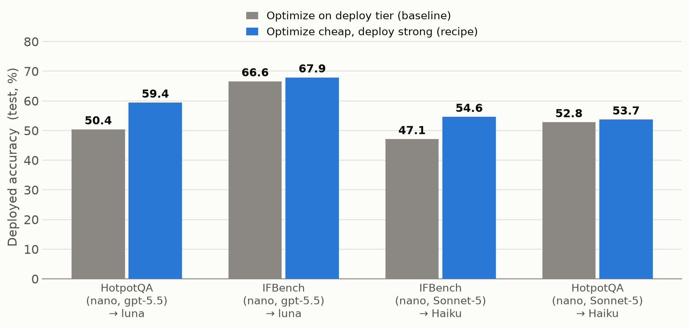
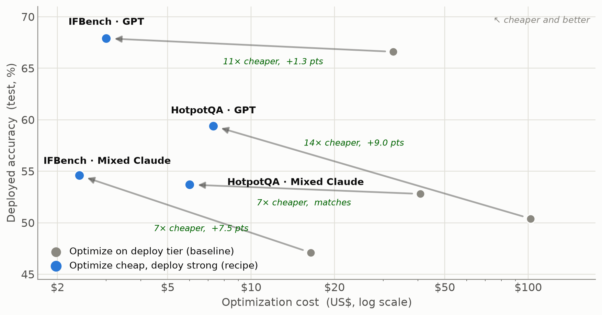

---
date:
  created: 2026-09-29
authors:
 - taloved
 - roipony
 - oshri
 - udi
 - lakshya
slug: optimize-cheap-deploy-strong
readtime: 10
title: "Optimize Cheap, Deploy Strong: A Recipe for Cost-Efficient GEPA"
description: "GEPA's cost is dominated by the task model that scores every candidate. Move that role to the cheapest model, keep a strong reflector for the rare edits, and deploy the evolved prompt zero-shot on a stronger model. On HotpotQA that is +9.0 points at about 14x less cost. We call it positive transfer: a prompt tuned on a cheap model can beat one the strong model tuned for itself."
social_image: blog/2026-09-29-optimize-cheap-deploy-strong/images/fig1_recipe.png
citation_authors:
  - "Tal Oved"
  - "Roi Pony"
  - "Oshri Naparstek"
  - "Udi Barzelay"
  - "Lakshya A Agrawal"
citation_technical_report_institution: "IBM Research, UC Berkeley"
citation_keywords: "prompt optimization, GEPA, cost-efficient optimization, cross-tier transfer, positive transfer, reflective optimization"
---

# Optimize Cheap, Deploy Strong: A Recipe for Cost-Efficient GEPA

Today, we are sharing a simple recipe for running **GEPA** at a fraction of the
cost, without giving up accuracy. In fact, you often get more of it. On HotpotQA,
a prompt optimized this way deploys at **59.4%** against **50.4%** without using
our recipe. That is a **+9.0 point** gain while
spending about **14x less** ($7 vs $102). On IFBench the same recipe wins by
**+7.5 points** at about **7x less**.

First, the primary cost driver in GEPA is the evaluation phase.
GEPA evaluates each candidate prompt on the full validation set every iteration.
For every candidate, a task LLM runs the prompt across all of those examples,
so over a full optimization run the task LLM is called hundreds or thousands of times.
That is what dominates the budget. It raises a simple question: what happens if we
run all of those repeated task LLM calls on a very cheap model?

The surprising part is the direction. The cheaper route is also the better one.
We call this **positive transfer**: a prompt tuned with a cheap task LLM can
carry upward to a stronger model at deployment, and reach higher accuracy than
that strong model reaches when it optimizes for itself.

## The Recipe

GEPA optimizes a prompt by running it, scoring the result, and asking a
model to reflect on the trace and propose an edit. That loop uses a model in
three different roles. The recipe is to stop paying for all three at the same
tier, and instead match each role to the cheapest model that can do its job.

1. **Answer on the cheapest model.** The task LLM runs on every rollout, so it
   dominates the budget. GEPA calls it hundreds of times per optimization; the
   reflector is called rarely. Put the task LLM on the cheapest tier you have
   (we use `gpt-4.1-nano`). This single move is most of the saving.

2. **Reflect with a strong model.** The reflection step proposes the edits that
   actually improve the prompt. It is rare, so it is cheap to make it strong. We
   call this the asymmetry of intelligence: a strong model (`Sonnet-5`,
   `gpt-5.5`) writes a precise, well-reasoned edit, and a cheap model only needs
   to rank whether that edit helped.

3. **Deploy the evolved prompt on a stronger model, zero-shot.** The prompt was
   learned using a cheap model, but you serve it on the tier you actually ship (`Haiku`,
   `luna`). No re-optimization. The prompt transfers up.

<figure markdown="span">
  { style="width: 100%;" }
  <figcaption>The recipe in one picture. A cheap task LLM scores every candidate and a strong reflector proposes rare, precise edits. The evolved prompt is then deployed zero-shot on a stronger model.</figcaption>
</figure>

In short: optimize where rollouts are cheap, reflect where reasoning is
worth paying for, and deploy where quality matters.

## Experiments

We ran the recipe across four tasks, four model families, and eleven models in
total. Here is a representative slice, chosen to show the recipe
rather than the full sweep.

### Start on a cheap model

We run GEPA with `gpt-4.1-nano` as the task LLM and a strong model as the
reflector, on HotpotQA (multi-hop QA) and IFBench (instruction following). Every
candidate prompt is scored by the cheap task LLM. The strong reflector only sees
the hard cases and proposes the next edit.

The evolved prompt is then deployed, unchanged, on a stronger model. We compare
against the honest baseline: running the full GEPA loop directly on that same
strong deployment model, task LLM and all.

<figure markdown="span">
  { style="width: 85%;" }
  <figcaption>Deployed accuracy of the evolved prompt. The recipe (optimize cheap, deploy strong) matches or beats optimizing directly on the deployment model, on both tasks and both model families shown.</figcaption>
</figure>

### Transfer to a strong model

This is where the recipe pays off. Deploying the prompt evolved with the cheap
task LLM on the strong tier does not just save money. It reaches a higher
accuracy than the strong tier reaches when it optimizes for itself.

<figure markdown="span">
  { style="width: 85%;" }
  <figcaption>Accuracy against optimization cost, on a log scale. Each arrow goes from the baseline to the recipe. Up and to the left means better accuracy for less money. All four setups cost far less; three lift accuracy and the fourth matches it.</figcaption>
</figure>

Even the base case is a win. On HotpotQA with the Claude family, the recipe only
ties the all-strong baseline on accuracy. But it gets there at about **7x less**
cost. When transfer helps, you pay less and score higher. When it does not, you
still pay a lot less.

## Which pairings transfer best

A natural question follows this recipe. If the task LLM, the reflector, and the deployment
model can all be different, does it matter whether they come from the same vendor?

It does, but not in the way vendor loyalty would suggest. What matters is the
size of the **capability gap** between the cheap task LLM and the deployment
model, not whether they share a vendor. The largest
transfer comes from the pipelines that cross vendors the most, because those are
the ones that pair the cheapest possible task LLM with a much stronger deployment
model.

<figure markdown="span">
  { style="width: 85%;" }
  <figcaption>Transfer gain over full same-tier optimization, pooled by model family. Single-vendor pipelines (GPT, Gemini) gain the least. Cross-vendor pipelines (a Claude deployment, a self-hosted Qwen task LLM) gain the most. Zero means tying the expensive same-tier baseline; every family clears it.</figcaption>
</figure>

Two practical rules come out of this. First, the reflector's vendor does not
matter, only its strength. A cross-vendor reflector (`Sonnet-5` proposing edits
for a GPT pipeline) matches or beats a same-vendor one on every task we tried.
Second, the deployment model can cross vendors freely. The biggest gains,
**+3.8%** pooled, come from the Qwen pipeline, where a self-hosted task LLM feeds
a cross-vendor deployment and the capability gap is widest. Every family
sits at or above the expensive same-tier baseline. Pooled across all setups the gain
is **+2.8%** (95% CI [+1.3, +4.4]), positive in 36 of 48 setups. At n=3 per
family the bars overlap, so read the ordering as a trend, not a ranking.

## Why it works

The cheap task LLM does not need to solve the task. It only needs to rank
candidates well enough that the strong reflector's good edits survive to the next
generation. Ranking is easier than solving, so a cheap model is enough for it.

The prompts GEPA evolves are also more explicit. They spell out the steps,
the format, and the failure cases the reflector saw. We looked at the prompts
themselves. The cheap search writes a longer prompt (**1.29x**), and even per 1,000 tokens it
uses more directives (**1.26x**), more prohibitions (**1.17x**), and far more
capitalized emphasis (**2.80x**).
A stronger deployment model has more capacity to follow that structure, so it
exploits the evolved prompt more fully than the small model that helped write it.
The prompt is a plan, and a stronger model executes the plan better.

## Conclusion

The takeaways:

1. **Positive transfer is real.** A prompt optimized on a cheap model can beat a
   prompt optimized directly on the deployment model. The cheaper route is not a
   compromise. It is often the better result.

2. **The task LLM is the budget.** It runs on every rollout, so moving it to the
   cheapest tier is where the 7x to 14x saving comes from. Spend on the reflector
   instead, because it is rare and it is what drives the gains.

3. **Reduce cost, not just improve accuracy.** Even when transfer only ties the
   expensive baseline, the recipe still cuts optimization cost by about 7x. You
   are never worse off for trying it.

## Future directions

1. **When it does not help.** On prompt-insensitive tasks like LiveBench-Math,
   there is little to learn from a prompt, so the cheap route only matches the
   strong one. It does not beat it. Knowing the low-headroom cases up front is
   part of the recipe.

2. **Automatic tier selection.** Given a budget, pick the task LLM, the reflector,
   and the deployment tier automatically. The recipe is a manual version of a
   choice that should be made for you.
