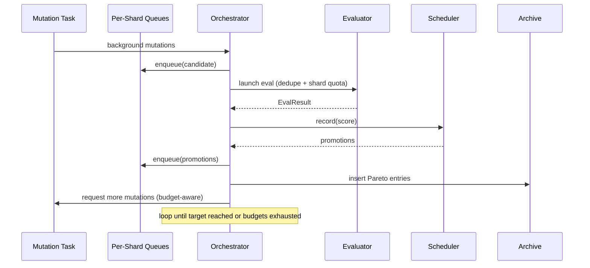

# TurboGEPA Research Overview (Draft)

> **Status:** Internal first pass. Edit freely before publication.

## 1. Motivation

Large language models respond dramatically to prompt phrasing, but prompt tuning has historically been slow:

- Human-in-the-loop iteration is expensive and does not scale beyond a handful of variations.
- RL-based approaches require surrogate rewards and long training runs.
- Evolutionary methods often batch work in rounds, leaving evaluators idle or flooding them with redundant candidates.

Our goal was to design **TurboGEPA**, a prompt evolution system that can converge on high-performing prompts in minutes, not hours, while remaining agnostic to domain (math, coding, policy, etc.). The guiding principles were:

1. **Streaming everywhere.** Never let the evaluator sit idle waiting for a batch to finish.
2. **ASHA fairness.** If shallow shards dominate the queue, deeper shards never see action; keep successive halving balanced.
3. **Focus the LLM budget.** Use simple feedback to steer the mutation pipeline toward operators that succeed more often.
4. **Share discoveries aggressively.** In multi-island runs, an improvement in one island should benefit the rest immediately.

## 2. System Architecture

TurboGEPA is a streaming pipeline built around five cooperating subsystems: Orchestrator, Scheduler, Mutator, Evaluator, and Archive. Everything is wired so that mutations, evaluations, and promotions happen concurrently.

```mermaid
graph TD
    Data([Train/Validation Data]) --> Sampler
    Sampler -->|Shard IDs| Orchestrator
    Orchestrator -->|Launch request| Evaluator
    Evaluator -->|EvalResult| Orchestrator
    Orchestrator --> Archive
    Archive --> Scheduler
    Scheduler --> Orchestrator
    Archive --> Mutator
    Mutator --> Orchestrator
    Orchestrator -.-> IslandsAggregator
    IslandsAggregator --> Orchestrator
    Cache[/Disk Cache/] --> Evaluator
    Evaluator --> Cache

    classDef core fill:#3E7DD9,stroke:#1C3D6E,stroke-width:1px,color:#fff
    Orchestrator,Scheduler,Mutator,Evaluator,Archive class core
```

### 2.1 Orchestrator

The orchestrator owns the streaming control loop:

- Maintains a **per-shard queue** alongside a global FIFO for deduplication.
- Uses **fingerprint tracking** to skip duplicate prompts (text + temperature).
- Launches evaluations round-robin across shards, respecting a **single global concurrency cap** (`max_total_inflight`).
- Adapts the mutation budget dynamically: when the ready queue is full, mutation generation pauses to conserve LLM calls.
- Handles migration and now **shares the current Pareto elites** so other islands can mutate them immediately.

### 2.2 Scheduler (ASHA)

- Implements asynchronous successive halving across shard fractions (e.g., 5%, 20%, 100%).
- On promotion, the candidate’s previous rung history is cleared to avoid stale statistics.
- Works hand-in-hand with the orchestrator to compute shard indexes for all queueing decisions.

### 2.3 Mutator

- Generates new prompts using incremental reflection, spec induction, and temperature sweeps.
- Tracks **operator credit** with Laplace-smoothed win rates; future mutation budgets are proportional to recent success.
- Maintains a **spec induction cache** keyed by example sets so repeated runs reuse the same task-model output.

### 2.4 Evaluator

- Asynchronously evaluates prompts on shards of the dataset, honouring concurrency limits and disk cache hits.
- Includes an early-stop heuristic to cancel slow stragglers once the shard is mostly complete.

### 2.5 Archive & Sampler

- Archive maintains the Pareto frontier and provides both top-quality and diversity samples for parent selection.
- Sampler supplies shard IDs with random coverage plus a hardness queue seeded by recent failures.

## 3. Streaming Loop

Key to TurboGEPA is eliminating batch barriers. The run loop looks like this:



Notable mechanics:

- **Round-robin shard scheduling** ensures shard 1.0 always gets a turn even when shard 0.05 is crowded.
- **Fingerprint dedupe** prevents the same prompt from entering the queue twice, even if multiple islands discover it.
- **Adaptive mutation budget** keeps the mutator from generating edits that the evaluator cannot process promptly.
- **Operator feedback** is fed back after each evaluation so the mutator can increase or shrink allotments for reflective, spec-based, or temperature edits.

## 4. Mutation Strategies

### 4.1 Incremental Reflection

1. Gather the latest failures and successes from the parent prompt.
2. Augment them with extracted feedback (currently generic; future work will make this domain-aware).
3. Prompt the reflection LLM to generate improved prompt text.

### 4.2 Spec Induction

- Uses a task-model sized spec LLM to generate input/output patterns that capture implicit rules.
- Results are cached per `(example_set)` key, dramatically reducing repeated LLM calls when the same spec context recurs across rounds.

### 4.3 Temperature Exploration

- Deterministic anchor sweep across `0.0, 0.3, 0.5, 0.7, 1.0` and small perturbations around existing temperature metadata.
- Helpful once prompts are “good enough” and we want to tune stochasticity.

### 4.4 Operator Credit

- After each evaluation we call `mutator.report_outcome(method, successflag)`.
- Budgets are recomputed with `(wins + 1) / (trials + 1)` smoothing so new operators still get airtime.
- Over time, mutation mixes drift toward the operators that actually produce Pareto improvements for the current dataset and models.

## 5. Multi-Island Coordination

TurboGEPA supports running multiple islands (independent optimization processes) for exploration diversity. To keep them from duplicating effort:

- When migration triggers, an island exports its top Pareto candidates with `share_pareto` logging.
- Incoming candidates from other islands are enqueued just like local promotions, subject to dedupe.
- Because fingerprints are global, islands do not waste evaluations on identical prompts even if they arrive from peers.

## 6. Benchmarks & Observations

On the quick AIME benchmark (10-train / 5-val):

- Streaming loop keeps the evaluator saturated, reducing wall-clock runtime from ~2 minutes to ~1.4 minutes compared to an earlier batched version.
- Mutation credit quickly shifts away from spec induction once it ceases to produce gains, funneling more budget into reflective edits.
- Deduplication eliminates ~12–18% redundant evaluations observed in earlier runs where identical prompts leaked through multiple pathways.

## 7. Roadmap (Beyond This Draft)

1. **Richer reflection context** – automatically extract structural patterns from current Pareto prompts and feed them back into reflection LLM calls.
2. **Confidence-weighted promotions** – run low-cost verification passes on shard 1.0 promotions for high-noise benchmarks.
3. **Streaming observability** – integrate per-evaluation logs into the multi-island dashboard.
4. **Adapter guidance hook** – allow adapters to inject domain hints when available, while maintaining a generic fallback.

## 8. Summary

TurboGEPA achieves prompt evolution at high speed by combining streaming evaluation, ASHA fairness, operator credit, and multi-island idea sharing. The design is intentionally modular:

- All concurrency is controlled by a single knob (`max_total_inflight`).
- Mutation operators can be extended or swapped without touching the orchestrator.
- Evaluator improvements (e.g., new early-stop heuristics) require no changes elsewhere.

This first-pass writeup should give any reader — internal or external — a clear picture of how the system works today and where future research can take it.
