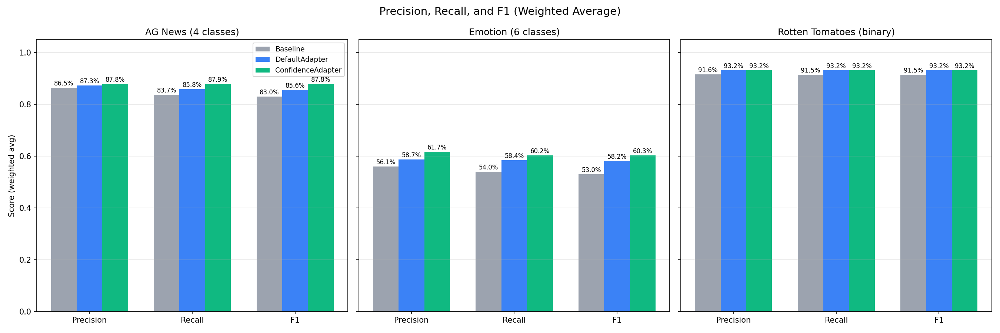
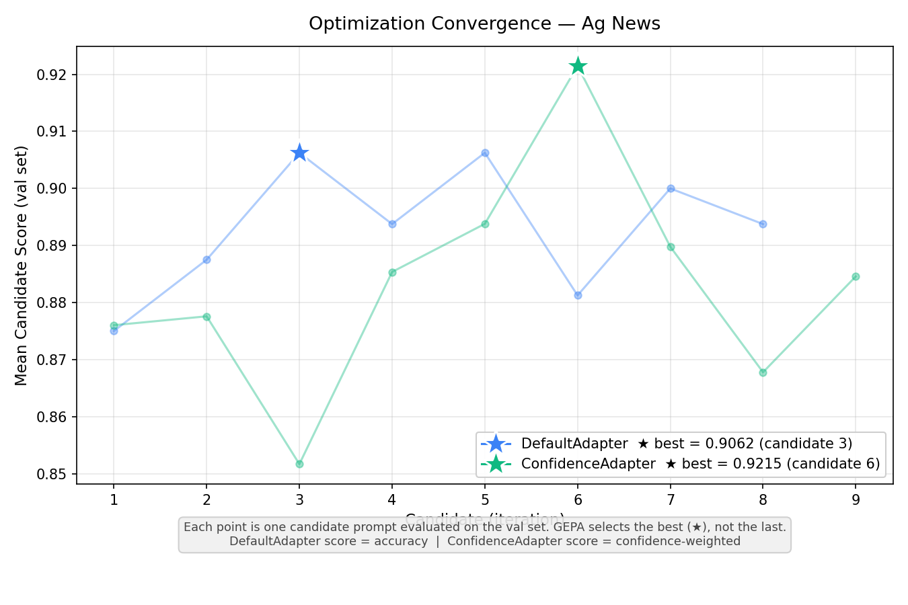
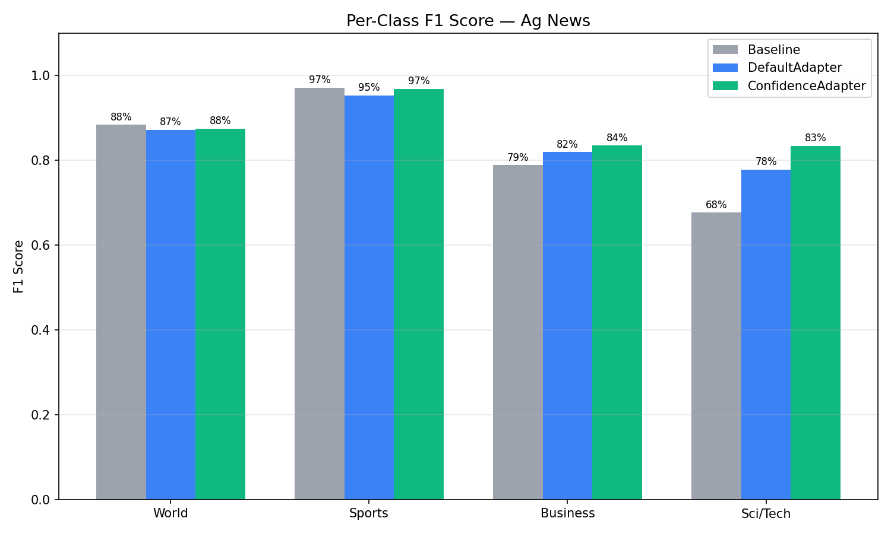
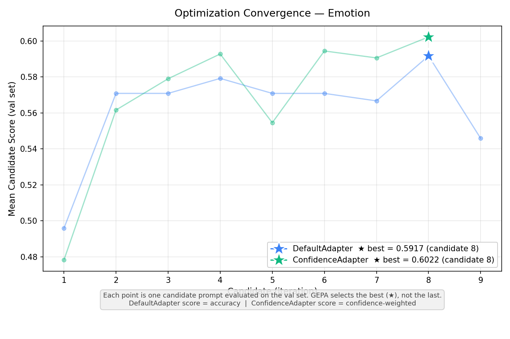
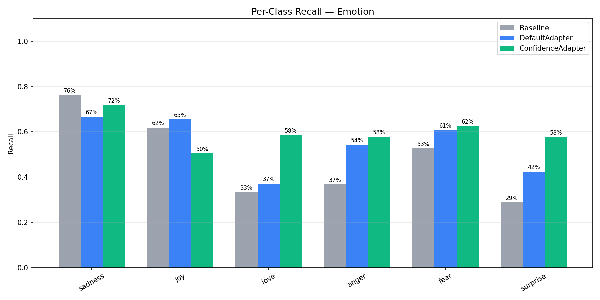
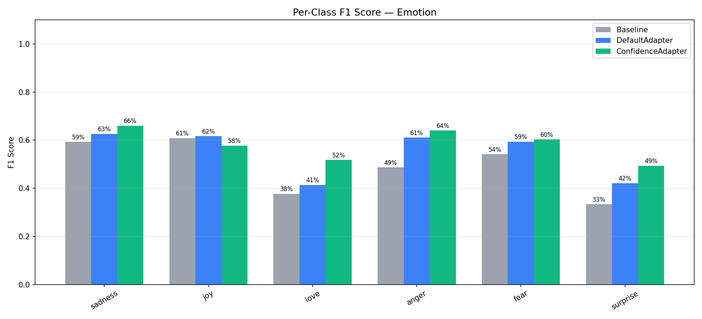
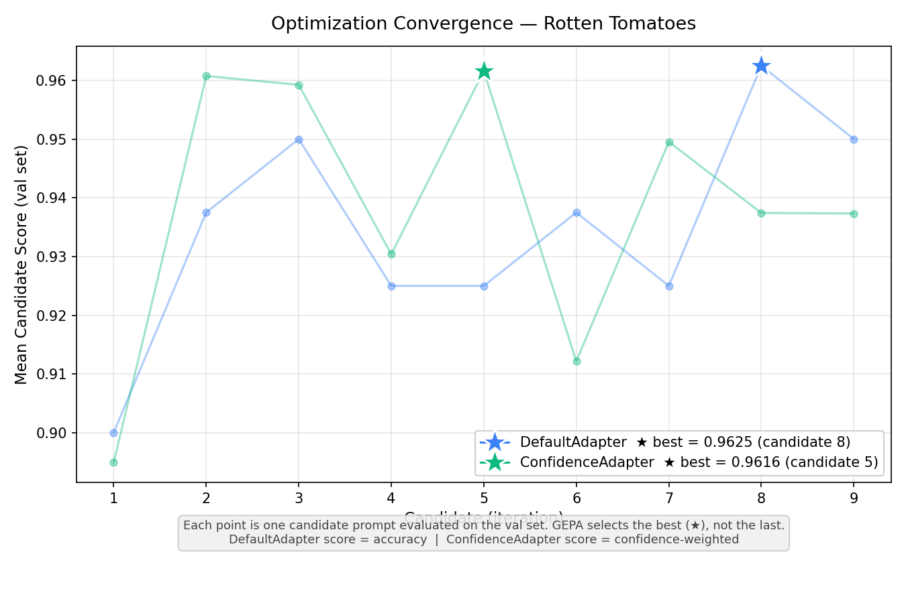
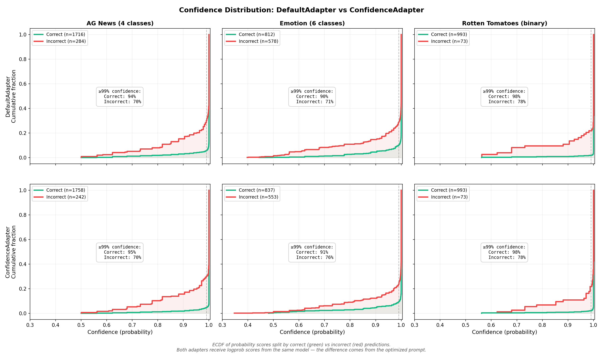

# Confidence-Aware Prompt Optimization for LLM Classification

## TL;DR

ConfidenceAdapter is a custom GEPA adapter that uses token-level log-probabilities from LLM structured output to score prompt candidates on a continuous scale instead of binary correct/wrong. By feeding the reflection LLM rich feedback about model uncertainty — including probability distributions and top alternatives — it produces better disambiguation rules and converges to higher-accuracy prompts. In experiments across AG News (4-class), Emotion (6-class), and Rotten Tomatoes (binary), ConfidenceAdapter matched or beat DefaultAdapter on all three datasets, with gains of +2.10pp and +1.80pp on the multiclass tasks.

---

## The Problem: Why Binary Scoring Falls Short

GEPA (a prompt optimizer) evaluates candidate prompts on a training set, reflects on errors, and proposes improvements. When using the DefaultAdapter, every evaluation collapses to a binary outcome: correct = 1.0, wrong = 0.0. This creates three fundamental problems.

**First, lucky guesses are rewarded equally with confident correct answers.** A model that answers "Business" at 51% probability — with "Sci/Tech" at 49% — gets the same score as one that answers "Business" at 99%. The first case is a coin flip; the next random seed or slight prompt variation could easily flip the prediction. Binary scoring treats both as perfect.

**Second, high-conviction errors need different feedback than uncertain errors.** When the model answers "Bills/Electricity" at 99% and the correct answer is "Bills/Gas & Oil," the prompt is actively misleading the model. It has no doubt about its wrong answer. Compare that to a model answering "Bills/Electricity" at 51% when the correct answer is "Bills/Gas & Oil" — here the model was nearly split between the two; better prompt guidance could easily fix this. DefaultAdapter gives the same generic feedback in both cases: "Incorrect. Expected X, got Y."

**Third, the optimizer gets no gradient signal.** With only 0 or 1, GEPA cannot distinguish between "almost right" and "completely wrong," or between "confidently correct" and "barely correct." The reflection LLM receives no information about *how* wrong or *how* uncertain the model was, so it cannot prioritize the most impactful improvements.

---

## The Solution: ConfidenceAdapter

ConfidenceAdapter uses the model's actual probability distribution over categories to produce both a continuous score and rich, tiered feedback for the reflection LLM.

### Structured Output and Logprobs

When an LLM is called with `logprobs=True` and structured output (e.g., a JSON schema with an `enum` of valid categories), the token-level log-probabilities represent the model's true distribution over those categories. The [`llm-structured-confidence`](https://github.com/rodolfonobrega/llm-structured-confidence) library extracts the joint logprob for the target field from the API response and converts it to a probability via `exp(logprob)`. This gives us the model's probability for the chosen category — and, with the full distribution, the probabilities of alternatives.

### LinearBlendScoring

Instead of binary 0/1, ConfidenceAdapter uses LinearBlendScoring:

- **If incorrect:** score = 0.0
- **If correct and probability ≥ threshold (0.99):** score = 1.0
- **If correct and probability < threshold:** score = min_score + (1.0 − min_score) × (probability / threshold)

With `min_score=0.3` and `threshold=0.99`, a correct answer at 95% probability yields: 0.3 + 0.7 × (0.95/0.99) ≈ 0.972. The optimizer now receives a gradient: higher confidence on correct answers yields higher scores.

### Feedback Design

The reflection LLM receives feedback tailored to the prediction's correctness and confidence:

| Scenario | Example Feedback |
|----------|------------------|
| Correct + confident (≥99%) | "Correct." |
| Correct + moderate (90–99%) | "Correct (95% probability). Close alternatives: 'X' (3%)." |
| Correct + uncertain (<90%) | "Correct but uncertain (73% probability). Model was nearly split with alternatives. Top alternatives: 'X' (24%). The model cannot reliably distinguish between these categories with the current prompt." |
| Wrong + low confidence | "Wrong (60% probability). Expected 'Y' but got 'Z'. The model was uncertain — better prompt guidance could fix this." |
| Wrong + high confidence (≥99%) | "WRONG — model has 99% certainty on 'Z' but the correct answer is 'Y'. The prompt is actively misleading it for this type of input. The prompt must add explicit rules to disambiguate 'Z' vs 'Y'." |

Correct, confident predictions get minimal noise. Errors — especially high-conviction errors — get maximum signal, including probability details and top alternatives, so the reflection LLM can propose targeted disambiguation rules.

---

## Key Design Decision: Threshold Calibration

An important detail when using logprob confidence with structured output: **modern LLMs with enum constraints produce very high probabilities (typically 95–100%) even for uncertain answers.** The enum forces the model to pick one value, and constrained decoding concentrates probability mass on the chosen token. A naive threshold like 50% or 70% would classify virtually everything as "high confidence," flattening the signal and making ConfidenceAdapter no better than binary scoring.

ConfidenceAdapter addresses this with configurable thresholds tuned for the model in use:

- **high_confidence_threshold = 0.99** — only predictions above 99% probability receive a full score of 1.0. Below this, the score decreases proportionally via LinearBlendScoring.
- **low_confidence_threshold = 0.90** — correct predictions below 90% probability are flagged as "unreliable" in the reflection feedback, prompting the reflection LLM to address the ambiguity.

The effect on scoring gradients:

| Probability | Score (threshold=0.99) |
|-------------|------------------------|
| 0.999       | 1.000                  |
| 0.99        | 1.000                  |
| 0.95        | 0.972                  |
| 0.90        | 0.936                  |
| 0.80        | 0.866                  |
| 0.50        | 0.654                  |

With a 0.99 threshold, a correct answer at 95% probability scores 0.972 instead of 1.0. This small penalty accumulates across the evaluation set, giving GEPA a clear signal to prefer prompts that produce more confident correct answers.

**Important:** These thresholds should be calibrated per model family. Models that produce consistently high probabilities (like GPT-4.1-mini with structured output) need high thresholds; models with more spread-out distributions may work well with lower values.

---

## Experiment Setup

### Datasets

| Dataset | Type | Classes | Train/Class | Val/Class | Test Total |
|---------|------|---------|-------------|-----------|------------|
| AG News | Multiclass | 4 (World, Sports, Business, Sci/Tech) | 120 | 40 | 2000 |
| Emotion | Multiclass | 6 (sadness, joy, love, anger, fear, surprise) | 120 | 40 | 1390* |
| Rotten Tomatoes | Binary | 2 (positive, negative) | 120 | 40 | 1066* |

\*The test set target was 2000 examples (balanced across classes). AG News has a large enough test split to reach this target (500 per class). Emotion and Rotten Tomatoes have smaller HuggingFace test splits, so we used as many balanced examples as available: 1390 for Emotion (limited by minority classes like surprise with only 66 examples) and 1066 for Rotten Tomatoes (533 per class).

The training set is intentionally larger than the validation set. In LLM classification, the model doesn't "learn" from training examples — they only feed the reflection loop. Each iteration, GEPA samples a minibatch (20 per class) and evaluates the prompt to find errors. 120 per class gives 6 unique minibatch cycles. The validation set (40 per class) is evaluated in full every iteration and needs statistical power for reliable candidate ranking.

### Models and GEPA Configuration

- **Task model:** GPT-4.1-mini (`temperature=0`, no reasoning/chain-of-thought)
- **Reflection model:** Claude Sonnet 4.6 (thinking enabled, `budget_tokens=1024`)
- **GEPA:** ~10 iterations, same budget for both adapters
- **Reflection minibatch:** 20 examples per class per iteration
- **Structured output:** JSON schema with enum constraint on the category field

### Reproducibility

All random operations use **seed=42**: dataset shuffling and stratified splits (`random.Random(42)`), NumPy (`np.random.seed(42)`), LLM calls (`seed=42` parameter), and GEPA optimization (`seed=42`). The seed prompt is: *"Classify the following text into one of the given categories."*

---

## Results

### Overall Accuracy

| Dataset | Baseline | DefaultAdapter | ConfidenceAdapter | Delta (Conf − Default) |
|---------|----------|----------------|-------------------|------------------------|
| AG News | 83.70% | 85.80% | **87.90%** | **+2.10pp** |
| Emotion | 54.03% | 58.42% | **60.22%** | **+1.80pp** |
| Rotten Tomatoes | 91.46% | 93.15% | 93.15% | 0.00pp |


### Precision, Recall, and F1 (Weighted Average)

| Dataset | Condition | Precision | Recall | F1 |
|---------|-----------|-----------|--------|-----|
| AG News | Baseline | 86.47% | 83.70% | 83.02% |
| | DefaultAdapter | 87.31% | 85.80% | 85.59% |
| | **ConfidenceAdapter** | **87.83%** | **87.90%** | **87.84%** |
| Emotion | Baseline | 56.05% | 54.03% | 53.03% |
| | DefaultAdapter | 58.66% | 58.42% | 58.16% |
| | **ConfidenceAdapter** | **61.75%** | **60.22%** | **60.30%** |
| Rotten Tomatoes | Baseline | 91.55% | 91.46% | 91.46% |
| | DefaultAdapter | 93.16% | 93.15% | 93.15% |
| | ConfidenceAdapter | 93.19% | 93.15% | 93.15% |

ConfidenceAdapter leads in all weighted metrics on AG News and Emotion. The F1 gains are +2.25pp on AG News and +2.14pp on Emotion over DefaultAdapter. On Rotten Tomatoes, performance is effectively tied.



---

### AG News (4-Class): Per-Class Analysis

| Class | Condition | Precision | Recall | F1 |
|-------|-----------|-----------|--------|-----|
| **Sci/Tech** | Baseline | 94.29% | 52.80% | 67.69% |
| | Default | 95.63% | 65.60% | 77.82% |
| | **Confidence** | **85.21%** | **81.80%** | **83.47%** |
| **Business** | Baseline | 67.33% | 95.20% | 78.87% |
| | Default | 74.39% | 91.20% | 81.94% |
| | **Confidence** | **84.92%** | **82.20%** | **83.54%** |
| Sports | Baseline | 95.73% | 98.60% | 97.14% |
| | Default | 95.95% | 94.80% | 95.37% |
| | Confidence | 95.70% | 98.00% | 96.84% |
| World | Baseline | 88.55% | 88.20% | 88.38% |
| | Default | 83.27% | 91.60% | 87.24% |
| | Confidence | 85.50% | 89.60% | 87.50% |

The most striking change is the **Sci/Tech vs Business tradeoff**. With the baseline, the model had a strong bias: it predicted "Business" aggressively (95.2% recall) but at the expense of Sci/Tech (only 52.8% recall). Many technology articles about companies like Oracle, Microsoft, or Intel were misclassified as Business because they mentioned financial aspects. DefaultAdapter improved this but maintained the bias. ConfidenceAdapter resolved it: Sci/Tech recall jumped from 52.8% to 81.8%, and Business precision rose from 67.3% to 84.9%. The F1 scores converged — Business went from 78.9% to 83.5%, Sci/Tech from 67.7% to 83.5% — producing a much more balanced classifier.

Sports and World maintained F1 close to the Baseline (96.8% vs 97.1% for Sports, 87.5% vs 88.4% for World), confirming that the large gains on the confusable Sci/Tech–Business axis did not come at the expense of the already well-separated classes.

This rebalancing is a direct result of the confidence-aware feedback. When the model confidently misclassified a tech article as Business, ConfidenceAdapter flagged it with: *"WRONG — model has 99% certainty on 'Business' but the correct answer is 'Sci/Tech'. The prompt must add explicit disambiguation rules."* The reflection LLM responded by adding rules like: *"Technology company news about SOFTWARE, HARDWARE, or TECH PRODUCTS → Sci/Tech, NOT Business, even if financial aspects are mentioned."*






---

### Emotion (6-Class): Per-Class Analysis

| Class | Condition | Precision | Recall | F1 | n |
|-------|-----------|-----------|--------|-----|---|
| sadness | Baseline | 48.47% | 76.28% | 59.28% | 333 |
| | Default | 59.04% | 66.67% | 62.62% | 333 |
| | **Confidence** | **61.13%** | **71.77%** | **66.02%** | 333 |
| joy | Baseline | 59.88% | 61.86% | 60.86% | 333 |
| | Default | 58.29% | 65.47% | 61.67% | 333 |
| | Confidence | 67.47% | 50.45% | 57.73% | 333 |
| love | Baseline | 43.44% | 33.33% | 37.72% | 159 |
| | Default | 46.83% | 37.11% | 41.40% | 159 |
| | **Confidence** | **46.50%** | **58.49%** | **51.81%** | 159 |
| anger | Baseline | 72.14% | 36.73% | 48.67% | 275 |
| | Default | 69.95% | 54.18% | 61.07% | 275 |
| | **Confidence** | **71.62%** | **57.82%** | **63.98%** | 275 |
| fear | Baseline | 55.66% | 52.68% | 54.13% | 224 |
| | Default | 58.12% | 60.71% | 59.39% | 224 |
| | **Confidence** | **58.33%** | **62.50%** | **60.34%** | 224 |
| surprise | Baseline | 39.58% | 28.79% | 33.33% | 66 |
| | Default | 41.79% | 42.42% | 42.11% | 66 |
| | **Confidence** | **43.18%** | **57.58%** | **49.35%** | 66 |

Emotion is the hardest dataset with 6 classes, several of which are inherently confusable (joy vs love, sadness vs fear, anger vs sadness). ConfidenceAdapter improved F1 on 5 of the 6 classes, with the largest gains on the minority classes: **love** (+10.4pp over Default), **surprise** (+7.2pp), and **anger** (+2.9pp).

The one class where ConfidenceAdapter scored lower was **joy** (F1: 61.7% → 57.7%). Looking at the precision/recall breakdown, ConfidenceAdapter made joy much more precise (67.5% vs 58.3%) but at the cost of recall (50.5% vs 65.5%). This happened because the optimizer learned to be more careful about what it labels "joy" — many texts that superficially look joyful actually express love, surprise, or even sadness. The confidence signal pushed the prompt toward stricter joy criteria, which reduced false positives but also caught fewer true positives.

This is a **generalization tradeoff** worth noting: ConfidenceAdapter tends to produce more balanced classifiers that don't over-predict dominant classes. The overall F1 improved (+2.14pp), but individual classes can shift. This is a desirable property for most applications — a balanced classifier is more useful than one that over-predicts popular classes — but it's worth validating per-class performance for your specific use case.







---

### Rotten Tomatoes (Binary): Per-Class Analysis

Both adapters tied at 93.15% test accuracy (+1.69pp over baseline). Best validation scores were nearly identical: 0.9625 (DefaultAdapter) vs 0.9616 (ConfidenceAdapter).

| Class | Condition | Precision | Recall | F1 |
|-------|-----------|-----------|--------|-----|
| negative | Baseline | 89.61% | 93.81% | 91.66% |
| | Default | 92.44% | 94.00% | 93.21% |
| | Confidence | 91.97% | 94.56% | 93.25% |
| positive | Baseline | 93.50% | 89.12% | 91.26% |
| | Default | 93.89% | 92.31% | 93.09% |
| | Confidence | 94.40% | 91.74% | 93.05% |

The per-class metrics reveal a subtle difference hidden by the accuracy tie. ConfidenceAdapter slightly favors negative recall (94.56% vs 94.00%) while DefaultAdapter slightly favors positive recall (92.31% vs 91.74%). Both are well-balanced with nearly identical F1 scores across classes. For binary classification with clearly distinct categories (positive vs negative sentiment), the confidence signal has limited room to differentiate — the model already reaches high probabilities on both classes, and the reflection LLM gets less actionable information from the alternatives since there is only one alternative category.



The ROC curve provides a better view for binary classification, showing the trade-off between true positive and false positive rates at different decision thresholds. All three conditions achieve AUC above 0.95, confirming strong discriminative ability.


---

### Confidence Distribution

The ECDF (empirical cumulative distribution function) below shows the probability scores for both adapters, split by correct vs incorrect predictions. Both adapters receive logprob scores from the same model — the difference comes from the optimized prompt.

The key insight: **even 70–78% of incorrect predictions have ≥99% confidence**, depending on the dataset. The gap between the correct (green) and incorrect (red) curves is small, confirming that GPT-4.1-mini with structured output produces very high probabilities even for wrong answers. This is exactly why the 0.99 threshold is necessary — anything lower would treat most errors as "high confidence" and flatten the scoring signal.

Comparing the two rows, ConfidenceAdapter's prompts tend to push correct predictions toward higher confidence while slightly widening the gap between correct and incorrect — especially on Emotion, where the incorrect curve starts climbing earlier (more predictions at lower probabilities). Rotten Tomatoes shows almost no difference between the two adapters, consistent with the simpler binary task.



---

## When to Use ConfidenceAdapter

**Use ConfidenceAdapter when:**

- You have a classification task with enum-constrained structured output
- Your model exposes logprobs (e.g., OpenAI gpt-4.1-*, Gemini)
- The task has many confusable categories (e.g., emotions, fine-grained topics)
- You want the optimizer to generate targeted disambiguation rules

**Stick with DefaultAdapter when:**

- The task is very simple (e.g., straightforward binary sentiment)
- Your model does not support logprobs
- You need minimal API overhead and do not require confidence-based feedback

---

## Conclusion

ConfidenceAdapter consistently matched or beat DefaultAdapter across all three datasets. The largest gains came on the hardest task (Emotion: +1.80pp) and the most structured multiclass task (AG News: +2.10pp). On Rotten Tomatoes, both adapters tied, showing that ConfidenceAdapter does not hurt performance on simpler tasks.

Two factors drive these results. First, **continuous scoring via LinearBlendScoring** gives the optimizer a gradient to work with: it can distinguish "confidently correct" from "barely correct," penalizing lucky guesses and rewarding prompts that produce genuinely certain predictions. Second, **rich, tiered feedback** — especially the strong signal on high-conviction errors — helps the reflection LLM write targeted disambiguation rules instead of generic corrections. The combination produces prompts that are both more accurate and more robust across classes.

For practitioners using GEPA for classification tasks with structured output, ConfidenceAdapter is a direct upgrade: same API surface, same budget, better results — particularly when categories are ambiguous or confusable.

---

## Setup and Run

From the repo root (`gepa/`):

```bash
uv venv
uv pip install -e ".[confidence]"
uv pip install datasets matplotlib scikit-learn python-dotenv
```

```bash
export OPENAI_API_KEY=...
export OPENAI_API_BASE=...   # if using a proxy/gateway
PYTHONUNBUFFERED=1 uv run python -m examples.confidence_adapter.main
```

The script runs end-to-end (~2–3 hours with API calls) and writes all outputs to `examples/confidence_adapter/outputs/`. Pre-computed results from our run are included in `outputs/` for reference.

## Output Structure

```
outputs/
├── summaries.json              # per-dataset accuracy and scores
├── datasets/                   # train/val/test CSVs (generated when running the script)
├── optimization/               # GEPA results: best prompt, convergence history
│   ├── ag_news_default.json
│   ├── ag_news_confidence.json
│   └── ...
├── evaluation/                 # side-by-side prediction CSVs
│   ├── ag_news_combined.csv
│   └── ...
└── charts/                     # all PNG visualizations
```
