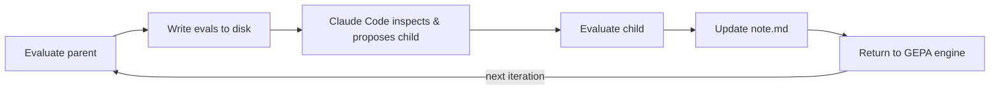

# Claude Code Reflector

**Standard GEPA reflection:** Python builds the reflection context, hands it to a model.
**Claude Code reflection:** Python builds a workspace on disk, then Claude investigates it agentically.

That shift is why this folder exists as a separate reflection backend — it has its own runtime, inputs, and mutation contract.

## What's Different

| Dimension | Standard Reflection | Claude Code Reflection |
|-----------|-------------------|----------------------|
| **Runtime** | Direct model callable | Shells out to `claude -p`, parses `stream-json` |
| **Inputs** | Structured dataset built in Python | Files on disk (`run_dir/evals/`) + persistent `note.md` |
| **Mutation** | Standalone string generation | Standalone string generation (future: path/git-commit-based mutation for optimizing a codebase) |
| **Multi-task** | Meta-prompt optimization | Targeted task optimization with reference tasks for inspiration |
| **Memory** | Stateless across iterations | Persistent cross-iteration note with accumulated lessons |
| **Sub-agents** | None | Optional RLM sub-agents for cheap reading/summarization |
| **Cost** | Cheap | Expensive (tool calls, more inputs available, usage limits) |

## Workflow

## Components

| File | What | Key Contents |
|------|------|-------------|
| `agent.py` | Orchestration | `AgenticProposer` (mutation loop), `EvalRecorderCallback` (disk persistence), `GlobalNote` (thread-safe note wrapper), `NoteUpdater` (post-mutation reflection) |
| `runtime.py` | CLI adapter | `make_claude_code_lm()` (GEPA-compatible callable via `claude -p`), `build_claude_code_env()` (env var setup), `parse_stream_json()` (output decoding) |
| `prompts.py` | Prompt layer | `CC_AGENTIC_MUTATION_SYSTEM_PROMPT` (mutator instructions), `CC_RLM_SYSTEM_PROMPT` (generic CC prompt), `build_note_update_prompt()` (note-taker prompt) |
| `__init__.py` | Exports | Re-exports public symbols |

## The Three Optimization Modes

Claude Code reflection works across all three `optimize_anything` modes, with one mode-specific enhancement:

| Mode | Use Case | Claude Code Adds |
|------|----------|-----------------|
| **Single-Task** | One task, one evolving artifact | File inspection for richer debugging, persistent `note.md`, optional RLM sub-agents |
| **Multi-Task** | One candidate optimized across many tasks | **Task-aligned mutation** — samples a target task from the Pareto front, borrows ideas from reference-task eval files |
| **Generalization** | Optimize on train set, select for transfer to val set | Same file-based mutation on train examples; engine handles val-set evaluation separately |

## Constraints

- Candidate dict must contain exactly one text field
- Mutation output must end in a fenced code block
- Run directory must exist and be accessible via `--add-dir`
- Eval quality depends on what the evaluator writes into `side_info`

## Further Reading

See [docs.md](docs.md) for deeper implementation details.
